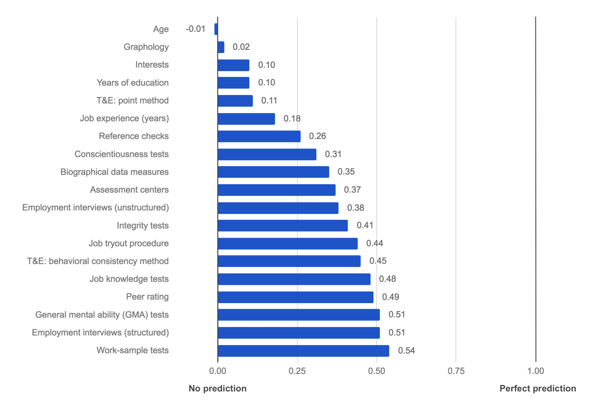
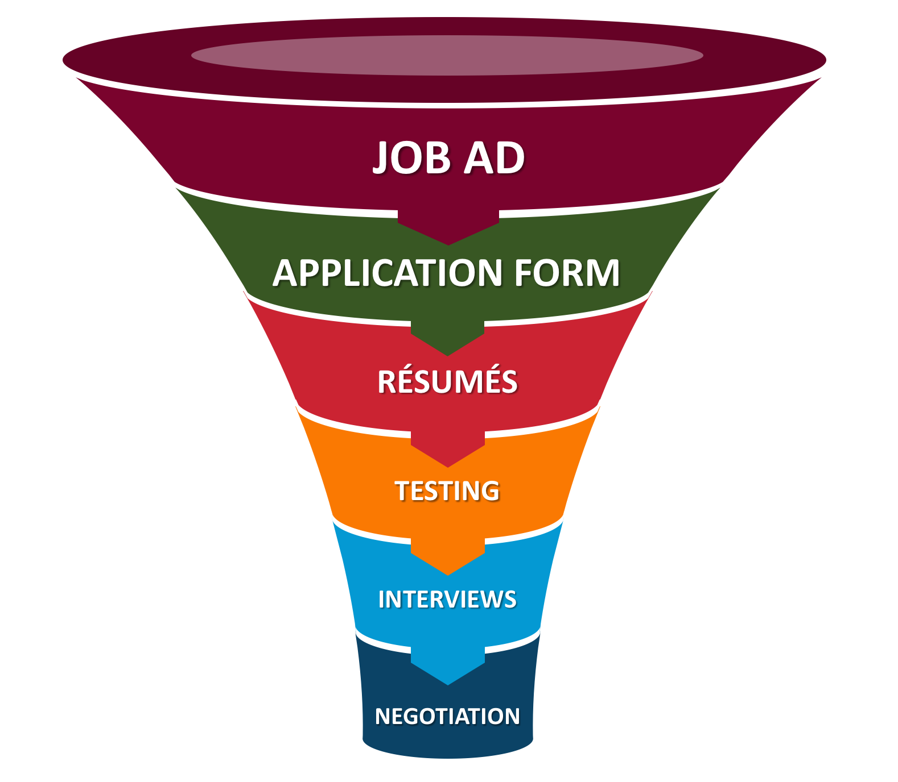
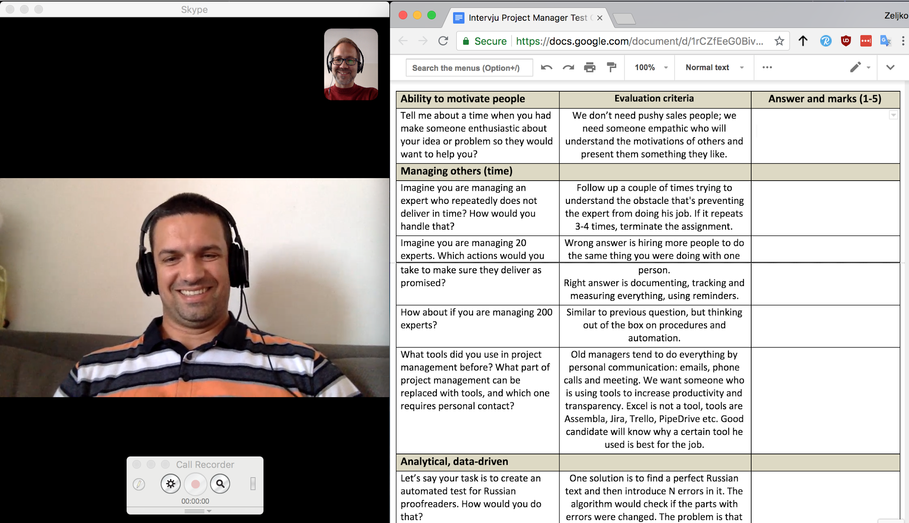
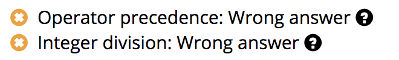
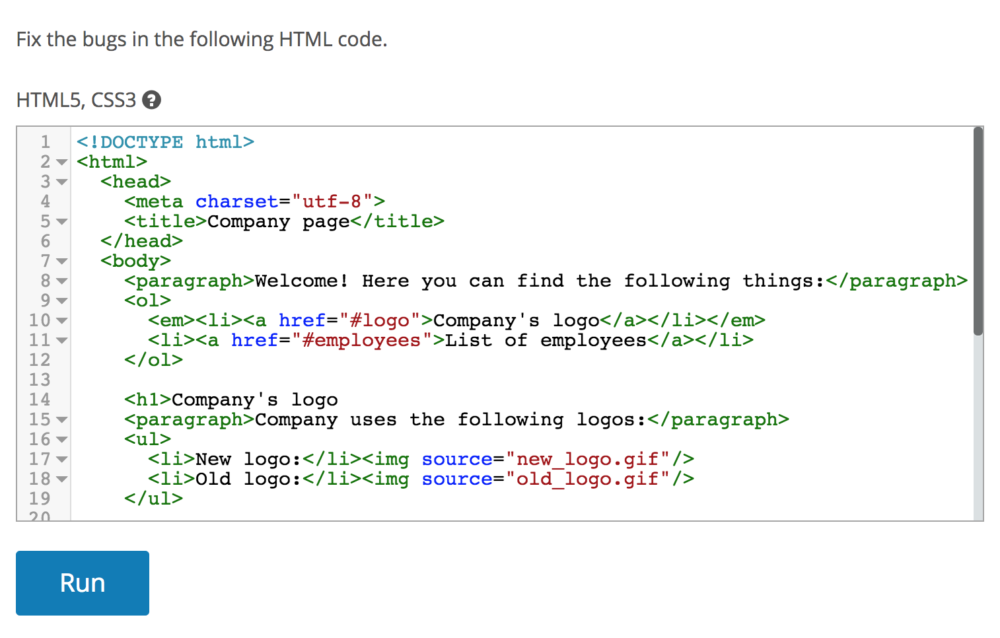

\newpage

{width=25%}

This book is licensed under CC BY-ND (Creative Commons Attribution-NoDerivatives) 4.0 license:

<https://creativecommons.org/licenses/by-nd/4.0/legalcode>

**You are free to:**

*Share* — copy and redistribute the material in any medium or format for any purpose, even commercially.

**Under the following terms:**

*Attribution* — You must give appropriate credit, provide a link to the license, and indicate if changes were made. You may do so in any reasonable manner, but not in any way that suggests the licensor endorses you or your use.

*NoDerivatives* — If you remix, transform, or build upon the material, you may not distribute the modified material.

\newpage

CHAPTER 1: The Failure of Traditional Employment Screening
----------------------------------------------------------

The traditional hiring process is broken. It’s a throwback to an industrial era hundreds of years ago, when we didn’t have employment science and relied on our hunches instead of data. If you’re reading this book, you probably feel the same way.

Together, we’re going to change this! Hiring can be made more accurate while requiring less time, resources, and frustration from both employers and candidates. It can be made more transparent, objective, and, perhaps sometimes, even enjoyable. 

### My First Hire

Many of us make the same mistakes when first hiring. I remember posting my first job ad: I was proud, as it was a sign that my little company was becoming serious. Customers were loving my product and I needed a software developer to help me out. It was obviously going to be the first hire of the many thousands that would follow, putting me on a path to me becoming the new Steve Jobs.

I had carefully crafted a job ad, put a paid listing on a local job site, and went to sleep. The next morning, I jumped out of bed in excitement, skipping across to my computer pumped to see how many hundreds of the world’s most talented people had applied for my job. I did find résumés, not hundreds but several from competent-looking candidates and experts in multiple domains—databases to front-end, XML to algorithms. They had more experience than me, and they’d worked on cool projects at previous companies. I started to expand my future company vision. Was I thinking too small? Maybe I could also do a hostile takeover of Microsoft and Amazon?

As I had more than 20 applicants, I screened the top five résumés. “I will hire only the best,” I said to myself, whilst stroking my beard contemplatively. I invited those five for an interview at the company “headquarters” (my apartment on the fourth floor of an old building, without an elevator).

If you have ever done a job interview for your company, you probably know that it feels like a first date. There’s the nerves, the desire to impress, and a looming sense of the possibility that should things go well. Too nervous to sit down, I kept myself busy vacuuming one last time---the headquarters was spotless.

The first candidate arrived and I sat him down with a glass of orange juice. We talked about his résumé and work experience. I explained what the job was, he confirmed that he was a very good fit for it. *Great.* We began talking about IT in general. I enjoyed the conversation, so I didn’t want to derail it by asking questions that may break the rapport that we were developing. At the same time, a nagging voice in my head told me that I needed to test the candidate, not just chat with him.

After 45 minutes of chit-chat, I finally got the courage to ask the candidate if we could do some specific screening questions and he agreed. This is an awkward moment in any interview, as you switch from a friendly conversation, to an examination with you as the professor. I began with questions related to the programming framework that the job required. To my surprise, he clammed up, struggling to answer even half the questions adequately. The interview swerved off the rails, crashing into a ravine of my misplaced optimism and his bad bluffing. He was not qualified for this job. 

I should have ended the interview then. Somehow, I couldn’t. Fifteen minutes later, I walked him out promising to “let him know if I was interested.” Disappointed, I returned to HQ’s boardroom (my kitchen table). *What a disaster. We’d had such a nice chat in the beginning, too.*

The next day, another candidate came to interview. I was more confident this time, and shortened the chit-chat to a mere thirty minutes. When I started asking prepared screening questions, his answers were mostly okay. It wasn’t clear if he didn’t understand some things, or merely had trouble expressing them. He agreed that I could send him a short coding test of basic programming skills. To my surprise, the candidate’s solutions were completely wrong and written in awful, amateurish code.

At least he tried to solve the test, though. The third candidate simply replied that he didn’t know how to solve the tasks. The fourth candidate failed the basic screening questions so badly that I didn’t even need to test him.

Just before the fifth candidate’s interview, he wrote that he was no longer interested in the job. I sat in my freshly vacuumed headquarters, looking out the window and thinking about what the hell was wrong with me. Why was I selecting the wrong candidates? I’d picked five from twenty, and they’d all been absolutely wrong for the position. Was I just bad at noticing red flags in résumés? How would I ever build a company? There had to be a better way to do this...

### The Bell Curve 

When I look back at those days, a decade ago, I can’t help but break out into a smile. My simple mistakes are funny in retrospect, because most first-time interviewers make them. My biggest mistake was not understanding the hiring bell curve.

While it is nice to think that everybody's performance is the same, it isn’t. If you recall math classes in school, probably 20% of people were good at math, 60% got by, and 20% couldn’t solve math problems without help. This distribution is so common in nature that it is called a normal distribution[^norm-dist] (also referred to as a bell curve), see the next figure.

[^norm-dist]: Wikipedia: <https://en.wikipedia.org/wiki/Normal_distribution>

{width=95%}

This distribution is used as a basis for scoring in every school, country, and *domain of knowledge*. While you would think that everybody who finishes medicine or physics is equally good, as those professions attract top performers, when you plot results of medicine or physics students, you also get the bell curve. Yes, they know much more about medicine or physics than the average person, but, *inside the domain*, there are still enormous differences between top and low performers.

Probably, you feel this about your profession too. When I ask my friends who finished medicine, law, or architecture, none of them have ever said, “Oh, all of us who finished school *X* are equally good.” If all professionals in a domain look equally good to me, it’s a sure sign that I don’t understand this area very well.

Even worse, the bell curve becomes more selective as we move to knowledge-worker professions (lawyers, accountants, managers, programmers, scientists, etc.), as opposed to physical professions. A great dock worker might be able to unload double the cargo of a bad worker, but they can’t be five times better, because his performance is limited—he’s still stuck with the same two arms and two legs as everyone else. However, for knowledge workers, their domain is their brain, and within their brain is their particular combination of knowledge, competence, motivation, and intellect. Have them apply this to tasks where there are hundreds of possible solutions, you will see the difference between individuals that can be several orders of magnitude. The best programmer might have the usable output of ten average hack coders. Lock one hundred physics graduates into a room for a year, and they won’t have achieved the output of a single Richard Feynman. It’s not fair that achievements are not distributed evenly among people or that we’re not all equal. But, this inequality is a reality that academia and businesses must accept.

When hiring knowledge workers, the goal is always to hire from the top 10%. Unfortunately, the best performers usually have good jobs already. They will rarely search for a new position and are probably tapped up for new jobs all the time. It’s often the case that they don’t even have a résumé, they’ve simply never needed one. Bad performers, however, will have plenty of time on the job market applying for jobs and perfecting their résumés. So, when you publicly post a job ad, most of the applicants will be bad performers. It’s just math. If a great performer finds a job in a month, while a bad performer takes five month, the bad performer will likely apply to five times as many jobs. In that simplified case, to hire someone in the top 10%, you’d need to hire just 1-in-50 applicants!

### “We Hire Only the Best” 

Why does all this matter? Because of the *top 10% fallacy*:

> The majority of companies say that they only hire the top 10% of talent. But, if that was the case, then 90% of people in any profession would be unemployed.

Math tells us that most employed workers must have an average performance, by definition. The logical conclusion is that most companies are fooling themselves. Realizing this can make you a little paranoid. If you interview a candidate and they come out as knowledgeable and a hard worker, why weren’t they hired by the rival companies that also interviewed them? Why did their previous employer let them go rather than offering them a pay raise to stay? Hiring is a case of asymmetric information—the candidate and their previous employers have much more information than you can extract in a one-hour interview.

I did eventually get better at hiring, although it took a lot of effort and testing. Several times, I’d proudly implement a new hiring process that I was sure would find a ten-percenter. Then, I’d attend a professional conference where, in the break, we’d start talking about our hiring procedures. “We filter out 80% of people based on the résumé,” one said, and everybody nodded in agreement. “But, then, a phone call with a candidate, with a few quick questions, will eliminate another 50%,” said someone else, to another round of nods. “The onsite interview is the most important part,” the conversation continued, “we spend more than 90 minutes discussing previous jobs, education, and motivation and asking specific questions that prove their knowledge. This is how you hire the top talent.” We did a bit more nodding. I was terrified. If we were *all* doing *exactly* the same thing, then none of us would get the top talent.

There is a joke about two people running away from a bear. One person asks the other, “Why are we running? The bear is faster than both of us!” His running partner replies, “Well, I don’t need to be faster than the bear. I just need to be faster than *you*!” A similar approach applies to hiring. Illustratively speaking, if you want to hire the top 10%, then you need to have a better hiring procedure than *nine* other companies.

Hiring doesn’t get easier if you work in a big company—quite the contrary. If you have a great brand and you can hire people from all over the world, then you will have an insane number of applicants. In 2014, 3 million people applied to Google[^google-chance], and only 1-in-428 of them were hired. There is no way to screen a population which is the size of Mongolia without resorting to some type of automated screening. But, Google is still a small company. If Walmart had a 1-in-100 selection criteria, they would need to screen the entire working population of the US and still find themselves 25 million people short[^largest-employers]. Before I had experience in hiring, I would often get angry with incompetent customer support representatives, delivery staff, or salespeople. How could a company hire them when they’re so incompetent? Now, I know better. I imagine myself being a head of a department hiring 500 people in a new city—for a below-average salary. Large enterprises hire on such a massive scale that they’re more focused on screening out the bottom 20% than chasing the hallowed top ten on the illusive far right of the bell curve.

[^google-chance]: Quartz article: <https://qz.com/285001/heres-why-you-only-have-a-0-2-chance-of-getting-hired-at-google/>

[^largest-employers]: Wikipedia: <https://en.wikipedia.org/wiki/List\_of\_largest\_employers\_in\_the\_United\_States>

This might sound like a bad thing, but it’s not, as it means a large majority of society can find employment. Hiring knowledge workers is not hiring on a massive scale. You can screen for the best and give them better benefits than the competition. A great employee that delivers twice as much is well worth a 50% higher salary.

### How Can We Fix Employment Screening?

For all the reasons discussed, the average hiring process just doesn’t cut it. The following chapters will teach you a new method called *Evidence-Based Hiring*. You will learn:

-   The common errors that people make when screening candidates.

-   Ways to overcome our biases.

-   The scientifically valid methods of screening.

-   How to automate much of your screening process.

-   The optimum position for a specific screening method in the hiring pipeline.

-   How to best communicate with candidates during the process.

-   The types of questions that you should ask to screen high-calibre candidates.

-   How to structure interviews.

-   How to measure the efficiency of your entire hiring process.

This book is focused specifically on everything which happens from the moment that you receive an application to the moment that you hire a candidate. So, out of this book’s scope are:

-   *Sourcing* applications: where to put your ads to find potential applicants.

-   *Employee branding*: whether you should offer bean bags, fruit baskets, and other creative ways to improve the public perception of your company.

-   *Training and development*: how to keep employees skilled, happy, and motivated.

\newpage
CHAPTER 2: The Current Model Doesn’t Work Because We’re All Biased
------------------------------------------------------------------

Before we can fix what’s broken, we first need to understand why it’s broken and who broke it. 

Let’s talk about intelligence for a moment. Try this brain-teaser:

> A father and son are in a horrible car crash, which kills the father. The son is rushed to the hospital. Just as he’s about to go under the knife, the surgeon says, “I can’t operate—this boy is my son!”
>
> How is this possible?

If you haven’t seen this puzzle, take no more than a minute to try and solve it. The answer is on the next page…

\newpage
The answer is simple: *the surgeon is the boy’s mother*. Were you able to solve it, and how many seconds did it take you to find the answer?

This is a classic question to test for gender bias. When we imagine a surgeon, we tend to imagine a male surgeon. Research from Boston University shows only 14% of students are able to come up with the answer[^bu-research]. Students that identified as feminists were still only able to find the solution 22% of the time.

You might think that you don’t have a gender or race bias, but even people in an in-group can be biased against its other members. Psychologists Kenneth and Mamie Clark created “the doll tests”, where kids are given a choice of a few dolls with different skin tones[^video-dolls]. African-American kids overwhelmingly choose white dolls, as they “are prettier” and “better.”

[^bu-research]: Boston University: <https://www.bu.edu/today/2014/bu-research-riddle-reveals-the-depth-of-gender-bias/>

[^video-dolls]: Youtube: <https://www.youtube.com/watch?v=WG7U1QsUd1g>

As adults, we can’t avoid our biases either. Whether on a date or in an interview, the first thing that you notice is the other person’s physical appearance. It’s regrettable, but it’s human nature. We are not biased because we are dumb or uneducated. We are biased because *with a lack of other information*, we resort to stereotypes to make a decision. That is usually intuitive and can't be turned off. If you think you can, I invite you not to think of a polar bear. Ironic process theory states[^ironic-process] that deliberate attempts to suppress certain thoughts make them more likely to surface.

[^ironic-process]: Wikipedia: <https://en.wikipedia.org/wiki/Ironic_process_theory>

### Screening by Proxy

When hiring, as we already discussed, we have a lack of information, and so we are likely to use proxies to make a decision:

>  If a person is good at X (proxy), they are probably going to be good at Y (work).

Popular screening proxies are; school prestige, years of work experience, having worked at a big name company, eloquence, self-confidence, appearance, punctuality, gender, and race.

Screening by proxy is not necessarily bad. When hiring, we must use proxies because we can’t know the results[^time-machine].

[^time-machine]: Unless you have a time machine, in which case please contact me in my youth to tell me future stock prices.

There are better and worse proxies. Good proxies are supported by research and shown to lead to good hires—they’re signals, while other proxies are just noise.

Screening discrimination probably won’t be based on a single proxy. We tend to interview with a preconceived idea of what a stereotypical candidate for that position should look like. Let’s say I am hiring a surgeon and all candidates have equal qualifications. One candidate walks in for an interview and he is a tall, Caucasian male with a deep, assertive voice. He’s missing the stethoscope around his neck, but otherwise he’s the epitome of every TV ER doctor. When interviewing him, I’m reassured by this. The next candidate walks in and I’m surprised to see it’s a young woman with short, dyed blond hair, and a tattoo on her neck. She looks more like a punk-rock singer than a surgeon. The interview goes well, and her answers are good, but something in my gut just doesn’t feel right. A hidden part of my brain is telling me it has never seen a surgeon like this. Situations that are familiar make us relaxed, while situations that are unfamiliar make us stressed and uncertain. Meanwhile, another part of my brain is evaluating my social situation—what will my coworkers say if I pick such a strange candidate? Is it worth the risk?

This is how our hidden biases work:

> If we don’t have enough information to decide between applicants, our emotions tell us to go with the most stereotypical candidate.

I am probably destined to choose the ER guy over the punk girl. It’s the safer choice. What do you think you would do?

Not only do people judge by proxy, they often judge by proxy of a proxy. For example, a common belief is that people who are nice to their dogs are nice to other people[^quote-dogs]. Double-proxy reasoning states that, if someone has a dog, they must have empathy and, therefore, they will be nice to everyone. A similar double proxy is that, if a man has a loving wife, he can’t be all that bad a human.

[^quote-dogs]: Quote: <https://www.goodreads.com/quotes/29535-you-can-judge-a-man-s-true-character-by-the-way>

Sounds quite reasonable until you remember the guy in the next figure.

![Adolf Hitler, Eva Braun, and their dogs.[^hitler-photo]](media/hitler-eva.jpg){ width=95% }

[^hitler-photo]: Wikimedia: <https://commons.wikimedia.org/wiki/File:Bundesarchiv_B_145_Bild-F051673-0059,_Adolf_Hitler_und_Eva_Braun_auf_dem_Berghof.jpg> 

By all historical accounts, Hitler loved his dog Blondi and was a strong supporter of animal rights. The Nazis introduced many animal welfare laws, offenders of which were sent to concentration camps[^animal-welfare]. Hitler, himself, was a vegetarian[^hitler-vegetarian] and was planning to ban slaughterhouses after WWII because of animal cruelty. He was also a non-smoker and non-drinker. Hitler’s mistress, Eva Braun, loved him so much that she decided to share his faith. They got married in his underground bunker and, 40 hours later, they committed suicide together[^eva-suicide].

We can trust that all these proxies didn’t give people a reliable read on Mr. Hitler, nor have we updated these proxies since. So, while there are slightly more women than men in the US, no woman has ever been elected president, neither has a Hispanic or Asian minority. These demographics, which represent 62% of society, have not been elected *once* in 58 presidential elections.

So, who gets votes? Well, all American presidents for the past 130 years, except one, had owned a dog[^us-pets]. All but two of them were married[^not-married]. All but two were Christians[^religious-affiliations]. All, except one, were white. No matter what people say they look for in a head of state, an older, white, religious male with a wife and a dog fits a stereotype of a good president.

[^animal-welfare]: Wikipedia: <https://en.wikipedia.org/wiki/Animal_welfare_in_Nazi_Germany> 

[^hitler-vegetarian]: Wikipedia: <https://en.wikipedia.org/wiki/Adolf\_Hitler\_and\_vegetarianism>

[^eva-suicide]: Wikipedia: <https://en.wikipedia.org/wiki/Eva_Braun#Marriage_and_suicide>

[^us-pets]: Wikipedia: <https://en.wikipedia.org/wiki/United_States_presidential_pets>

[^not-married]: Quora: <https://www.quora.com/Has-there-ever-been-a-U-S-president-who-was-not-married>

[^religious-affiliations]: Wikipedia: <https://en.wikipedia.org/wiki/Religious_affiliations_of_Presidents_of_the_United_States>

The problem is not restricted to the average voter. When Albert Einstein graduated from ETH Zurich in 1900, both his professors of mathematics and physics refused to give him a job recommendation[^book-einstein]. The professor of mathematics refused because Einstein skipped his math lectures. The professor of physics refused because Einstein called his lectures “outdated” and questioned why he didn’t teach modern theories. As a result, Einstein was the only one in his class of students who couldn’t find employment in his field. He was forced to work at a patent office, and only managed to get an academic job a few years after he published his special theory of relativity. If the main criterion for examination had been creating original physics papers, or if the testing of students was blind, it’s likely a young Albert could have shown what he had to offer. In the case of Einstein, his professors used a “did the student attend my lectures” proxy and a “did the student like my course” proxy.

It is important to realize that proxies are just proxies and they should not be taken into account without data proving their validity.

[^book-einstein]: Book by Walter Isaacson: *Einstein: His Life and Universe*

### Proxies and Biases in Hiring

Let’s take a look at places where biases and incorrect proxies can derail a typical hiring process:

1.  *Résumé screening* - résumés are stuffed with proxies which candidates have intentionally included to look better, and that can trip our biases. Candidates of the right age will put their birthdate, others will omit it. Attractive candidates will attach their photo, the others will not. Prominent schools and well-known companies will be put at the top, even if the candidate was not the best student or employee there. Some candidates’ “personal achievements” sections will list charity work, Boy Scouts, Mensa membership, or other proxies-of-a-proxy.

2.  *The telephone interview -* here, we tend to ask candidates very simple questions which are related to their previous experience and résumé. Delivered this way, it is not a knowledge or work test. Instead, it’s more of a short communication skills test that extroverts will ace. Even if the job requires communication skills, this doesn’t mean a phone call is a good proxy for work-specific communication.

3.  *Interviews* - Most interviewers base their decisions on subjective feelings, which research shows are largely influenced by a 20-second first impression[^first-impression].

4.  *Giving candidates tasks on interviews* - here, bias is introduced when we watch a candidate solve a task. It immediately puts them under pressure, which we often want for our “performs well under stress” proxy, but it’s an artificial situation that they’re unlikely to be faced with when hired.

5.  *Standardized testing* - although standardized testing is good, bias is introduced when we decide *what* to test. If we ask questions that require experience, then we bias against young graduates that may otherwise be great employees. If we administer verbal reasoning tests, we bias against non-native speakers.

We can’t rely on hunches or biases when hiring. We need to be both methodical and scientific. Fortunately, there is a great deal of hiring research that tells us which methods work and which, well, don’t.

[^first-impression]: Paper: <https://www.researchgate.net/publication/313878823_The_importance_of_first_impressions_in_a_job_interview>

\newpage
CHAPTER 3: Not All Methods Are Equal
------------------------------------

Since we’re all biased and we use incorrect proxies, why not just outsource hiring to experts or recruitment agencies? After all, they’ve been screening people for many years, so they must know how to do it right?

Not really. I was surprised to discover that many experts disagree with each other. Everybody praises their pet method and criticizes the others. Many of these methods look legitimate, but are based on fake science.

### Hiring Science Gone Wrong

Fake science looks similar to real science, with impressive-looking studies, charts, and numbers—until you dig deeper into what those numbers actually represent.

For example, let's look at popular personality tests. HR departments love personality tests, because they are universal—they need just one test for all candidates.

Many companies claim that their personality test has high *statistical reliability*[^reliability] (when a candidate repeats the test they get a similar result). That doesn’t mean a thing. A person's height has a high “reliability” because it doesn’t change from day to day. That doesn’t mean it is good for hiring—well, unless you’re hiring a basketball player.

It’s the same when companies claim high *face validity* (the candidate agrees that the results accurately represent them). Horoscopes have high face validity[^barnum-effect], but we wouldn’t think of only hiring Libras because they are supposedly curious and outgoing.

One of the oldest personality profiling system is Myers–Briggs. According to The Myers-Briggs Company, "88% of Fortune 500 companies use it in hiring and training"[^fortune-500]. Myers–Briggs sorts people into 16 archetypes[^16personalities] that have fancy names, like “Architect” and “Commander.” More than 20 studies concluded that Myers-Briggs doesn’t work[^personality-popular]. Myers-Briggs Type Indicator (MBTI) is not even reliable, as 50% of people get a different Myers-Briggs archetype on repeated testing[^measuring-mbti]. Forbes concluded that, “MBTI is so popular because it provides the illusion of solution[^mysterious-popularity].” The New York Times called Myers-Briggs “totally useless” and concludes that it is popular because people like to put themselves and others into categories[^mb-useless].

[^reliability]: Wikipedia: <https://en.wikipedia.org/wiki/Reliability_(statistics)>
[^barnum-effect]: Wikipedia: <https://en.wikipedia.org/wiki/Barnum_effect>
[^fortune-500]: The Myers-Briggs Company: <https://www.themyersbriggs.com/en-US/Products%20and%20Services/Myers-Briggs>
[^16personalities]: 16personalities: <https://www.16personalities.com/personality-types>
[^personality-popular]: Psychometric Success: <http://www.psychometric-success.com/personality-tests/personality-tests-popular-tests.htm>
[^measuring-mbti]: Article: <http://www.indiana.edu/~jobtalk/Articles/develop/mbti.pdf>
[^mysterious-popularity]: Article: <https://www.forbes.com/sites/toddessig/2014/09/29/the-mysterious-popularity-of-the-meaningless-myers-briggs-mbti/>
[^mb-useless]: Article: <https://op-talk.blogs.nytimes.com/2014/07/18/why-myers-briggs-is-totally-useless-but-wildly-popular/>

Another popular assessment is DiSC[^disc] (Dominance, Influence, Steadiness, and Conscientiousness). DiSC results are not normalized[^ipsative], meaning that you can’t compare different people with it. Some assessment vendors, like People Success, claim that DiSC “has a validity rate of between 88% and 91%”[^people-success]. Validity around 0.9 would be a spectacular result for any pre-employment method, on par with with a crystal ball. But, the vendor failed to mention that it was just face validity[^disc-analysis].

Generally, modern psychology has debunked the idea that people fall into certain “types.” Personality traits come in a spectrum—for example, people are distributed on a scale from introversion to extroversion. Traits are not binary. And, the traits that people actually have are *not* the ones claimed by Myers-Briggs or DiSC.

A personality test that *is* scientifically proven is the Big Five[^big-five], which measures openness, conscientiousness, extraversion, agreeableness, and neuroticism. The Big Five doesn’t classify people as a certain “type”, merely offers percentage scores for each trait, see the next figure.

{width=95%}

While scientific, the Big Five still gives weak predictions. A paper by Morgeson et al.[^morgeson] summarizes multiple studies and concludes that only one of its variables (conscientiousness) is worth looking at, and even that is weakly correlated.

[^disc]: RMi: <https://www.rmiexecutivesearch.com/disc-assessment>

[^ipsative]: Wikipedia: <https://en.wikipedia.org/wiki/Ipsative>

[^people-success]: People Success: <http://www.peoplesuccess.co.uk/behavioural-style/validity/>

[^disc-analysis]: Presentation: <http://www.amazureconsulting.com/wp-content/uploads/2016/07/DISCPastAndPresentAndWilliamMarston.pdf>

[^big-five]: Wikipedia: <https://en.wikipedia.org/wiki/Big_Five_personality_traits>

[^morgeson]: Morgeson et al. (2007): <https://pdfs.semanticscholar.org/0fc2/97c288263c1a4d0e1e1119668563274d242e.pdf>

### The Ultimate Measure: Predictive Validity

The only statistical measure that we should look for is *predictive validity*[^predictive-validity]. This is different to face validity and reliability because it actually measures how well the candidate did at their job *after* being hired.

Predictive validity is very hard to calculate. One would need to follow up a few years after the hire to correlate actual job performance with the original screening scores. Fortunately, there's research that shows which screening methods have high predictive validity. Schmid and Hunter[^schmid-hunter] did a meta-analysis of thousands of studies and compared different screening methods. Their conclusions are in the next figure.

[^predictive-validity]: Wikipedia: <https://en.wikipedia.org/wiki/Predictive_validity>

[^schmid-hunter]: Schmid and Hunter (1998): <http://citeseerx.ist.psu.edu/viewdoc/download?doi=10.1.1.172.1733&rep=rep1&type=pdf>

{width=95%}

Predictive validity is a range from -1.0 (negative correlation) to 1.0 (positive correlation). The higher the number, the more often we were right about whether someone was a good hire. A screening method with a 1.0 predictive validity would find a great hire every time.

Now, let's go through the rankings, from worst to best.

### Low Validity Methods

These methods definitely shouldn’t be used, because they have validity below 0.2 and, so, are about as good as asking Mystic Mahjoob, the local fortune teller: 

Method                                  | Validity  | Description     
:-----------                            | ---:      | :---------------------------- 
Age                                     | -0.01     | Candidate age has non-existent validity, so companies that discriminate against candidates that are “too young” or “too old” should stop doing so—not only because it’s illegal in most countries, but it’s also just plain invalid.
Graphology                              | 0.02      | Analysis of a candidate’s handwriting is advertised as a way to detect their personality. It’s popular in Western Europe, especially in France where 70-80% of companies still use it[^bbc-graphology] (no, I’m not making this up). This is surprising, since it has no validity and even the graphology wiki page[^wiki-graphology] states it is a pseudoscience.
Interests                               | 0.10      | Interests are a common part of a résumé that you can safely ignore, as they have very low validity.
Years of education                      | 0.10      | Surprisingly, requiring more education for a job has very little validity. In other words, slapping a PhD requirement on a job that could be done by an engineer with just a bachelor’s degree doesn’t significantly improve the quality of your hires.
Training and experience: point method   | 0.11      | This method gives points for candidate’s training, education, and experience, multiplied by the length of time in that activity[^ipac-point]. It can be calculated manually from a résumé or automatically from the application form. Point scoring is popular in government hiring, but, today, even government websites point out that it “does not relate well to performance on the job.”[^gov-point]
Job experience (years)                  | 0.18      | Years of experience in the job correlates only slightly with the job performance, and, thus, should not be used. It’s often a deciding factor since it’s easy to determine from a candidate's résumé and, somehow, feels, intuitively, like it should be valid—it isn’t.

[^bbc-graphology]: BBC article: <http://www.bbc.com/capital/story/20171025-the-peculiar-psychoanalysis-of-job-hiring>

[^wiki-graphology]: Wikipedia: <https://en.wikipedia.org/wiki/Graphology>

[^ipac-point]: IPAC presentation: <http://www.ipacweb.org/Resources/Documents/conf13/white.pdf>

[^gov-point]: Section from OPM.gov: <https://tldrify.com/pgu>

### Medium Validity Methods

The methods below have validity between 0.2 and 0.45 and can be used in addition to high validity methods:

Method                                  | Validity  | Description     
:-----------                            | ---:      | :---------------------------- 
Reference checks                        | 0.26      | Contacting previous employers is a valid method, as past performance predicts future performance. Unfortunately, it is often not possible for a current job, as previous employers are usually reluctant to share that information and it is illegal in some countries.
Conscientiousness tests                 | 0.31      | Conscientiousness is a measure of a specific personality trait and can be asked during an interview. It highlights candidates with a high level of self-discipline.
  Biographical data measures            | 0.35      | Many life experiences (such as school, parenting style, hobbies, sports, membership in various organisations, etc.) are scored based on *statistical data from past hires*. Quite hard to develop, but easy to use thereafter. Note that sex, age, and marital status are illegal to use.
  Assessment centers                    | 0.37      | Assessment centers use a variety of methods, including personality and aptitude tests, interviews, and group exercises. They are popular with companies, which is unfortunate because their validity is low for such a time-intensive, multi-method approach.
  Employment interviews (unstructured)  | 0.38      | A normal interview where there is no fixed set of questions. It is enjoyable for both a candidate and an interviewer, as it feels like a friendly chat, but doesn’t have the validity of a more structured interview.
  Integrity tests                       | 0.41      | These tests can either ask candidates directly about their honesty, criminal history, drug use, or personal integrity, or draw conclusions from a psychological test. Again, conscientiousness is the most important personality trait.
  Job tryout procedure                  | 0.44      | Candidates are hired with minimal screening and their job performance is monitored for the next three to six months. This method has reasonable validity, but it is very costly to implement.
  Training and experience: behavioral consistency method | 0.45 | First, companies identify Knowledge, Skills and Abilities (KSA[^ksa]) that separate high performers from low. Candidates are then asked to give past achievements for each KSA. Responses are scored based on a rating scale.

[^ksa]: Wikipedia: <https://en.wikipedia.org/wiki/Knowledge,_Skills,_and_Abilities>

### High Validity Methods

Only five methods have a validity above 0.45:

Method                                  | Validity  | Description     
:-----------                            | ---:      | :---------------------------- 
Job knowledge tests                     | 0.48      | Question the specific professional knowledge required for the job. This method has high validity, but can pose a problem when screening junior candidates who require training.
Peer rating                             | 0.49      | Asking coworkers to evaluate a candidate’s performance and averaging the results is surprisingly valid. People inside a company have a better insight of each other’s abilities. A good method for in-company promotion or reassignment, but not for hiring outside employees.
General mental ability (GMA) tests      | 0.51      | GMA tests measure the ability of a candidate to solve generic problems, such as numerical reasoning, verbal reasoning, or problem solving. They don’t guarantee that a candidate has the required skills, just the mental capability to develop them if trained. Note that brainteasers like “how would you move mount Fuji?” are too vague and subjective for a GMA test.
Employment interviews (structured)      | 0.51      | The same interviewer asks different candidates identical questions, in the same order, writes down the answers (or, even better, records the entire session), and gives marks to each answer. This way, different candidates can be transparently compared using the same criteria.
Work-sample tests                       | 0.54      | To test if a candidate will be good at work, give them a *sample of actual work to do*. A simple and very effective idea.

As these methods have the highest validity, they should be the core of our Evidence-Based Hiring process, and, so, logically, they’re what we will focus on in the rest of this book.

### The Multiple Methods Approach

Based on the above research, we can conclude that:

> No single method of screening has high enough validity to be used exclusively, so it is necessary to combine multiple methods. 

There simply is no silver bullet for hiring. No simple signals that you can detect in a résumé and decide if a candidate is going to be a star hire. However, we do now know what methods to combine to get the highest validity for the least time, effort, and cost; work-sample tests, knowledge tests, GMA, and structured interviews.

\newpage
CHAPTER 4: Reward vs Effort
---------------------------

### The Last Question

So, we need to use multiple methods. But, in which order?

Say that you apply for a Sales Manager job at the Acme Corporation. First, they conduct a phone interview. Then, they call you for a face-to-face interview. After that, you visit for a whole day of testing: aptitude tests, situational tests, personality tests, the whole shebang. The Friday after that, you have an on-site interview with your prospective manager. Ten days later, you have an evening interview with his manager. More than a month has passed since you applied, and you’re five rounds in. Annoying, since you’re currently employed and need to make excuses to go for each interview or test. Finally, they send you an email stating they want to make you an offer. Again, you come to the shiny Acme Corporation office for a final talk with both managers. They offer you a salary you are satisfied with—great. You wipe the sweat from your forehead and relax into your chair.

Just one more question, your would-be future boss asks, “Tu español es bueno, ¿no?”

“Erm. Sorry, what?” you say, flustered.

“You don’t speak Spanish?” he replies. “Oh, maybe we forgot to mention it, but you’ll be working a lot with our partners in Mexico. So, we need someone fluent in Spanish. *Sorry.*”

What would you do in this situation? I would probably take the nearest blunt object and launch it at their heads. How could anyone forget such a simple requirement as “fluent in Spanish”? All those afternoons wasted, for both you and them, just because they forgot to ask one question.

This story would be funnier if a similar thing didn’t happen to me, both as a candidate and as an interviewer. It is a typical example of a minimum requirement which takes less than a minute to check, yet it wasn’t checked until the very end of the hiring process.

How you order your screening process makes all the difference.

### Reward vs. Effort Ratio

When I started doing screening, I didn’t understand this. At the beginning of the process, I did both all the things that were *traditionally* done first and the things that were *important* to me. Everyone else began by screening résumés, so I did that too. Meeting a candidate for an interview was important to me, so that was a logical second step. I understand, now, that I was completely wrong in the ordering.

A screening process is a kind of funnel that collects information at each step which can predict future behavior. But, collecting information has a cost in both time and money. In other words:

> Screening_Efficiency = Reward / Effort

Accordingly, the screening process should be reordered, so that the *most efficient methods come first*. Higher efficiency methods give the most valid information to make a decision, saving time for both you and the candidate.

In the Acme example, an on-site interview gives more information than checking Spanish fluency, but an interview takes hours of managers’ and candidates’ time. Checking Spanish fluency gives less information than an on-site interview, but it requires only a one-minute phone call to know for sure whether you can reject them. It is vastly more efficient.

### Why the Traditional Model Is Not Efficient

Let’s examine effort and reward in the traditional screening process for both candidates and employers. Here’s how the Acme Corporation process for an average candidate might look:

Step            | Company effort    | Candidate effort  | Reward                | Validity
:-------        | :---              | :---              | :----------           | :--- 
Application form, résumé, and a cover letter | 5 min. | 25 min. | Does the candidate satisfy the basic requirements? | Low 
Phone screen    | 20 min. | 15 min. | Can the candidate communicate well and answer promptly? | Low 
First interview (unstructured) | 45 min. | 45 min. interview + 1 hour commute | Find out more about the candidate’s education, work experience, and style of communication. | Medium 
On-site assessment and knowledge test | 4 hours | 4 hours of assessment + 1 hour commute | Candidate score on personality test, aptitude tests, knowledge test, and interview with a psychologist. | Medium 
Second interview with two managers (structured ) | 2x1 hour | 1 hour interview + 1 hour commute | Details about the candidate’s past behavior, experiences, strengths, and weaknesses, in a form that can be compared to other candidates. | High 
Job offer (phone) | 5 min. | 5 min. | Will the candidate accept the terms? |  
TOTAL: | 7 hours 15 min. | 9 hours 30 min. |                   |  

As you can see, a huge amount of time is invested in each application by both the company and candidate.

The problem occurs when you look at the last column. The point of screening is to collect the maximum reward (information) for the least effort (time). The first steps don’t give much useful information at all. A résumé tells us years of education or interests (validity of 0.1) and job experience (validity of 0.18). A short, fifteen-minute phone screening also has low validity. A company must invest more than five hours to get their first piece of high-validity information from the knowledge test. So, why structure things this way around?

The traditional approach is popular because, first, most people don’t question the way things have always been done. Secondly, because people are uncomfortable asking tough questions. Most companies spend the first few hours with “soft” topics (conversation and personality tests) before they go to the “hard” topics (testing knowledge and asking direct questions).

This makes sense for dating, because we often enjoy the dating process. But, it doesn’t make sense for hiring —because both an interviewer and a candidate would rather be elsewhere. Being direct saves effort for both.

If a candidate passes the entire process, it takes 7 hours and 15 minutes of company time. Let’s look at how much time could we save by eliminating them earlier:

Elimination Step                            | Invested company effort   | Time efficiency
:---------------                            | ---:                      | ---:
Candidate passes all stages                 | 7 hours 15 minutes        | 1x
Candidate fails the knowledge test          | 5 hours 10 minutes        | 1.4x
Candidate fails the phone screen            | 25 minutes                | 17.4x
Candidate fails application form questions  | 5 minutes                 | 87x

Eliminating a candidate from an application form is 87 times more time efficient (5 minutes vs 7 hours 15 minutes), and that’s before you multiply this again by the number of candidates. If you have 20 candidates and an average applicant takes five hours to screen, failing after the knowledge test, the total effort is a huge 100 hours.

Surprisingly, real-world companies cover the entire spectrum of efficiency. For example, one government agency which I know of would put every applicant through the almost full procedure, so they would be close to 1x. Needless to say, they have a large HR department. At the other end of the spectrum, some high-tech companies have automated screening, so that they can screen thousands of candidates with very little effort.

What is the efficiency of your company? How much, on average, does it cost you (in time and money) to eliminate a candidate?

Recruiters often say that they are very efficient, because they eliminate the majority of candidates from their résumé alone. But, if 90% of candidates are eliminated based on low-validity criteria, then that process can be summarized with this joke:

> A recruiter splits a stack of job applications, and throws a half of them in the garbage.
> “What are you doing?!” asks his coworker.
> “Well,” answers the recruiter, “we don’t want unlucky people in our company, do we?”

### Ways to Reduce Effort & Increase Reward

There is one ingenious idea rarely mentioned in screening resources: find a person who knows the candidate the best, and convince them to do a screening—for free. That person is the candidate themself, and the method is *candidate self-selection*. Candidates don’t want to be failures: they want to succeed in their job. If your job description indicates that they are probably going to fail if they were hired, they’re not going to apply.

> When advertising normal products, you want to sell to as many people as possible. 
> But, when advertising jobs, you want to “sell” it to the right people for the job—and scare away everybody else.*

I realized this the first time that my company was advertising a managerial position. Our previous job ad was for a developer and we had 30 applicants. But, when we needed a manager, which was a more demanding job, more than 140 people applied. The problem was that our developer job ad was very specific: we listed languages and technologies which candidates needed to know. The manager’s job ad was more general, and everybody thinks they would be a great manager. It didn’t have specific criteria that candidates could use for self-elimination.

Whenever you have a job ad that is too general, the quality of candidates will decrease. Therefore, you must always provide a realistic picture of what the job actually entails, and your selection criteria for getting it. If your job requires frequent weekend trips, say so. If the necessary criteria is at least two years of experience managing five people, say that loudly, in ALL CAPS if you must. It’s saving everyone’s time.

If the job description is too unspecific, you will end up with hundreds of candidates but run the risk of your hire quitting after six months because the job was “not what they were expecting.”

Sounds obvious, but I used to make the mistake of leaving out one crucial part of the job description, just because other companies omitted it too—*the salary range*. While I knew exactly what salary range my company could afford, salary negotiations are difficult and awkward, so I left them for the end. As a result I spent hours and hours interviewing some senior candidates, only to discover that—aside from a unforeseen lottery win—I could not afford them. I wasted their and my time.

The second way to decrease effort significantly is to employ the magic of automated testing. Here, the computer can screen hundreds of candidates for near-zero cost, once we’ve invested the one-time effort of developing a good automated test.

The third way to decrease effort is to divide testing into two parts—short tests early in the screening process and longer tests later. Most candidates will fail the first test anyway, so we will save time by not doing longer, unnecessary tests with them. This also saves time for candidates, as they only need to take the longer test if they are qualified.

To increase the reward, we need to use high-validity methods as early as possible. Every method in the screening process asks the applicant to answer questions. These can be as simple as the “Name” field on the application form, as complex as answering a mathematical problem in a structured interview, or as straightforward as stating whether they will accept a starting salary of \$65,000. Our rewards are the answers to these questions. They tell us whether to send the applicant further down the funnel or back home.

Every method, whether it has high or low validity, has one thing in common—it’s only as good as the questions asked within it. So, the next chapter is dedicated solely to the art of asking good questions.

\newpage
CHAPTER 5: Maximizing the Reward: How to Ask Good Questions?
------------------------------------------------------------

The general rule for screening questions in both tests and interviews is simple, but very powerful once you’ve wrapped your head around it:

> Only ask a question if it can eliminate the candidate in the current screening round.

After all, if it can’t provide actionable evidence, why should you waste time on it? Of course, you can always ask questions like, “What are your hobbies?” but, if one candidate answers “football” and the other “sailing,” what can you do with that information? How does it inform your hiring decision? Are you going to reject the candidate who prefers football? Interviewers often say that such questions help provide a “complete picture” of a candidate, but previous chapters have explained why that’s nothing more than a back door for bias.

It’s the same with easy questions, asking a qualified accountant the difference between accounts payable and receivable won’t provide any actionable information. Of course, in addition to being eliminatory and moderately hard, a question also needs to have predictive validity. We don’t want to eliminate 90% of candidates for being right-handed, no matter how good our last left-handed employee was.

### Great Questions Cheat Sheet: Bloom’s Taxonomy

Fortunately, there’s one high-level concept that you can learn in 15 minutes, which will make you much better at asking elimination questions.

In every domain, there are different levels of knowledge. Memorizing the formula E=mc^2^ shows some knowledge but doesn’t make you a physicist—that might require applying E=mc^2^ to a specific, related, problem.

The American psychologist Benjamin Bloom categorized these different levels of knowledge into hierarchy we now call Bloom’s Taxonomy[^blooms-taxonomy], see the next figure.

[^blooms-taxonomy]: Wikipedia: <https://en.wikipedia.org/wiki/Bloom%27s_taxonomy>

{width=95%}

At the bottom of the pyramid are lower-order thinking skills; *remembering*, *understanding,* and *applying*. At the top of the pyramid are higher-order thinking skills; *analyzing*, *evaluating,* and *creating*. Creating is the hardest skill for any profession and the smallest number of candidates can do it.

For example, here is how Bloom’s taxonomy is applied to testing foreign-language proficiency:

-   **Remembering**: recall a word in a foreign language.

-   **Understanding**: understand text or audio.

-   **Applying**: use a language to compose an email or to converse with people.

-   **Analyzing**: analyze a piece of literature.

-   **Evaluating**: discuss which book has better literary value.

-   **Creating**: write a poem, essay, or fictional story.

Bloom’s taxonomy is an important tool for your screening because:

> The higher the question in the hierarchy, the more domain knowledge the candidate needs to demonstrate.

However, not all tasks require higher-tier knowledge. For example, if you are hiring a Spanish-speaking customer support representative, you need someone who *applies* the language (level 3). So, while it might seem better to have a candidate who can also *create* poetry in Spanish (level 6), we need to consider if they will get bored doing a job below their knowledge level. Therefore:

> The elimination questions that we ask should match the skill level required for the job. 

If the test is too low in the hierarchy, then it is easier for both the administrator and the test taker—but it completely loses its purpose. Unfortunately, both job screening and academic tests often get this wrong. In education, schools want most of their students to pass. Often rote memorization is all you need. But, the fact that you’ve memorized which year Napoleon was born doesn’t make you a good historian—doing original research does.

Let's see examples of automated questions for every level of Bloom’s taxonomy, and how to automate scoring for each step.

### Level 1: Remembering

Let’s suppose you are hiring an astronomer. You could test basic knowledge with the following question:

How many planets are in the solar system?

-   7

-   **8 (correct)**

-   9

-   10

-   11

This is often called a trivia question—recalling bits of information, often of little importance. In my modest opinion, using such questions in screening should be banned by law. Why?

First, trivia questions test *simple memorization*, which is not an essential skill for 21st century jobs.

Second, since memorization is easy, test creators often try to make it harder by adding *hidden twists*. The hidden twist in the question above is that there were nine planets until 2006, when Pluto was demoted to a dwarf planet. A person who knows astronomy, but was on holiday when news of Pluto’s dismissal was going around, would fail this question. On the other hand, a person who knows nothing about astronomy but just happened to be reading a newspaper that day, back in 2006, would answer correctly.

Third, trivia questions are *trivial to cheat*. If you copy-paste the exact question text into Google, you will get an answer in less than a second, see the next figure.

{width=95%}

This is not only a problem for online tests: it’s also trivial to cheat in a supervised classroom setting. All you need is a smartphone in a bag, a mini Bluetooth earphone bud[^bluetooth-earbud], and a little bit of hair to cover your ear. It doesn’t take a master spy. How can you know if a student is just repeating a question to themself or talking to Google Assistant?

[^bluetooth-earbud]: Bluetooth Earbud on Amazon: [*http://a.co/fxz9Wbm*

For some reason, many employers and even some big testing companies love online tests with trivia questions, such as “What is X?” They think having copy-paste protection and a time limit will prevent cheating. In my experience, they merely test how fast a candidate can switch to another tab and retype the question into Google.

Which brings us to the last problem which results from badly formulated trivia questions: *candidate perception*. If you ask silly questions, you shouldn’t be surprised if the candidate thinks your company is not worth their time. 

### Level 2: Understanding

How can you improve the Pluto question? You could reframe it to require *understanding*, not *remembering*. For example, this is better:

> Why is Pluto no longer classified as a planet?

-   It is too small.

-   It is too far away.

-   **It doesn’t dominate its neighborhood. (correct)**

-   We have discovered many larger objects beyond it.

All the options offered are technically correct: Pluto is small, far, and astronomers have discovered many large objects beyond it. But, that is not the reason for its reclassification. You would need to understand that astronomers must agree on three criteria for a planet, and Pluto doesn’t satisfy the third one—dominating its neighborhood.

However, just like level-1 questions, even a rephrased formulation above can be solved with a quick Google search, see the next figure.

{width=95%}

A smart candidate will deduce the right answer after reading the first search result. It would take a little more skill to do so, which is good, but not very much, which is not.

However, there is a trick to improving level-2 questions even further:

> If the question is potentially googleable, replace its important keywords with descriptions.

In the example above, the Google-friendly keyword is “Pluto”. If we replace it with a description (celestial body) and decoy about another planet (Neptune), we get a better question:

> Recently, astronomers downgraded the status of a celestial body, meaning that Neptune has become the farthest planet in the solar system. What was the reason for this downgrade of that celestial body?

-   It is too small.

-   It is too far.

-   **It doesn’t dominate its neighborhood. (correct)**

-   We discovered many large objects beyond it.

Currently, the first result Google returns for this question is completely misleading[^google-npr]. Therefore, with a time limit of two minutes, this question can be part of an online screening test. However, Google is always improving and, in a year, it’ll probably be able answer it. So, let’s look at better questions to ask, further up Bloom’s taxonomy.

[^google-npr]: As of 2017, the first answer on Google was: <https://www.npr.org/templates/story/story.php?storyId=5653191>

### Level 3: Applying

Let’s presume that our imaginary candidates are applying to work at an astronomer’s summer camp. They need to organize star-gazing workshops, so the job requirement is to know the constellations of the night sky.

One approach would be organizing a dozen late-night interviews on a hill outside of the city, and rescheduling every time the weather forecast is cloudy.

However, there’s a much easier way—we just test if the candidates can *apply* (level 3) their constellation knowledge with a simple multiple-choice question:

*Below is a picture of the sky somewhere in the Northern Hemisphere. Which of the enumerated stars is the best indicator of North?*

{width=95%}

-   A

-   B

-   C

-   D

-   E

-   **F (correct)**

This question requires candidates to recognize the Big Dipper[^big-dipper] and Little Dipper[^ursa-minor] constellations, which helps to locate Polaris (aka The North Star). The picture[^night-sky] shows the real night sky with thousands of stars of different intensities, which is a tough problem for a person without experience.

[^big-dipper]: Wikipedia: <https://en.wikipedia.org/wiki/Big_Dipper>

[^ursa-minor]: Wikipedia: <https://en.wikipedia.org/wiki/Ursa_Minor>

[^night-sky]: Credits: <https://www.flickr.com/photos/50428479@N06/>

Because the task is presented as an image, it is non-googleable. A candidate could search for tutorials on how to find the North Star, but that would be hard to do in the short time allotted for the question.

This level of question is not trivial, but we are still able to automatically score responses. In my opinion, you should never go below the *apply* level in an online test. Questions in math, physics, accounting, and chemistry which ask test-takers to calculate something usually fall into this *apply* category, or even into the *analyzing* category, which is where we’re going next.

### Level 4: Analyzing

Unlike the *apply* level, which is straightforward, *analyzing* requires test-takers to consider a problem from different angles and apply multiple concepts to reach its solution.

Let’s stick with astronomy:

> We are observing a solar system centered around a star with a mass of 5x10^30^ kg. The star is 127 light years away from Earth and its surface temperature is 9600K. It was detected that the star wobbles in a period of 7.5 years, with a maximum star wobbling velocity of ±1 m/s. If we presume that this wobbling is caused by a perfectly round orbit of a single gas giant, and this gas giant’s orbit plane lies in a line of sight, then calculate the mass of this gas giant.

-   **2.41 x 10^26^ (correct)**

-   8.52 x 10^26^

-   9.01 x 10^27^

-   3.89 x 10^27^

-   7.64 x 10^28^

Easy, right? There are a few different concepts here: Doppler spectroscopy, Kepler's third law, and a circular orbit equation. Test-takers need to understand each one to produce the final calculation[^doppler-example]. Also, note that star distance and surface temperature are not needed, as in real life, the candidate needs to separate important from unimportant information.

[^doppler-example]: Wikipedia: <https://en.wikipedia.org/wiki/Doppler_spectroscopy#Example>

If the example above was a bit complicated, this second one is more down-to-earth, see the next figure.

![Online *Inspector* question.[^testdome-inspector]](media/inspector-screenshot.png){width=95%}

[^testdome-inspector]: TestDome: <https://www.testdome.com/questions/html-css/inspector/17629>

The above text box contains HTML with four errors and a *Run* button which provides feedback to the candidate on the debugging progress. As fixing invalid code is the bread and butter of front-end development, this kind of task easily filters out candidates with no HTML experience.

Of course, we’ve now moved beyond the realms of multiple-choice answers, which means marking this type of question is more difficult. But, it’s still possible to automate it. You need to write something that checks the output of a piece of code, called a unit test[^unit-testing]. Today, a few platforms provide a testing service where you can upload your own code and unit tests to check them.

[^unit-testing]: Wikipedia: <https://en.wikipedia.org/wiki/Unit_testing>

### Level 5: Evaluating

The next level, *evaluating,* demands more than merely analyzing or applying knowledge. To be able to critique literature or architecture, you need to have a vast knowledge of the subject to draw from. Typical questions in the *evaluating* category might be:

-   Do you think *X* is a good or a bad thing? Explain why.

-   Judge the value of *Y*?

-   How would you prioritize *Z*?

While great in theory, scoring answers to *evaluating*-level questions is difficult and subjective in practice. Reviewing a candidate’s answer would require a lot of domain knowledge, and would still be subjective. If a candidate gave a thorough explanation as to why the best living writer is someone who you’ve never heard of, let alone read, would you give them a good or bad score?

In the end, it is highly opinionated. That means that it’s not easy to measure knowledge, and highlights:

A.  How strongly a candidate’s opinion matches those of the interviewer. “She also thinks X is the best, she must be knowledgeable!”

B.  How eloquent the candidate is. “Wow, he explained it so well and with such confidence, he’s obviously very knowledgeable!”

Unless you want your company to resemble an echo chamber or a debate club, my advice is to avoid *evaluating* questions in tests and interviews. Because of the problems above, Bloom’s taxonomy was revised in 2000[^bloom-revised]. We’re using the revised version, with *evaluating* demoted from level 6 (the top) to to level 5. Let’s go meet its level-6 replacement:

[^bloom-revised]: Article: <http://www.nwlink.com/~donclark/hrd/bloom.html#revised>

### Level 6: Creating

*Creating* is the king of all levels. To create something new, one needs not only to remember, understand, apply, analyze, and evaluate, but also to have the extra spark of creativity to actually make something new. After all, it’s this key skill that separates knowledge workers from other workers.

Surprisingly, *creating* is easier to check then *evaluating*. If a student is given the task of creating an emotional story, and their story brings a tear to your eye, you know they are good. You may not know how they achieved it, but you know it works.

Accordingly, *creating*-level tests are often used in pre-employment screening, even when they need to be manually reviewed. For example:

-   Journalist job applicants are asked to write a short news story based on fictitious facts.

-   Designer job applicants are asked to design a landing page for a specific target audience.

-   Web programmers are asked to write a very simple web application based on a specification.

Although popular and good, this approach has a few drawbacks:

-   Manually reviewing candidate answers is time consuming, especially when you have 20+ candidates.

-   Reviewers are not objective, and have a strong bias to select candidates who think like them.

-   The best candidates don’t want to spend their whole evening working on a task. Experienced candidates often outright reject such tasks, as they feel their résumé already demonstrates their knowledge.

The solution to these problems is to break down what you’re testing into the shortest unit of representative work, and test just that. Here is an example of a *creating*-level question which screens data scientists, by asking them to create a single function in Python, see the next figure.

![Online *Marketing Costs* question[^testdome-marketing-costs].](media/marketing-costs-screenshot.png){width=95%}

[^testdome-marketing-costs]: TestDome: <https://www.testdome.com/questions/data-science/marketing-costs/11855>

A good data scientist with Python experience can solve this question in less than 20 minutes. While there are a few ways to implement this function, which method the candidate chooses doesn’t matter as long as it works. We can just automatically check if the *created* function returns valid results.

Most people think their profession is too complicated to be tested automatically. Don’t presume this. For example, architecture is a very complex profession, where there are an infinite number of solutions to an architectural problem. Yet, you will probably be surprised to learn that, since 1997, certification for architects in the United States and Canada is a completely automated computer test. The ARE 4.0 version of that test[^are] contains 555 multiple-choice questions and 11 “vignettes.” A vignette is actually a full-blown simulation program where the aspiring architect needs to solve a problem by drawing elements. For example, the *Structural Systems Vignette* from the next figure asks a candidate to complete the structural framing for a roof, using the materials listed in the program.

[^are]: Wikipedia: <https://en.wikipedia.org/wiki/Architect_Registration_Examination#ARE_4.0>

{width=95%}

The candidate’s solution is automatically examined and scored, without human involvement. That makes the testing process transparent and equal for all. There is no chance for examiner bias, nepotism, or plain corruption in the examination process.

If architects in the United States and Canada are automatically evaluated using questions from the *creating* level since 1997, why is such testing an exception and not a rule for technically-oriented jobs 20 years later?

I don’t know, and I think we can do much better.

\newpage
CHAPTER 6: The New Model in Detail
----------------------------------

Now, we have all the building blocks we need. Let’s do a quick recap and then explain our new screening process step by step.

### Everything We’ve Learned: Validity, Reward vs. Effort, Good Questions

We learned that not all methods of screening are equal, as they differ substantially in their predictive validity. High-validity methods are:

-   Job knowledge tests.

-   Peer rating (for in-company hiring).

-   General mental ability tests.

-   Structured employment interviews.

-   Work-sample tests.

Therefore, these are going to be the primary methods of our improved screening process.

To minimize possible bias, we will write down the requirements needed for the job and stick to them in every step of the process. We will avoid subjective judgements of “fit” and write every decision down, so that the process can be reviewed by other people. Because different jobs require different levels of knowledge, we will take into account Bloom’s hierarchy and write questions pitched at the job’s level.

If the information gathered at each step doesn’t give us the criteria to exclude a candidate, it is not relevant for screening. All steps together form a funnel where the most effective methods start at the top of the funnel, see the next figure.

{width=95%}

Note that the funnel diagram is not to scale, as each step is drawn just slightly smaller than the previous one. In reality, the number of candidates can be 5-10 times smaller for each step (e.g. 2,000 job ad views and only 200 applications). Automation can be used most effectively at the top of the funnel, when you have larger amounts of candidates being considered, to save the most time.

Ready? Excited? Let’s get started by looking at the first step in our new screening funnel: the Job Ad.

### The Job Ad

Take a look at this sample job ad:

| Rockstar Developer Wanted                                     |
| :---                                                          |
| \
Do you want to change the world? Join AirBabysitters and revolutionize the babysitting business. Millions of families have problems finding short-term babysitters, and millions of students would like to earn extra money. We connect them, giving parents time for themselves and giving students nice and flexible work, thus disrupting the on-demand childcare sector. Our platform is a web app, and you will be one of the rockstars developing it. It needs to be mobile friendly, rock-solid, and scalable to millions of users.\
\
If you have technical expertise, join our awesome team. We are very friendly, informal, and have a flexible work schedule. Last but not least, we have a sweet downtown office with a ping-pong table, an in-house yoga teacher, and bulletproof coffee on tap!\
\
If interested, send your résumé to [our email](#the-job-ad).    |

Do you think it does a good job of summarizing the company and vacancy? Let's imagine a following story:

*Joe, a young father of two, likes the ad. He is acutely aware of the problem of finding a babysitter whenever he wants to take his wife to dinner and a movie. He applies. His enthusiasm shows in the interviews, and his twelve years of experience don’t hurt either. He gets the job.*

*The problems begin immediately... although he knows everything connected to front-end development, the Airbabysitter’s back end is written in Java and he hasn’t used Java in years. Also, after the initial week, he finds he’s in charge of technical customer support, a job he has never liked. But, the biggest problem is the work schedule. His coworkers are mostly young, childless, and arrive at work after 10am. They stay until 7pm, or even later, drinking beer or playing ping-pong. Joe’s kids are in kindergarten, so he’s on a completely different rhythm. He’s in at 8am after dropping them off, and leaves work at 4pm to pick them up. This is a problem for him and his colleagues, as many technical issues appear later in the day. Even worse, every second weekend, they work overtime because of important deadlines. The last time they had weekend overtime, Joe refused to participate, arguing that he needs his weekends for his family. The founder who hired him gets angry. It turns out “flexible work schedule” meant the employee was supposed to be flexible, not the company. In the end, they agree on a mutual contract termination five months in. Joe’s furious. The startup helping young parents fired him–because he’s a young parent. The company founder is equally mad and shouts at HR for the bad job that they’re doing when screening employees for “cultural fit.”*

Withholding relevant information in a job ad to look “more sexy” only hurts your company (and future hires) in the end. Your selection process doesn’t start with the first question in an interview, or the first time that you screen a résumé. It starts with the job ad.

If you take a look at the Rockstar Developer job ad again, it fails to mention many things that Joe and other candidates would find relevant:

-   Work schedule.

-   Expected salary range.

-   Overtime work.

-   Day-to-day tasks (e.g., technical support).

-   Required skills (e.g., back-end Java experience).

-   Whether the company offers stock options, remote work, or visa sponsorship.

And, while we’re at it, what do buzzwords like “rockstar developer” or “awesome team” even mean? The job ad asks, “Do you want to change the world?” Everybody wants to change the world, or, at least, their small corner of it, so there’s no filtering happening there.

Let’s rewrite that job ad to include the relevant information:

| Full-time Web Developer (HTML/JS/Java) in a Startup           |
| :---                                                          |
| \
[AirBabysitters](#the-job-ad) is a platform that connects parents and casual babysitters. We already have thousands of users and we’re growing rapidly.\
\
We are hiring a full-time web developer who will work on the following:\
-   Front end (HTML/CSS, Javascript).\
-   Back end (Java and PostgreSQL).\
-   Architecture of the entire platform.\
-   Technical customer support (25% of your time).\
\
Our office is downtown and parking is in the same building. We are a team of 15, who are mostly younger, informal, and very diverse. Most of the people in the office work from 10am until 7pm, with a long lunch break. We often have beers or dinner after work. Because of deadlines, we sometimes work on weekends, but compensate with overtime pay or extra vacation days. You are expected to travel at least two times a year, to conferences in Las Vegas and New York.\
\
The salary range is \$70,000 to \$90,000 per year, but we also offer 0.4% equity with a two-year vesting period. Salary depends on your level of experience and knowledge.\
\
Minimum requirements are good knowledge of HTML/CSS, Javascript, Java, SQL, and three-years experience. We will screen candidates with an online test (60 minutes of your time). Selected candidates will be invited to a 30-minute Skype interview and 90-minute face-to-face interview at our office.\
\
We need someone who can begin working next month. Unfortunately, we can’t offer visa sponsorship or remote work.\
\
If interested, please [apply using this form](#the-job-ad).     |

If Joe had seen this ad, he would have never applied. He could easily see that the job requires Java and technical support, which he dislikes, and a late working schedule, which he can’t do. On the other hand, we can easily imagine the following person:

*Emma found this job to be a perfect match. She is young and single, often going out and sleeping late into the morning. Hanging out with coworkers is really important to her. The salary is in her expected range, and she would even get equity. She doesn’t mind working some weekends, and she can use the extra vacation days for her next trip to Thailand.*

While the second job ad is less sexy, it is much more specific, thus filtering more job seekers. Candidates are completely capable of screening themselves, at zero cost for you, if you give them all the relevant information. In hiring, being honest and transparent pays in the long run. The last thing that your company needs is a dissatisfied employee leaving after five months because you over-promised in the beginning.

If you don’t know what criteria to put in the job ad, think of the most common reasons why your candidates fail at interviews. Probably, you can add text to the job ad that would have deterred them from applying in the first place.

### The Application Form

The job ad finished with instructions on how to apply. As a rookie employer, I would put this:

“If interested, send your résumé and cover letter to *our email*.”

I learned the hard way that this is a mistake. My inbox instantly got filled with 30 résumés, two pages long on average, and 30 cover letters which were obviously copy/paste jobs from prepared templates. I was stuck with 70+ pages of tedious reading that wouldn’t give me the actual information that I needed to eliminate candidates. As I mentioned in [*Chapter 2: Proxies and Biases in Hiring*](#proxies-and-biases-in-hiring), most people have a polished résumé, full of buzzwords and examples of how they’ve changed the world. Switching to an application form makes a huge difference.

Why?

Because, after asking biographical details, you can sneak in a few, quick, selective questions. You shouldn’t overdo it, because candidates tend to quit on longer application forms. In the case of my companies, 20 minutes is the maximum a candidate should spend applying, and we estimate that it takes them five minutes to fill in their name, email, LinkedIn profile, and upload a résumé. That leaves us with 15 minutes for quick screening questions. While the higher-level questions, like *creating* from Bloom’s hierarchy, are usually too long to be included, we can comfortably fit in three to five *applying*-level, multiple-choice questions. Every question that we include must meet two requirements:

1.  The question must be *basic* enough that, if the applicant answers incorrectly, they will be eliminated from the process.

2.  The question must be *difficult* enough that at least 20% of applicants will fail it.

It might seem hard to find questions that are both *basic* and *difficult*. But, that’s not the case. For example, one of the really basic skills that we want from an employee working in a tech company is an ability to interpret a simple chart. The online three-minute question that checks just that is in the next figure.

![Online *Profit per Employee* question[^profit-employee].](media/profit-employee-screenshot.png){width=95%}

[^profit-employee]: TestDome: <https://www.testdome.com/questions/numerical-reasoning/profit-per-employee/10960>

To our great surprise, so many people failed this *applying* question that we have classified it as hard in our testing system. Don’t get me wrong, I don’t think candidates who fail this question are bad workers, but, between two candidates, I prefer to hire a person who doesn’t need help interpreting data.

This question checked numerical reasoning, which is a part of general mental ability (which we know from earlier has a 0.51 predictive validity). The same system of short, demanding questions works in almost every domain of knowledge. For example, when hiring a WordPress expert, you could use online question from the next figure.

![Online *Theme Header* question[^theme-header].](media/theme-header-screenshot.png){width=95%}

[^theme-header]: TestDome: <https://www.testdome.com/questions/wordpress/theme-header/11688>

Our data shows that more than 70% of people claiming WordPress expertise can’t achieve a full score on this question, even if they have three minutes to google it in a separate tab. Given two candidates, I prefer to give a job to a candidate who has the expertise that they are claiming.

Again, as with the Job Ad, if you’re not sure what questions to ask in your application form, think of basic questions which candidates fail in your interviews.

When you do it right, you get results as those in the application test in the next figure.

{width=95%} 

For this remote-working marketing position, we got 230 applications. But, after the application test, 201 candidates failed to reach the passing score of 70%. That was 201 résumés and covering letters that we didn’t have to read, allowing us to focus on just the top 28 candidates. It is also a great experience for these 28 candidates, because, they qualified for the next round in just ten minutes. And, they knew that they did well, since our testing system displays their score at the end of the test.

To conclude, short screening questions embedded within the application form are the second most effective screening method, after a properly written job ad.

### Screening Résumés

The next step is reading résumés. Résumés should be read as what they are, a marketing brochure. We need to wade through the hyperbole haystack in search of the fact-needles that we require. To do so in a structured way, first, make a list of relevant requirements before reading any résumé. This will be easy, since these are already stated in the job ad. For example, if you are searching for a marketing manager, the requirements might be:

-   Has experience in marketing projects with a total spend of at least one million.

-   Has led, at least, a five person team for, at least, a year.

-   Average duration with each employer is more than a year.

It’s easier to uncover our biases when we create lists like this. Is it OK that we require experience with million-dollar projects? What if a candidate led a small team of three people for five years? Would that still qualify? You must decide in advance if you want the requirement to be a minimum criteria (pass or fail) or scoring criteria (e.g., from 1 to 10).

It is probably obvious that you shouldn't give negative points for age, gender, or ethnicity, not only because it’s illegal but because it has no predictive validity. It’s perhaps less obvious, however, that you shouldn’t give *positive* points for the same things. This is called “positive discrimination” and some companies use it in an effort to increase diversification. Mathematically, giving two positive points to a certain ethnicity is equal to giving two negative points to all other ethnicities. It’s just negative discrimination in disguise.

While companies will have different résumé scoring procedures, they should all ask the same question: “Would we feel comfortable if our procedure was posted on the company notice board?” If the answer is no, then there’s something wrong.

After we have a fixed set of requirements, we can read résumés and search for the relevant information only. We assign a score to each candidate and they get a pass or a fail. This treats candidates more equally and the screening process takes only 2-3 minutes per candidate.

### Communicating With Candidates

Imagine that you are a very talented candidate. You applied to a few companies and passed their initial tests. You know you are good. Why would you spend time progressing through multiple stages with companies that don’t get back to you for weeks?

Therefore, for most companies, the key communication begins after the application form and résumé screening. You’ve already screened most candidates. You can now inform all who have failed, thanking them for their time. Next, you need to motivate candidates who passed to invest effort in the upcoming stages. No big words or motivational speeches are needed here. You just need to let good candidates know that:

-   They passed the application form questions.

-   They passed the résumé screening.

-   You are thankful for their interest and invested time.

-   What the next steps in the screening process are going to be.

-   The name of the person who reviewed their application, together with that person’s contact details in case they have questions.

Having a real person address them by name shows both a personal touch and that someone cares about their application. The level of personal attention depends whether your company is hiring in an *employer market* (where unemployment is high) or a *candidate market* (where talent is scarce). In employer markets, email communication as a first step is fine. If you employ in Silicon Valley, however, email will probably not cut it. You will have to call or meet with candidates, explain why your company is good, how you can help their career, and make sure you have good reviews on [GlassDoor.com](https://www.glassdoor.com).

Here are a few common questions which our candidates tend to ask at this stage, together with our answers:

-   Q: Is the salary range from the job ad fixed?\
    A: Yes, usually it is, otherwise we would put a different range.

-   Q: Can I work part-time, instead of full-time?\
    A: Usually no, because otherwise we would have put part-time in the job ad.

-   Q: How long will your process take, as I am also talking with another company?\
    A: We can hurry up your application, but the minimum time is X.

Whatever the answer is, give it directly and timely. It is very annoying for candidates not to receive a response for days or to get a convoluted answer. Your communication is a mirror of your company culture, so make it shine.

### Detailed Screening Test

After you have motivated candidates to continue, you can send them a detailed screening test. Normally, this test is between 50 and 100 minutes, and I would advise against anything longer. The shorter, the better. You should also present the test as a benefit to them: after all, they can take it from their home, at their convenience, and, in the process, distinguish themselves from other candidates.

To select good questions for a test, you need to identify two things:

A.  The key, testable skills for the job.

B.  Bloom’s level of those skills.

For example, empathy can be a key skill for a customer representative but it’s hard to test for. On the other hand, language skills, verbal reasoning, or typing skills can easily be tested. Don’t worry if you can’t test something that is important for a job—for other stuff there is always the interview. The purpose of the detailed screening test is to detect unqualified candidates in all *testable* skills. Even the most empathetic person will be a bad customer representative if they don't properly speak the required support language.

Next, create screening questions to match the Bloom hierarchy level that is required for the job. If you make the level too low, you’ll end up with employees who can only do the basic tasks. If you make the level too high, they will be overqualified and bored.

To give you an idea, below is a list of jobs and fitting work-sample questions:

Job  | Work-sample test question   |
:--- | :------------               |
Accountant                  | “File the following ten invoices into the accounting system. If the invoice is missing some details, select what is missing in the *More information needed* dropdown.” |
Customer Analytics          | “Given the following Excel pivot table, find the count and total of requested customer refunds in Germany for December which were not paid out by the end of that month.” |
Factory Product Manager     | “Calculate cost variance for a project with the starting budget X (spread equally over duration) and expected duration Y, if you are currently A months into the project and the money spent so far is B.” |
Translator                  | “Below is the example of an original and translated text. Unfortunately, the translated text has seven words that are mistranslated. Select each of them and provide a word that fits the context.” |
Programmer                  | “Change the following HTML code, so the page formats correctly for screens with a width of 480px.” |
Journalist                  | “Given the following facts, write a title and a lead paragraph of a maximum of 35 words.” |
Customer Service Agent      | “Below is an email from an angry customer whose delivery failed to show up on time. Our system indicates that the delivery was late because of road traffic. Write your response to the customer.” |

I have noticed that many people fail to create short tests, primarily because they don’t understand the difference between elimination and knowledge tests. Screening tests are *elimination tests*. Most candidates should fail. They’re not *knowledge tests* like those used in schools, where students are sorted into A, B, C, D, and F grades. You don’t need easy D-level questions, as you would never hire D-level candidates anyway.

It’s both not fair and not necessary to give applicants long work-sample tests, such as asking a translator to translate a few pages from a book or asking a programmer to create a simple app. Although this approach is popular, it takes up too much of candidate's time, they can feel they are doing free labor, and their creations are difficult to evaluate.

In jobs where performance is highly subjective (such as writing or design), it is often impossible to do automated scoring. But, even then, you can use this trick:

>  Ask multiple people for a blind review and then use the average score as a result.

For example, when evaluating designers, ask three colleagues to rate their designs. Don’t tell them the candidates’ names or show them résumés. After all, visitors to a web page won’t ever know who designed it. Your screening processes should be just as blind.

### Structured Interviews

With the detailed screening test completed, we have now eliminated most of the candidates. We only need to interview the few who remain. Interviews come in a few forms; phone, video call, and on-site interview. No matter which medium of communication is used, the problem is the same. How do you objectively compare candidates?

Easy, we’ll only use structured interviews.

Remember, the validity of unstructured interviews is 0.38, while the validity of structured interviews is 0.51. The effort to prepare questions in advance is well worth a 35% better prediction.

*Structured interviews* enforce a rigid process:

-   There is a list of specific questions.

-   Every candidate is asked the same questions, in the same order.

-   The interviewer writes down the score for every question, based on a predefined criteria.

-   Candidate answers are written down or recorded.

-   The company keeps records of all interviews for future analysis.

All the tools that you need for structured interviews are available free of charge. We use Google Docs for questions and scoring, as well Skype and Call Recorder[^call-recorder] for calls. Our interviews look like in the next screenshot.

[^call-recorder]: Ecamm Call Recorder: <https://www.ecamm.com/mac/callrecorder/>

{width=95%}

Of course, this requires preparation on the side of the interviewer. So, write questions in advance. If the answer to the question is complex, define the criteria for evaluation. For example, these are some of our questions for a position of Internal Project Manager:

| Question | Scoring criteria | Answers and marks (1-5) |
| :------  | :---------       | :--- |
| Tell me about a time when you had to make someone enthusiastic about your idea or problem so that they would want to help you? | *Wrong:* Pushing your idea onto others. \
\
*Correct:* Having empathy to understand the motivations of others and present them something in a way that they will like. |
| Imagine that you are managing an expert who repeatedly misses deadlines. How would you handle this? | *Wrong:* Threatening them. \
\
*Correct:* Following up a couple of times to understand the obstacle that’s preventing them doing their job. If it repeats three or four times, find a replacement contractor. |
| Imagine that your job changes overnight, going from managing five experts to 20. How would your supervision style change? | *Wrong:* Working harder or hiring a subordinate to assist you. \
\
*Correct:* Move from a personal to a more systematic approach—documenting, tracking, and measuring everything, using reminders. |

When the structured interview is over, we are in a much better position to judge candidates. Multiple interviewers can read notes, or listen to a recording and give their marks. All these marks are then added to compare candidates. We can even compare today’s candidate with a really good employee who we hired three years ago.

Here are some tips for running an effective structured interview:

-   *Let the candidate talk*. If you’re talkative, I strongly suggest recording your interviews. If you later find out that candidate is talking less than 70% of the time, you’ve failed as an interviewer.

-   *Don’t be suggestive in questions*. If the candidate isn’t talking much, or taking a long time to formulate an answer, resist the temptation to offer them more information like, “would you rather do *A* or *B*?” Choosing an option and rephrasing is much easier than answering independently, so you are giving that candidate an unfair advantage.

-   *Be comfortable with silence*. A good rule for presentations is that, whenever you ask an audience if they have questions, you should silently count to ten before continuing. People need time to speak up. Exactly the same applies to interviews. Use silent moments to your advantage: often a candidate will start talking just to end the silence.

-   *Control the flow of the conversation*. If the candidate goes into too much detail or starts to meander into what they did three jobs ago or as a Boy Scout in Alaska, raise your hand and gently interrupt them: “Unfortunately, because of time constraints, we need to move to the next question.”

Some people feel the above recommendations are too restrictive, formal, or cold. But, in my experience, a structured, professional interview gives better predictions than a friendly, conversational interview and is fairer on the applicant. We both need some distance to be objective.

While we’ve focused mostly on work-related questions so far, I’ll now explain why it’s equally important to probe a candidate’s motivation and character—a lesson that I have learned the hard way.

### Probing Motivation and Character

I was hiring a programmer for a full-time, remote position. One candidate came out on top, let's call him Mike. He not only knew how to code, he was teaching it to kids at summer camps. However, his résumé was not great. He’d prolonged his time at university for many years and he still didn't finish it. He started working a few years ago but had long periods out of work. He blamed both on his health problems and family issues. Still, he was smart and I really wanted to hire him. He assured me that he could balance his remaining exams with work. Just to be on the safe side, we agreed on a four-day workweek, and signed the employment contract.

In Mike’s second week some of his tasks were unexpectedly unfinished. There were many silly bugs in his code, including those that programing tools report automatically—if you ever run them. After weeks of similar inattention and amateur mistakes, we had to conclude that Mike was smart but sloppy and that he didn’t pay attention to details. After talking with him, he promised to be more attentive.

This saga continued for months until, one day, his manager came to me. “I think we have a problem,” he said. “Mike’s been logging normal 9-to-5 working hours but has not been on Skype which made me suspicious. So, I checked the commit logs. Mike’s been committing a little bit of code every day at 11PM but not working at all during the day.” Mike had pulled the four-hour workweek[^four-hour] trick on us.

[^four-hour]: Book: <https://www.amazon.com/4-Hour-Workweek-Escape-Live-Anywhere/dp/0307465357>

I wondered if I should have sent Mike for psychological testing before hiring him? After all, many companies do them as a first step in their hiring process. Maybe they’d have found what I had obviously missed? I decided this was the perfect opportunity for an experiment.

I sent Mike to a specialized psychological testing company, for a multiple-hour Big Five test[^big-five], emotional testing across eight dimensions, and an interview with a licensed psychologist. Two days later, I got a three-page PDF report in my inbox. It was a fascinating read–Mike was rated as a great employee. The report stated that Mike is “very honest, conscientious, and diligent,” “committed to his job,” and, “when he starts something, he finishes it”.

Did they mix up the results with someone else, I wondered?

I called Mike to the office the next day. I turned a monitor around showing his timesheet and an actual log side-by-side. He turned red. He admitted that he was not working some days. He said that he was busy with university and that he thought he could manage the work at night. “It won’t happen again,” he said. “I am sure it won’t,” I replied, “here is your contract termination.” He took the document and left in silence.

I learned a lot from this unfortunate event. All the clues were there: he had studied without finishing his courses for over a decade and had held a whole series of jobs. But, he’d spun a nice story during the interview which had evoked my empathy. He was even good at manipulating professional psychologists, it seemed. I would never have used the words, “when he starts something, he finishes it” for a person who studied for ten years without graduating.

That’s the problem with psychology. Companies pay billions of dollars for the promise of reading a candidate’s mind, but it doesn’t work. Psychological tests are based on self-reporting and smart candidates are able to manipulate them, just like Mike had done. Until we invent a mind-reading machine, a lot of today’s psychological testing is a waste of money.

Accepting all this, how can you probe motivation and character? Well, you have to be willing to give a candidate tough questions, while trying to find inconsistencies in their story.

There are two phenomena that can help us become better at this:

-   While most people are prone to exaggeration and overpromising, few will outright lie.

-   People are more likely to lie in writing, in comparison to when they are looking you in the face.

With that in mind, we can:

-   *Ask situational questions*. Instead of asking a candidate if they are good at X, ask them for a situation where their actions demonstrated that proficiency. "Good at X" is just an exaggeration, and a lot of candidates will have no problem saying that. Inventing an entire story is an outright lie, and most people will not go that far.

-   *Ask about the candidate’s past, not a hypothetical future*. If you have ever studied product development, interface design, or run focus groups, you have already learned the mantra: the best predictor of future behavior is *past behavior*. Ask people if they would donate to charity and an overwhelming majority will answer yes. Ask them, “how many times have you donated to charity in the last year?” and you’ll get a vastly different result.

-   *Ask tough questions in person.* If you suspect a candidate could be dishonest, hold back difficult questions until the in-person interview.

Here is a list of suggested questions and scoring criteria to help you probe motivation in an interview.

Question | Scoring criteria | Answers and marks (1-5)
:-----   | :---------       | :---
How did you hear about the position and what motivated you to apply? | Is the candidate selective in applying for a job? Is the candidate motivated by this specific work? \
\
*Red flags:* Too much emphasis on money.
Why did you decide to leave your last job? | Is this position a logical next step for them? Are the reasons for leaving their last job fulfilled by this job? \
\
*Red flags:* Bad mouthing their last employer or having unrealistic career expectations. |
Would you mind if I contact your previous employer and ask them for a reference? | Are they welcoming to the idea, do they feel the previous employer would say nice things about them? \
\
*Red flags:* They had a dispute with the last employer which can’t be justified. |
Why do you have this gap / job change in your résumé? | Can the candidate provide a consistent explanation for gaps in career or frequent job changes? \
\
*Red flags:* Unconvincing explanations, withholding information. |
Where do you see yourself 3-5 years from now?	| Does the candidate’s ambition align with the company’s typical career development? \
\
*Red flags:* Extremes, such as doing the same thing as now or advancing unrealistically far. |
Tell me about a disagreement/difficult situation which you had with your manager. | Do they handle conflicts at work in a calm, rational, respectful manner? \
\
*Red flags:* Not taking any ownership for the bad things. Making conflicts personal. |

You should also add motivation and character questions that are specific to the job vacancy. For example, when hiring a designer, the obvious thing to look for is the likeability of their designs. But, in my experience, the frequent problem with designers is that they get too attached to their designs and treat any feedback as a personal insult. I even had an interior designer storm out on me because I bought a designer chair not in accordance with his vision of my flat. Therefore, when I look for designers now, I ask questions like:

Question | Scoring criteria | Answers and marks (1-5)
:-----   | :---------       | :---
What are the first steps of your design process and how much time do you spend on each? | Do they invest time talking with the client or understanding the target audience first? \
\
*Red flags:* Start designing before they have sufficient input. |
How many variants of your design do you normally do? | Does the designer create multiple variants and iterate on designs, based on feedback? \
\
*Red flags:* Insisting on just one variant of the design. |
What happened the last time that a client didn’t like your design? | How does the designer overcome disagreement with the client? Do they try to understand their issues? \
\
*Red flags:* Pushing their vision upon the client. |

Next, let’s look at example questions for a representative working on the phone for customer technical support. In this profession, representatives often lose motivation and there’s high staff turnover.

Question | Scoring criteria | Answers and marks (1-5)
:------  | :---------       | :---
Have you had a customer-facing job before? If you had it, how did you like it and what were its good and bad sides? | Do they show enthusiasm for this type of work? How realistic are they in their assessment of it? \
\
*Red flags:* No relevant experience. Unrealistic idea of the job. |
Give me an example of the last two times that you helped a friend, family member, neighbor or stranger with a technical issue? How did you approach the problem?	| Do they show enjoyment for explaining technology? Do they just jump in and solve the problem or actually take the time to explain it to the user, so that they could solve it themselves next time? \
\
*Red flags:* Impatience, unwillingness to help, disrespect for laymen. |

There are many positions in which technical knowledge is less of a problem than motivation, such as in the job above. Therefore, it might seem better to do interviews first and screening tests after. It isn’t. Having a quick application test or detailed screening test first will always be more *effective*. Interviews, no matter how well-done, are expensive. It’s always better to wait until you have the smallest pool of candidates before investing time in interviews.

### Second Opinions

Interviews don’t require the effort of just one person, they require collective effort to get right. Generally, having multiple people involved in the interview process is better because:

-   If the main interviewer is busy asking questions, communicating with the candidate, or writing notes, a second pair of eyes and ears can notice things that might be missed otherwise.

-   Everybody has bias. But, multiple people have different biases, and, so, can compensate for each other.

-   Different people have different expertise. A second interviewer might notice problems with skills, knowledge, or motivation missed by the first.

There are a few ways to solicit second opinions:

A.  *Have multiple people on the interview*. One leads the questioning and conversation, while the others listen and make notes. After the interview finishes, they compare impressions and discuss the differences between them.

B.  *Note-taking by a single interviewer*. Just the simple task of taking notes makes interviewers more rational and unbiased. People will rarely write, “I don’t like this candidate.” They are more likely to provide an explanation, such as, “Often the candidate didn’t answer the question directly.” These notes can later be reviewed by another interviewer as the basis for eliciting a second opinion.

C.  *Multiple rounds of interviews, done by different interviewers*. For example, Google has at least four rounds of interviews with different members of the team. Any interviewer has the power to veto a candidate if they conclude the applicant is unfit for the job. Often companies undertake interviews with multiple levels of the organization—e.g., HR, project management, a departmental boss, etc.

D.  *Recording audio or video of the interview*. If the candidate agrees, you can record the interview. Other interviewers can then review these at their own convenience, and you have a detailed archive for future reference.

When we hire internally, we find a combination of the last three works best. Two rounds of interview, with a single interviewer taking notes and recording a video. This reduces scheduling issues and the waste of a second interviewer’s time if the main interviewer decides to veto the candidate. If the interviewer decides the candidate is a potential hire, another team member reviews the recording and the given scores.

Reviewing recorded interviews is not as time-consuming as you might think. If conversational speech is slow, you can set the speed to 1.5x and skip the parts where the interviewer talks, as well as the softer initial and end parts. As a result, you can usually finish in less than half the time the interview originally took.

You can purchase a Skype call recorder or use the Zoom.us client which has free video recording. Many video players supports listening to videos at higher speed. Recording and reviewing interviews is both easy and worthwhile.

A special form of second opinions are the references from previous employers. As mentioned before, the best predictor of future performance is past performance. We always ask a candidate, “Would you mind if we contact your previous employer and ask them for a reference?” This way, even if the candidate is reluctant, they will still have to explain why.

In an ideal world, you could then call their previous employer. However, this is often problematic—as legal departments of most companies don’t want the liability for giving that information. Asking previous employers is still an option if they are a small business, or if you are well-connected in the industry. You can search your LinkedIn profile for connections in one of the candidate’s previous companies. Of course, you should treat this information confidentially.

### Negotiating the Contract

With all the previous steps completed, if you still think that this is the right hire, it’s time to negotiate the contract. Unfortunately, often negotiations will fail, but that is expected. Your improved screening process will find you good employees, and good employees usually have multiple available options.

Transparency is the single best thing to improve the chance of hiring. Give the candidate honest feedback after each step of the process. If you don’t, the simple fact of passing each stage will lead them to think they are perfect and, so, push for the top of the salary range that you stated in the job ad. If, during the process, you realize that they are more junior than desired, tell them this. If their technical skills in Java disappointed you, inform them that they need to improve. This way, there are no big surprises when it comes to the negotiation and the salary you offer.

Ideally, transparency should come from both sides. This is often not the case. No matter how well and fairly you communicate, negotiations can break down because an applicant suddenly decides to reject your offer for reasons that they have never articulated. This is unavoidable and doesn’t mean that you’ve done anything wrong.

In case of uncertainty, both you and a candidate have the option of a probation period. While extremely resource-intensive, probation periods are the ultimate work-sample test. In the case of a probation period, it is important to negotiate:

-   How long will the probation period last? Normally, it is two to six months.

-   What specific performance criteria does the employee need to satisfy?

-   When and by whom will the performance be reviewed?

If during probation period you realize that the candidate isn’t right, there’s no reason for you both to invest further time, just terminate the contract.

### Wrapping It Up

Once you have a hire, before you can go out and celebrate, you need to wrap everything up properly. Contact the other candidates to inform them that you’ve hired someone else. Explain the reasons why you preferred the other candidate, so that they know how to improve in the future. Keep bridges open—if you leave them with a good impression, perhaps they’ll come to you later in their career. If they were your second choice for the hire, tell them so. We once had a situation where our primary pick turned out to have motivational problems when working remotely. We terminated his contract and contacted our second pick who previously didn’t get the job because he had less experience, but was otherwise great. He is now employed by us and we’re very satisfied with his work.

Lastly, archive all lists, interview notes, recordings, test results, and related emails. There are practical reasons why—you will need data to analyze for improving your screening process, and you can get into hiring or employment lawsuits. It is in the company’s best interest to have everything archived. If such a lawsuit happens, you will have years of data to justify the reasonings behind any of your decisions.

Now, your screening process is much improved, but you’re not done yet...

\newpage
CHAPTER 7: We’re Not Done Yet: Continuous Improvement
-----------------------------------------------------

How do you know if your Evidence-Based Hiring process is any good? There is only one way to tell—look at the data.

As in science, if you collect the data right, the data will be honest to you. Sometimes, the data will tell that you are doing well; sometimes, that you are doing badly; and, sometimes, that you’re not really doing anything at all. A good rule of thumb is that, if a company says that their screening procedure is excellent, it’s likely they’re not analyzing their data at all.

While there is good research on the general validity of each screening method, the best method to use is likely to vary slightly for your specific industry. You must systematically evaluate what methods and questions work for *your* profession and in *your* locale. Thus, your screening process becomes a never-ending cycle of Plan → Execute → Measure → Improve[^pdca], see the next figure.

[^pdca]: Also known as PDCA cycle: <https://en.wikipedia.org/wiki/PDCA>

{width=95%}

*Planning* is deciding what methods to use, what skills are necessary, and what questions to ask.

*Executing* is doing the screening rounds.

*Measuring* is writing down all candidate answers and scores.

*Improving* is analyzing what is good and what is bad in your process, and changing your hiring standards for the next round.

Note that *improving* part can even start in the *execution* phase, because, after reviewing just a few candidates, you will already have enough data to notice mistakes. 

Here are checklists of what to review during different parts of the screening process:

Résumé screening checklist         | When to check?        | Corrective action     |
:---                            | :---                  | :-------              |
Does screening of each résumé take too much time? | After 5-10 résumés | Create a list of selection criteria or shorten your existing one. |
Do applicants have the desired level of experience? | After 10-20 résumés screened | If you want more experienced applicants, update the Job Ad to target them: \
- Raise salary level.\
- Explicitly state that you’re looking for experience.\
- Update company branding to reflect employee age diversity. |
Are too many applicants applying? | After 50-100 applications | Revise the Job Ad to include more requirements, and make sure that the application form has questions that eliminate candidates. |

Preparing questions checklist      | When to check?        | Corrective action     |
:---                            | :---                  | :-------              | --------              
Are the questions ambiguous? | Immediately after writing questions | Send questions to, at least, one other coworker for review. |
Are the answers to the questions available online? | Immediately after writing questions | Rephrase question using suggestions from [*Chapter 5: Level 2: Understanding*](#level-2-understanding) to make it less googleable. |

Testing candidates checklist       | When to check?        | Corrective action     |
:---                            | :---                  | :-------              |
Do the majority of candidates answer the question correctly? | After 5-10 candidates tested | If everybody answers the question correctly, it has no predictive value. Make it harder, or replace with another question. |
Do all of the candidates answer the question incorrectly? | After 10-30 candidates tested | Since you’re searching for a top-10% candidate, most applicants should get your questions wrong. But, if 100% fail, it’s likely the question, not them. Make it easier, or replace with another question. |
Do enough people answer the question within the allotted time? | After 10-30 candidates tested | Fast solvers often need only half the allotted time. If most of the correct answers as submitted close to the maximum time, increase that maximum. |
Do many, otherwise good, applicants give the same, incorrect answer? | After 10-30 candidates tested | There is a high probability that they are right and you are wrong. Double-check the correct answer. |

Structured Interview checklist     | When to check?        | Corrective action     |
:---                            | :---                  | :-------              |
Do interviews overrun their allotted time? | After 2-3 candidates interviewed | Ask a more experienced interviewer to sit in and give feedback. An interviewer should talk less than 30% of the time, whilst still controlling the flow of the conversation. |
Do candidates have a wrong impression of the job? | After 3-5 candidates interviewed | The Job Ad is probably misrepresenting the job. Ensure that every key task, responsibility, perk, and expectation is listed there. |

Negotiation checklist              | When to check?        | Corrective action     |
:---                            | :---                  | :-------              |
Do negotiations with potential hires often fail? | After 2-3 failed negotiations | Be more transparent with candidates in the entire process after every step, from the Job Ad to the negotiation. |
Do you regularly lose promising applicants to other companies during the screening process? | After 2-3 lost candidates | Audit your process against similar companies. How long are they taking to make an offer? Increase the speed of your screening process. |

Post-hire checklist              | When to check?        | Corrective action     |
:---                            | :---                  | :-------              |
Does a new hire fail to perform on the job? | After 2-6 months of employment | Check if the job requires a different set of skills than what is tested in the screening process. |
High turnaround of new hires? | After 6-18 months of employment | Get feedback from people leaving the company. Use that knowledge to improve motivation questions asked at interview. \
\
If the problem persists, there might be an issue with your company culture. Undertake an anonymous employee survey. |

Some of these problems, such as question difficulty and allotted time, are really hard to get right when creating your initial hiring process. Accept this and adopt a lean approach, correcting mistakes as soon as you have the necessary data. You don’t need anything high-tech—spreadsheet software and a list of reminders is enough.

\newpage
CHAPTER 8: Conclusion 
----------------------

In my modest opinion, we don't live in a world of equal opportunities.

To understand why I think this and why I wrote this book, you need to know a little about my background. I grew up in a small, poor, provincial city in Croatia. I didn’t attend the eighth grade of primary school—because, in 1993, nobody did. Croatia had just separated from Yugoslavia and there was a civil war. My primary school was bombed[^amihanovic]. Every second day, we sat in an air shelter instead of a classroom. The war stopped by the time I enrolled in high-school, but my education was not looking bright. The average monthly wage at that time was \$140[^cro-wage], so it took a year to convince my parents to buy my brother and me a computer. We had heard of the Internet, but there was no such luxury in my city.

[^amihanovic]: Photo: <http://os-amihanovic-sb.skole.hr/upload/os-amihanovic-sb/images/multistatic/24/Image/1.jpg>

[^cro-wage]: Paper (Croatian): <http://www.hde.hr/sadrzaj.aspx?Podrucje=171>

Then, one day, I got a large package. A state agency responsible for youth computer science education had selected me for a programming competition. I got a photocopy of a photocopy of an American book about algorithms. I read page after page and tried to use my new knowledge to solve the tasks. 

I went to the state competition and was surprised by the level of transparency. To prevent professors leaking problems to their students in advance, all tasks came in sealed envelopes that are opened at the moment the competition starts. To ensure evaluations are fair, an evaluator program connected to students’ computers and calculated the scores. When the competition finished, we all went outside the room while the evaluator computer calculated and printed the results. When I have finally read the printed results, my name was not in the middle or at the bottom of the list. It was at the top. The evaluator computer had decided that I was the best young programmer in the country, for that year.

A few months later, there was a summer computer science camp. The president of the state agency called me and asked if I want to give a five-day course on programming to younger students. “You won, so you obviously know something you can share with younger folks,” he said. I was surprised. I was just a high school student with no experience, and no diploma. I won a contest that, in most domains, someone like me would never even have been invited to enter. Now, I was allowed to teach purely because I’d proven I knew the topic.

Never again in my life have I experienced such a level of transparency and equality as in those computer science competitions. I’ve never forgotten them and it’s a mystery to me why the world doesn’t run on similar principles. I got lucky, but so many others don’t. If I hadn't been selected for competition and sent photocopied books, my career would go in a very different direction.

Today, identical twins separated at birth and sent to different countries still have completely different chances of professional success. In 2017, average monthly wage was 23 times higher in Switzerland than in the Ukraine[^eu-wage]. Both have similar climates, population, rich history, and are just two hours flight time from each other. Yet, because of language, culture, and visa requirements, it is extremely hard even for a talented Ukrainian to go to a Swiss university or get a Swiss job.

It has always been a matter of luck where you are born and, until recently, there was not much you could do about it. Slowly, the world is changing. The Internet has changed how we study, find jobs, and work. Because there are no borders online, geography is just not what it used to be. In 2015, 20-25% of the workforce were teleworking[^telecommuting] and freelancers made up 35% of the U.S. workforce[^freelancing]. In 2017, 81 million students studied online[^mooc]. While the numbers are still small, the trends are obvious. Today, motivated individuals need only a laptop to get an education and to enter the workforce.

[^eu-wage]: Wikipedia: <https://en.wikipedia.org/wiki/List_of_European_countries_by_average_wage>

[^telecommuting]: Global Workplace Analytics: <http://globalworkplaceanalytics.com/telecommuting-statistics>

[^freelancing]: Upwork study: <https://www.upwork.com/i/freelancing-in-america/2016/>

[^mooc]: Article: <https://www.class-central.com/report/mooc-stats-2017/>

Businesses shouldn’t care how someone looks, where they live, what school they attended, and with what accent they speak. They should only care what they can do, and for what price. Outliers don’t want to be judged by their appearance, they want to be judged by their work. Being fair doesn’t cost companies anything—quite the contrary, it makes them money. The truth is that the best employees *are* outliers, and this book tries to give you the tools to find them.

\newpage
BONUS CHAPTER: Screening Software Developers
--------------------------------------------

Since my background is in programmer screening, what follows is a detailed guide for this. Note that this guide is not designed for a general audience because programming differs from other jobs in multiple ways.

First, you will almost always want to hire an already good programmer. Why not hire an average one and then train them up? The problem is that years of experience and training don’t guarantee that somebody will become a great programmer. The large majority of great programmers love programming and have done it from an early age. In that sense, programmers are similar to musicians. Would you ever hire a mediocre 27-year-old musician with the hope that they will improve? Absolutely not—if they were really into music, they would already be great.

Second, since the output of programming is a working program, the testing of programmers can be mostly automated. And, the great thing about automatic testing is that it can find really good outliers. For example, one of the top competitors at the data-science-challenge platform Kaggle.com is a 16-year-old high schooler[^kaggle].

Third, there is a large variety of productivity levels among programmers. We are not sure why, but good programmers can write code that is shorter, more elegant, runs faster, and has fewer bugs, up to ten times quicker[^joel-high-notes]. Most people who apply for a programming job can’t solve even the simplest coding task.

[^kaggle]: Mashable: <https://mashable.com/2017/07/28/16-year-old-ai-genius/>

[^joel-high-notes]: Article: <https://www.joelonsoftware.com/2005/07/25/hitting-the-high-notes/>

This effect has been observed for a long time. Imran Gorky wrote in 2007:

> “I’ve come to discover that people who struggle to code don’t just struggle on big problems, or even smallish problems (i.e., write a implementation of a linked list). They struggle with tiny problems.”[^imranontech] 

He proceeded to develop the famous FizzBuzz question[^fizz-buzz]. Today, I don’t recommend using FizzBuzz, as even programmers who had been living under a rock have heard about this task. But, I can confirm that the effect is real, because we accidentally bumped into a similar question, which is even shorter than FizzBuzz.

[^imranontech]: Blog post: <https://imranontech.com/2007/01/24/using-fizzbuzz-to-find-developers-who-grok-coding/>

[^fizz-buzz]: C2 wiki: <http://wiki.c2.com/?FizzBuzzTest>

Our FizzBuzz was discovered when creating a tutorial for candidates' testing interface. We provided them with a code template and a method that works in some cases. Tutorial asked them to correct two minor bugs in the method. Take a look at our average-method problem:

    Fix the bugs.
    
    …
    public static double Average(int a, int b) {
      return a + b / 2;
    }
    …

Can you find both bugs in the allotted time of five minutes? We didn’t want it to be a trick question, so we also provided reasons why the formula failed:

{width=50%}

These hints make it obvious that operator priority makes the calculation wrong (primary school math), and that an integer divided by another integer results in an integer division (this is the same in C++, Java, or C\#). But, even if a candidate can’t find the bugs with the current code, they could write their own. A good programmer should be able to write an average method in less than 30 seconds.

To our great surprise, a third of people were not able to come up with any of the correct solutions, such as “return (a+b)/2.0;”, or “return (a+b)/2d;” or “return (double)(a+b)/2;” And our FizzBuzz is just three lines of code!

That is why writing simple code should be the first step of your screening process. Some of the people who couldn’t solve this task had nice-looking résumés listing experience in cloud computing, multi-tier architectures, and other buzzwords. Résumé screening would provide completely wrong impression of them.

However, despite all of the reasons presented above, it has taken two decades for the idea of automated programmer testing to catch on. The main reason is the complexity of automated testing. Because of that complexity, you’re unlikely to be developing a testing platform yourself, but using one of the existing platforms, such as Codility, HackerRank, or our company, TestDome. To be honest, exactly which platform you pick is not so important—it’s how you test. Here’s a walkthrough for programmer testing, created using TestDome but replicable on any of the testing platforms. The examples are for a *.NET Web Developer* internal vacancy.

The first test was short, and part of the candidate application process. The key was to focus on just the two or three most important job requirements that can be automatically tested.

For example, our job ad clearly stated that “we require a strong knowledge of C\# and JavaScript.” So, we decided to have two ten-minute questions, one for C\# and another one for JavaScript, see the next figure.

{width=95%}

The first question asked to call a few methods with proper exception handling. The second asked for a method to modify the page after a button click. Both questions were easy, but required candidates to write, at least, some code.

Although the job ad clearly stated the requirements, out of 415 candidates that applied, only 140 were able to solve both questions (a candidate pass rate of 34%). This pass-rate seems low, but it’s typical for both us and users of our testing platform.

It is only after the screening test that we proceed to résumé screening. We had predetermined criteria for what we search for. As I explained in [*Chapter 6: Screening Résumés*](#screening-résumés), this reduces our biases, improves prediction, and saves time.

After we had a smaller pool of candidates, we patted them on the back, saying that we like their résumé and that their score on the screening test was good. But, since we had many more candidates, we needed another test. We divided necessary coding skills into discrete tasks, using short questions on specific topics. Take a look at our test in the next figure.

{width=95%}

A few things about how the testing was organized:

-   The test was 90-minutes long, which still took up less of a candidate’s time than coming in for an interview.

-   The C\# skills were tested in two distinct areas: object-oriented programming (OOP), and algorithms and data structures. The OOP question asked to implement a fictive *IBird* interface, while the algorithm question asked to calculate where a grasshopper would be after N steps.

-   The CSS skill was tested with the *Ad* question, which asked to style a specific &lt;div&gt; element.

-   The JavaScript skill was also tested in two distinct areas—processing data in JavaScript (*Height* question) and using JavaScript to manipulate the HTML DOM (*Cards* question).

-   All questions were automatically scored.

When we used this test, we set the minimum pass score to 78%. This allowed a candidate to flop one question and still be invited for an interview. In the end, only 20% of invited candidates passed (28 of the 140 that made it to this round).

The next step was conducting Skype interviews with candidates, recorded and reviewed by another coworker. We covered this step in detail in [*Chapter 6: Structured Interviews*](#structured-interviews). We ended up hiring a candidate who didn’t have the top test score, but scored highly in the interview. As I wrote before, technical expertise is just one factor, but it is the easiest and cheapest to test.

### How Testing Platforms Work

If you want to implement your own testing platform, or are interested in how testing platforms work, here is a detailed breakdown.

Let’s start with automated checking of answers. How is that implemented? There are two standard ways:

-   *Text input and output*. The candidate writes a program that reads standard input and writes to standard output. Text output is compared to the correct output. This works in the same way for all programming languages, so test cases can be language-agnostic.

-   *Unit testing.* The candidate needs to perform just the task (e.g., fixing a bug), and doesn’t need to write code for reading input and output. The solution is tested using a unit testing framework, specific for each language.

Most testing platforms use the text input and output approach, but we opted to use unit tests. It’s easier for candidates and allows us to test many more things. Because we have HTML/CSS unit tests running in headless Chrome[^headless-chrome], we can ask such questions as the one in the next figure.

[^headless-chrome]: Google: <https://developers.google.com/web/updates/2017/04/headless-chrome>

{width=95%}

In addition to simply testing if a program’s output is valid, we can also test algorithmic complexity, performance, and memory consumption.

*Algorithmic complexity* is denoted with *Big O[^big-o]*. O(1) means that the program is guaranteed to run in constant time. O(N) means the maximum program running time is proportional to length N of input. There is also logarithm complexity O(log N), quadratic complexity O(N^2^), and many others[^common-o]. The lower the complexity, the better. Determining exact O requires manual examination, but there is a hack. Testing platforms measure complexity indirectly, by measuring performance. Here are the steps:

1.  Limit the maximum running time of a program, e.g., 2 seconds.

2.  Code a solution that has the lowest possible O.

3.  Increase N (size of input) until your optimal solution runs within a given running limit, e.g., 1.6 seconds.

4.  Candidate solutions that are not optimal will exceed the maximum running time for N, and, thus, fail the test.

In other words, it is easer to test if the answer has the optimal O or not, then to find exact O. An example is our Binary Search Tree[^binary-search], where one third of the points are given for performance.

[^big-o]: Wikipedia: <https://rob-bell.net/2009/06/a-beginners-guide-to-big-o-notation/>

[^common-o]: Wikipedia: <https://en.wikipedia.org/wiki/Big_O_notation#Orders_of_common_functions>

[^binary-search]: TestDome: <https://www.testdome.com/questions/c-sharp/binary-search-tree/12976>

*Memory consumption* can be measured in the same way. If we limit memory consumption of a candidate’s code to 12 MB, and we know that the optimal solution takes 10 MB, then candidate solutions which take more than 20% of optimal memory will fail.

There are other aspects of programming that would be nice to check, but are unfortunately a bit subjective.

*Code length* should be as short as possible, while maintaining readability. Two common measures people use are lines of code (LOC[^loc]) and byte length of code. They are both simple, but problematic. The LOC measure gives an advantage to programmers who put multiple statements in the same line, which decreases readability. Similarly, byte length of source code gives an advantage to programmers who name variables “a” instead of “average”, which is bad practice. If you want to compare the code length of two solutions, there is a better way: compare the sizes of zipped[^gzip] source code instead. In a ZIP file, repeating patterns of whitespace are compressed, and repeating the variable name “average” doesn’t take much more space then “a.” The popular Computer Language Benchmarks Game uses this measure[^benchmarksgame].

[^loc]: Wikipedia: <https://en.wikipedia.org/wiki/Source_lines_of_code>

[^gzip]: Wikipedia: <https://en.wikipedia.org/wiki/Gzip>

[^benchmarksgame]: Benchmarks Game: <https://benchmarksgame-team.pages.debian.net/benchmarksgame/how-programs-are-measured.html#source-code>

*Readability* of code is hard to judge. For example, functional code or code that uses a certain design pattern will be hard to read for some, but completely readable to others. Still, checking readability of code makes sense, because people in the company need to be able to read the code employees produce.

Our system automatically scores program validity, performance, and memory consumption. We believe that these are the most important—a program which works is better than a shorter/more readable program which doesn’t work. 

There is one more thing companies use to score candidates: real-time coding. Personally, I don’t know why watching someone code would give better insights than merely seeing the end result. In the case of a whiteboard interview, candidates who talk a lot often appear smarter than quiet candidates. In the case of an online test, a candidate who doesn’t code anything in the first five minutes (while thinking about the problem) would appear worse than a candidate who writes some partially correct code in the same time. 

Now, we need to address one common concern regarding online tests—the fear that candidates will cheat. This cheating comes in two forms.

*Finding answers online.* A valid concern, if you are a testing company or test thousands of people with the same questions. If you test less than that, don’t worry; it takes time for questions to leak. The majority of candidates will not share questions online because of the fear that they are going to be identified and sued. As we are a testing company, it is a concern for us. After we had more than 500 paying customers, some candidates started posting our questions online. We combated this with automated leaking detection. A script periodically queries Google for unique parts of our questions. If leaked, we get a notification. You can do the same for your questions by setting automated Google Alerts[^alerts].

[^alerts]: Google Alerts: <https://www.google.com/alerts>

*Another person taking the test.* This happens rarely with individual candidates. However, a few years ago, we tried to use oDesk (now Upwork) to find developers for low-level tasks. We were impressed with the quality of the candidates who applied, only to discover later that they had no intention of doing the work. After passing the screening process, they delegated the work to an inexperienced person, while the expert would be busy applying for further jobs to outsource. Having such an “interview expert” is a common tactic for outsourcing agencies in developing countries.

A way to combat this is to verify identity using a computer’s webcam. There are three types of such online proctoring: live, record-and-review, and automated[^proctoring]. We use record-and-review proctoring, where pictures of a candidate are taken periodically (see the next figure).

[^proctoring]: Wikipedia: <https://en.wikipedia.org/wiki/Proctor#Online_Proctoring>

{width=95%}

### Conclusion

For HR departments the easiest way to hire is to have the same process for every applicant, and to not have separate tools for developers, students, salespeople, etc. But if you screen developers like every other employee, you are wasting your time and not getting the best talent. Programmer screening is quite advanced and there are 20 years of experience in using better tools than a phone or a whiteboard. Live coding, automated checking of correctness and memory consumption, coding replay, code analysis, and online proctoring are all available on various platforms where you can even enter your own custom questions. And let’s not forget that such testing is asynchronous, meaning candidates can take it whenever works best for their schedule and avoid traveling to your office.

In conclusion, setting up a developer screening process takes an upfront effort, but in the end pays out for both you and the candidates.

\newpage

One more thing...
-----------------

Thanks for finishing the book!

But, how do you decide what to read among millions of books? Reviews help readers like you, and they also help authors know what is good about the book, and what can be improved.

If you enjoyed this book, please take a few minutes to review it on Amazon ([*https://rebrand.ly/ebh*](https://rebrand.ly/ebh)) and/or Goodreads ([*https://rebrand.ly/gr-ebh*](https://rebrand.ly/gr-ebh)).

\newpage

About the Author
----------------

{width=50%}

Zeljko Svedic is a cofounder of TestDome, a company which provides automated pre-employment screening to ABB, eBay, PayPal—and thousand others. He and fellow cofounder Mario Zivic met while preparing for computer-science competitions. It seems that both prepared quite well, as they each won first-place prizes in national competitions (Zeljko in 1997, Mario in 2000). After university, Zeljko went to work for Microsoft and Infragistics and Mario went to work for Ericsson. Together, they founded TestDome in 2013, after realizing that company testing still lagged behind the competitions that they participated in back in the ‘90s.

In his private life, Zeljko loves reading obscure blogs, writing even more obscure articles, and traveling to warm places. He is a proud father of a lovely, pink-loving princess named Sara.

\newpage

