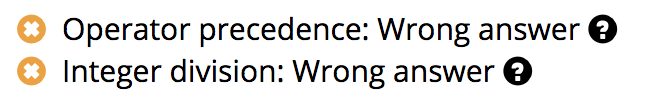
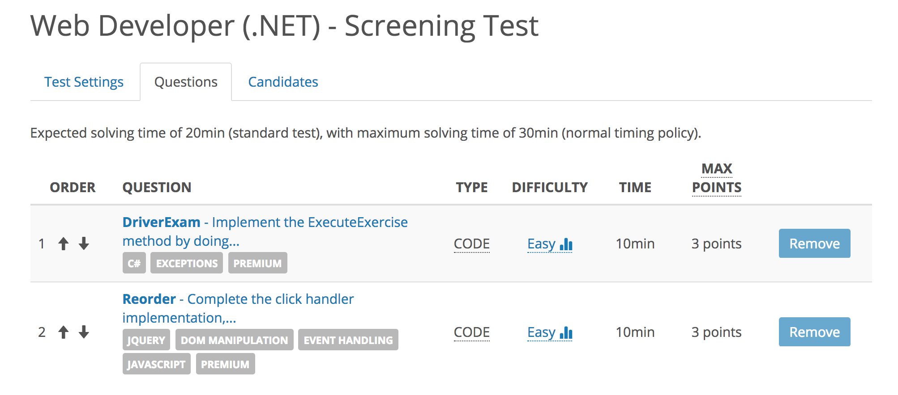
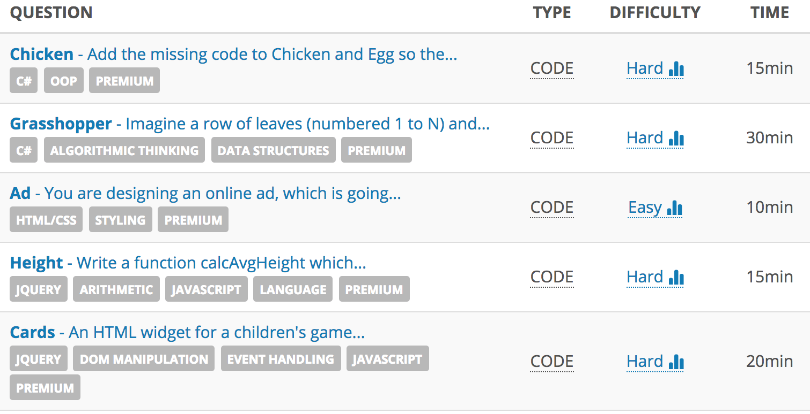
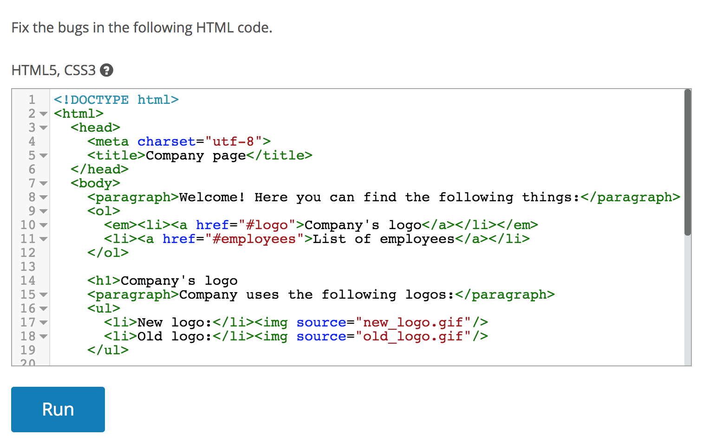
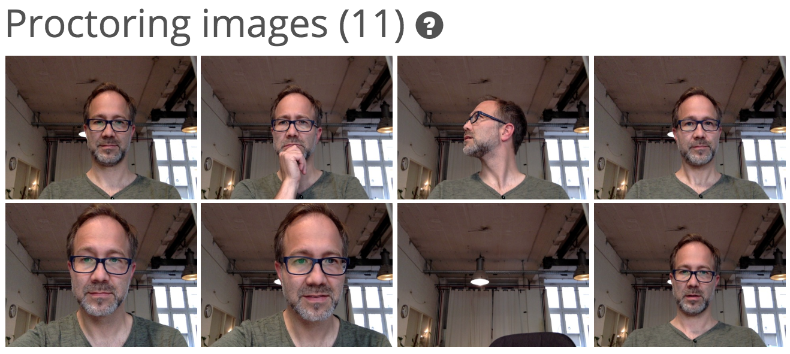

\newpage
BONUS CHAPTER: Screening Software Developers
--------------------------------------------

Since my background is in programmer screening, what follows is a detailed guide for this. Note that this guide is not designed for a general audience because programming differs from other jobs in multiple ways.

First, you will almost always want to hire an already good programmer. Why not hire an average one and then train them up? The problem is that years of experience and training don’t guarantee that somebody will become a great programmer. The large majority of great programmers love programming and have done it from an early age. In that sense, programmers are similar to musicians. Would you ever hire a mediocre 27-year-old musician with the hope that they will improve? Absolutely not—if they were really into music, they would already be great.

Second, since the output of programming is a working program, the testing of programmers can be mostly automated. And, the great thing about automatic testing is that it can find really good outliers. For example, one of the top competitors at the data-science-challenge platform Kaggle.com is a 16-year-old high schooler[^kaggle].

Third, there is a large variety of productivity levels among programmers. We are not sure why, but good programmers can write code that is shorter, more elegant, runs faster, and has fewer bugs, up to ten times quicker[^joel-high-notes]. Most people who apply for a programming job can’t solve even the simplest coding task.

[^kaggle]: Mashable: <https://mashable.com/article/16-year-old-ai-genius>

[^joel-high-notes]: Article: <https://www.joelonsoftware.com/2005/07/25/hitting-the-high-notes/>

This effect has been observed for a long time. Imran Gorky wrote in 2007:

> “I’ve come to discover that people who struggle to code don’t just struggle on big problems, or even smallish problems (i.e., write a implementation of a linked list). They struggle with tiny problems.”[^imranontech] 

He proceeded to develop the famous FizzBuzz question[^fizz-buzz]. Today, I don’t recommend using FizzBuzz, as even programmers who had been living under a rock have heard about this task. But, I can confirm that the effect is real, because we accidentally bumped into a similar question, which is even shorter than FizzBuzz.

[^imranontech]: Blog post: <https://megalodon.jp/2017-0307-0400-10/tickletux.wordpress.com/2007/01/24/using-fizzbuzz-to-find-developers-who-grok-coding/>

[^fizz-buzz]: C2 wiki: <http://wiki.c2.com/?FizzBuzzTest>

Our FizzBuzz was discovered when creating a tutorial for candidates' testing interface. We provided them with a code template and a method that works in some cases. Tutorial asked them to correct two minor bugs in the method. Take a look at our average-method problem:

    Fix the bugs.
    
    …
    public static double Average(int a, int b) {
      return a + b / 2;
    }
    …

Can you find both bugs in the allotted time of five minutes? We didn’t want it to be a trick question, so we also provided reasons why the formula failed:

{width=50%}

These hints make it obvious that operator priority makes the calculation wrong (primary school math), and that an integer divided by another integer results in an integer division (this is the same in C++, Java, or C\#). But, even if a candidate can’t find the bugs with the current code, they could write their own. A good programmer should be able to write an average method in less than 30 seconds.

To our great surprise, a third of people were not able to come up with any of the correct solutions, such as “return (a+b)/2.0;”, or “return (a+b)/2d;” or “return (double)(a+b)/2;” And our FizzBuzz is just three lines of code!

That is why writing simple code should be the first step of your screening process. Some of the people who couldn’t solve this task had nice-looking résumés listing experience in cloud computing, multi-tier architectures, and other buzzwords. Résumé screening would provide completely wrong impression of them.

However, despite all of the reasons presented above, it has taken two decades for the idea of automated programmer testing to catch on. The main reason is the complexity of automated testing. Because of that complexity, you’re unlikely to be developing a testing platform yourself, but using one of the existing platforms, such as Codility, HackerRank, or our company, TestDome. To be honest, exactly which platform you pick is not so important—it’s how you test. Here’s a walkthrough for programmer testing, created using TestDome but replicable on any of the testing platforms. The examples are for a *.NET Web Developer* internal vacancy.

The first test was short, and part of the candidate application process. The key was to focus on just the two or three most important job requirements that can be automatically tested.

For example, our job ad clearly stated that “we require a strong knowledge of C\# and JavaScript.” So, we decided to have two ten-minute questions, one for C\# and another one for JavaScript, see the next figure.

{width=95%}

The first question asked to call a few methods with proper exception handling. The second asked for a method to modify the page after a button click. Both questions were easy, but required candidates to write, at least, some code.

Although the job ad clearly stated the requirements, out of 415 candidates that applied, only 140 were able to solve both questions (a candidate pass rate of 34%). This pass-rate seems low, but it’s typical for both us and users of our testing platform.

It is only after the screening test that we proceed to résumé screening. We had predetermined criteria for what we search for. As I explained in [*Chapter 6: Screening Résumés*](#screening-résumés), this reduces our biases, improves prediction, and saves time.

After we had a smaller pool of candidates, we patted them on the back, saying that we like their résumé and that their score on the screening test was good. But, since we had many more candidates, we needed another test. We divided necessary coding skills into discrete tasks, using short questions on specific topics. Take a look at our test in the next figure.

{width=95%}

A few things about how the testing was organized:

-   The test was 90-minutes long, which still took up less of a candidate’s time than coming in for an interview.

-   The C\# skills were tested in two distinct areas: object-oriented programming (OOP), and algorithms and data structures. The OOP question asked to implement a fictive *IBird* interface, while the algorithm question asked to calculate where a grasshopper would be after N steps.

-   The CSS skill was tested with the *Ad* question, which asked to style a specific &lt;div&gt; element.

-   The JavaScript skill was also tested in two distinct areas—processing data in JavaScript (*Height* question) and using JavaScript to manipulate the HTML DOM (*Cards* question).

-   All questions were automatically scored.

When we used this test, we set the minimum pass score to 78%. This allowed a candidate to flop one question and still be invited for an interview. In the end, only 20% of invited candidates passed (28 of the 140 that made it to this round).

The next step was conducting Skype interviews with candidates, recorded and reviewed by another coworker. We covered this step in detail in [*Chapter 6: Structured Interviews*](#structured-interviews). We ended up hiring a candidate who didn’t have the top test score, but scored highly in the interview. As I wrote before, technical expertise is just one factor, but it is the easiest and cheapest to test.

### How Testing Platforms Work

If you want to implement your own testing platform, or are interested in how testing platforms work, here is a detailed breakdown.

Let’s start with automated checking of answers. How is that implemented? There are two standard ways:

-   *Text input and output*. The candidate writes a program that reads standard input and writes to standard output. Text output is compared to the correct output. This works in the same way for all programming languages, so test cases can be language-agnostic.

-   *Unit testing.* The candidate needs to perform just the task (e.g., fixing a bug), and doesn’t need to write code for reading input and output. The solution is tested using a unit testing framework, specific for each language.

Most testing platforms use the text input and output approach, but we opted to use unit tests. It’s easier for candidates and allows us to test many more things. Because we have HTML/CSS unit tests running in headless Chrome[^headless-chrome], we can ask such questions as the one in the next figure.

[^headless-chrome]: Google: <https://developers.google.com/web/updates/2017/04/headless-chrome>

{width=95%}

In addition to simply testing if a program’s output is valid, we can also test algorithmic complexity, performance, and memory consumption.

*Algorithmic complexity* is denoted with *Big O[^big-o]*. O(1) means that the program is guaranteed to run in constant time. O(N) means the maximum program running time is proportional to length N of input. There is also logarithm complexity O(log N), quadratic complexity O(N^2^), and many others[^common-o]. The lower the complexity, the better. Determining exact O requires manual examination, but there is a hack. Testing platforms measure complexity indirectly, by measuring performance. Here are the steps:

1.  Limit the maximum running time of a program, e.g., 2 seconds.

2.  Code a solution that has the lowest possible O.

3.  Increase N (size of input) until your optimal solution runs within a given running limit, e.g., 1.6 seconds.

4.  Candidate solutions that are not optimal will exceed the maximum running time for N, and, thus, fail the test.

In other words, it is easer to test if the answer has the optimal O or not, then to find exact O. An example is our Binary Search Tree[^binary-search], where one third of the points are given for performance.

[^big-o]: Wikipedia: <https://rob-bell.net/2009/06/a-beginners-guide-to-big-o-notation/>

[^common-o]: Wikipedia: <https://en.wikipedia.org/wiki/Big_O_notation#Orders_of_common_functions>

[^binary-search]: TestDome: <https://www.testdome.com/questions/c-sharp/binary-search-tree/12976>

*Memory consumption* can be measured in the same way. If we limit memory consumption of a candidate’s code to 12 MB, and we know that the optimal solution takes 10 MB, then candidate solutions which take more than 20% of optimal memory will fail.

There are other aspects of programming that would be nice to check, but are unfortunately a bit subjective.

*Code length* should be as short as possible, while maintaining readability. Two common measures people use are lines of code (LOC[^loc]) and byte length of code. They are both simple, but problematic. The LOC measure gives an advantage to programmers who put multiple statements in the same line, which decreases readability. Similarly, byte length of source code gives an advantage to programmers who name variables “a” instead of “average”, which is bad practice. If you want to compare the code length of two solutions, there is a better way: compare the sizes of zipped[^gzip] source code instead. In a ZIP file, repeating patterns of whitespace are compressed, and repeating the variable name “average” doesn’t take much more space then “a.” The popular Computer Language Benchmarks Game uses this measure[^benchmarksgame].

[^loc]: Wikipedia: <https://en.wikipedia.org/wiki/Source_lines_of_code>

[^gzip]: Wikipedia: <https://en.wikipedia.org/wiki/Gzip>

[^benchmarksgame]: Benchmarks Game: <https://benchmarksgame-team.pages.debian.net/benchmarksgame/how-programs-are-measured.html#source-code>

*Readability* of code is hard to judge. For example, functional code or code that uses a certain design pattern will be hard to read for some, but completely readable to others. Still, checking readability of code makes sense, because people in the company need to be able to read the code employees produce.

Our system automatically scores program validity, performance, and memory consumption. We believe that these are the most important—a program which works is better than a shorter/more readable program which doesn’t work. 

There is one more thing companies use to score candidates: real-time coding. Personally, I don’t know why watching someone code would give better insights than merely seeing the end result. In the case of a whiteboard interview, candidates who talk a lot often appear smarter than quiet candidates. In the case of an online test, a candidate who doesn’t code anything in the first five minutes (while thinking about the problem) would appear worse than a candidate who writes some partially correct code in the same time. 

Now, we need to address one common concern regarding online tests—the fear that candidates will cheat. This cheating comes in two forms.

*Finding answers online.* A valid concern, if you are a testing company or test thousands of people with the same questions. If you test less than that, don’t worry; it takes time for questions to leak. The majority of candidates will not share questions online because of the fear that they are going to be identified and sued. As we are a testing company, it is a concern for us. After we had more than 500 paying customers, some candidates started posting our questions online. We combated this with automated leaking detection. A script periodically queries Google for unique parts of our questions. If leaked, we get a notification. You can do the same for your questions by setting automated Google Alerts[^alerts].

[^alerts]: Google Alerts: <https://www.google.com/alerts>

*Another person taking the test.* This happens rarely with individual candidates. However, a few years ago, we tried to use oDesk (now Upwork) to find developers for low-level tasks. We were impressed with the quality of the candidates who applied, only to discover later that they had no intention of doing the work. After passing the screening process, they delegated the work to an inexperienced person, while the expert would be busy applying for further jobs to outsource. Having such an “interview expert” is a common tactic for outsourcing agencies in developing countries.

A way to combat this is to verify identity using a computer’s webcam. There are three types of such online proctoring: live, record-and-review, and automated[^proctoring]. We use record-and-review proctoring, where pictures of a candidate are taken periodically (see the next figure).

[^proctoring]: Wikipedia: <https://en.wikipedia.org/wiki/Proctor#Online_Proctoring>

{width=95%}

### Conclusion

For HR departments the easiest way to hire is to have the same process for every applicant, and to not have separate tools for developers, students, salespeople, etc. But if you screen developers like every other employee, you are wasting your time and not getting the best talent. Programmer screening is quite advanced and there are 20 years of experience in using better tools than a phone or a whiteboard. Live coding, automated checking of correctness and memory consumption, coding replay, code analysis, and online proctoring are all available on various platforms where you can even enter your own custom questions. And let’s not forget that such testing is asynchronous, meaning candidates can take it whenever works best for their schedule and avoid traveling to your office.

In conclusion, setting up a developer screening process takes an upfront effort, but in the end pays out for both you and the candidates.

