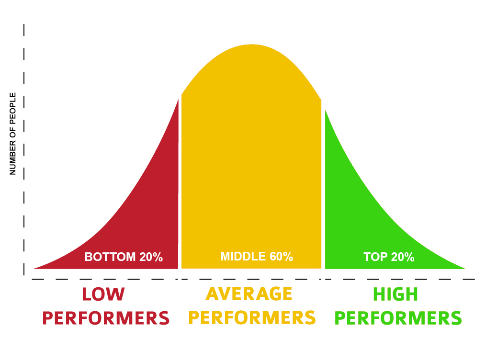

\newpage
CHAPTER 1: The Failure of Traditional Employment Screening
----------------------------------------------------------

The traditional hiring process is broken. It’s a throwback to an industrial era hundreds of years ago, when we didn’t have employment science and relied on our hunches instead of data. If you’re reading this book, you probably feel the same way.

Together, we’re going to change this! Hiring can be made more accurate while requiring less time, resources, and frustration from both employers and candidates. It can be made more transparent, objective, and, perhaps sometimes, even enjoyable. 

### My First Hire

Many of us make the same mistakes when first hiring. I remember posting my first job ad: I was proud, as it was a sign that my little company was becoming serious. Customers were loving my product and I needed a software developer to help me out. It was obviously going to be the first hire of the many thousands that would follow, putting me on a path to me becoming the new Steve Jobs.

I had carefully crafted a job ad, put a paid listing on a local job site, and went to sleep. The next morning, I jumped out of bed in excitement, skipping across to my computer pumped to see how many hundreds of the world’s most talented people had applied for my job. I did find résumés, not hundreds but several from competent-looking candidates and experts in multiple domains—databases to front-end, XML to algorithms. They had more experience than me, and they’d worked on cool projects at previous companies. I started to expand my future company vision. Was I thinking too small? Maybe I could also do a hostile takeover of Microsoft and Amazon?

As I had more than 20 applicants, I screened the top five résumés. “I will hire only the best,” I said to myself, whilst stroking my beard contemplatively. I invited those five for an interview at the company “headquarters” (my apartment on the fourth floor of an old building, without an elevator).

If you have ever done a job interview for your company, you probably know that it feels like a first date. There’s the nerves, the desire to impress, and a looming sense of the possibility that should things go well. Too nervous to sit down, I kept myself busy vacuuming one last time---the headquarters was spotless.

The first candidate arrived and I sat him down with a glass of orange juice. We talked about his résumé and work experience. I explained what the job was, he confirmed that he was a very good fit for it. *Great.* We began talking about IT in general. I enjoyed the conversation, so I didn’t want to derail it by asking questions that may break the rapport that we were developing. At the same time, a nagging voice in my head told me that I needed to test the candidate, not just chat with him.

After 45 minutes of chit-chat, I finally got the courage to ask the candidate if we could do some specific screening questions and he agreed. This is an awkward moment in any interview, as you switch from a friendly conversation, to an examination with you as the professor. I began with questions related to the programming framework that the job required. To my surprise, he clammed up, struggling to answer even half the questions adequately. The interview swerved off the rails, crashing into a ravine of my misplaced optimism and his bad bluffing. He was not qualified for this job. 

I should have ended the interview then. Somehow, I couldn’t. Fifteen minutes later, I walked him out promising to “let him know if I was interested.” Disappointed, I returned to HQ’s boardroom (my kitchen table). *What a disaster. We’d had such a nice chat in the beginning, too.*

The next day, another candidate came to interview. I was more confident this time, and shortened the chit-chat to a mere thirty minutes. When I started asking prepared screening questions, his answers were mostly okay. It wasn’t clear if he didn’t understand some things, or merely had trouble expressing them. He agreed that I could send him a short coding test of basic programming skills. To my surprise, the candidate’s solutions were completely wrong and written in awful, amateurish code.

At least he tried to solve the test, though. The third candidate simply replied that he didn’t know how to solve the tasks. The fourth candidate failed the basic screening questions so badly that I didn’t even need to test him.

Just before the fifth candidate’s interview, he wrote that he was no longer interested in the job. I sat in my freshly vacuumed headquarters, looking out the window and thinking about what the hell was wrong with me. Why was I selecting the wrong candidates? I’d picked five from twenty, and they’d all been absolutely wrong for the position. Was I just bad at noticing red flags in résumés? How would I ever build a company? There had to be a better way to do this...

### The Bell Curve 

When I look back at those days, a decade ago, I can’t help but break out into a smile. My simple mistakes are funny in retrospect, because most first-time interviewers make them. My biggest mistake was not understanding the hiring bell curve.

While it is nice to think that everybody's performance is the same, it isn’t. If you recall math classes in school, probably 20% of people were good at math, 60% got by, and 20% couldn’t solve math problems without help. This distribution is so common in nature that it is called a normal distribution[^norm-dist] (also referred to as a bell curve), see the next figure.

[^norm-dist]: Wikipedia: <https://en.wikipedia.org/wiki/Normal_distribution>

{width=95%}

This distribution is used as a basis for scoring in every school, country, and *domain of knowledge*. While you would think that everybody who finishes medicine or physics is equally good, as those professions attract top performers, when you plot results of medicine or physics students, you also get the bell curve. Yes, they know much more about medicine or physics than the average person, but, *inside the domain*, there are still enormous differences between top and low performers.

Probably, you feel this about your profession too. When I ask my friends who finished medicine, law, or architecture, none of them have ever said, “Oh, all of us who finished school *X* are equally good.” If all professionals in a domain look equally good to me, it’s a sure sign that I don’t understand this area very well.

Even worse, the bell curve becomes more selective as we move to knowledge-worker professions (lawyers, accountants, managers, programmers, scientists, etc.), as opposed to physical professions. A great dock worker might be able to unload double the cargo of a bad worker, but they can’t be five times better, because his performance is limited—he’s still stuck with the same two arms and two legs as everyone else. However, for knowledge workers, their domain is their brain, and within their brain is their particular combination of knowledge, competence, motivation, and intellect. Have them apply this to tasks where there are hundreds of possible solutions, you will see the difference between individuals that can be several orders of magnitude. The best programmer might have the usable output of ten average hack coders. Lock one hundred physics graduates into a room for a year, and they won’t have achieved the output of a single Richard Feynman. It’s not fair that achievements are not distributed evenly among people or that we’re not all equal. But, this inequality is a reality that academia and businesses must accept.

When hiring knowledge workers, the goal is always to hire from the top 10%. Unfortunately, the best performers usually have good jobs already. They will rarely search for a new position and are probably tapped up for new jobs all the time. It’s often the case that they don’t even have a résumé, they’ve simply never needed one. Bad performers, however, will have plenty of time on the job market applying for jobs and perfecting their résumés. So, when you publicly post a job ad, most of the applicants will be bad performers. It’s just math. If a great performer finds a job in a month, while a bad performer takes five month, the bad performer will likely apply to five times as many jobs. In that simplified case, to hire someone in the top 10%, you’d need to hire just 1-in-50 applicants!

### “We Hire Only the Best” 

Why does all this matter? Because of the *top 10% fallacy*:

> The majority of companies say that they only hire the top 10% of talent. But, if that was the case, then 90% of people in any profession would be unemployed.

Math tells us that most employed workers must have an average performance, by definition. The logical conclusion is that most companies are fooling themselves. Realizing this can make you a little paranoid. If you interview a candidate and they come out as knowledgeable and a hard worker, why weren’t they hired by the rival companies that also interviewed them? Why did their previous employer let them go rather than offering them a pay raise to stay? Hiring is a case of asymmetric information—the candidate and their previous employers have much more information than you can extract in a one-hour interview.

I did eventually get better at hiring, although it took a lot of effort and testing. Several times, I’d proudly implement a new hiring process that I was sure would find a ten-percenter. Then, I’d attend a professional conference where, in the break, we’d start talking about our hiring procedures. “We filter out 80% of people based on the résumé,” one said, and everybody nodded in agreement. “But, then, a phone call with a candidate, with a few quick questions, will eliminate another 50%,” said someone else, to another round of nods. “The onsite interview is the most important part,” the conversation continued, “we spend more than 90 minutes discussing previous jobs, education, and motivation and asking specific questions that prove their knowledge. This is how you hire the top talent.” We did a bit more nodding. I was terrified. If we were *all* doing *exactly* the same thing, then none of us would get the top talent.

There is a joke about two people running away from a bear. One person asks the other, “Why are we running? The bear is faster than both of us!” His running partner replies, “Well, I don’t need to be faster than the bear. I just need to be faster than *you*!” A similar approach applies to hiring. Illustratively speaking, if you want to hire the top 10%, then you need to have a better hiring procedure than *nine* other companies.

Hiring doesn’t get easier if you work in a big company—quite the contrary. If you have a great brand and you can hire people from all over the world, then you will have an insane number of applicants. In 2014, 3 million people applied to Google[^google-chance], and only 1-in-428 of them were hired. There is no way to screen a population which is the size of Mongolia without resorting to some type of automated screening. But, Google is still a small company. If Walmart had a 1-in-100 selection criteria, they would need to screen the entire working population of the US and still find themselves 25 million people short[^largest-employers]. Before I had experience in hiring, I would often get angry with incompetent customer support representatives, delivery staff, or salespeople. How could a company hire them when they’re so incompetent? Now, I know better. I imagine myself being a head of a department hiring 500 people in a new city—for a below-average salary. Large enterprises hire on such a massive scale that they’re more focused on screening out the bottom 20% than chasing the hallowed top ten on the illusive far right of the bell curve.

[^google-chance]: Quartz article: <https://qz.com/285001/heres-why-you-only-have-a-0-2-chance-of-getting-hired-at-google/>

[^largest-employers]: Wikipedia: <https://en.wikipedia.org/wiki/List_of_largest_United_States-based_employers_globally>

This might sound like a bad thing, but it’s not, as it means a large majority of society can find employment. Hiring knowledge workers is not hiring on a massive scale. You can screen for the best and give them better benefits than the competition. A great employee that delivers twice as much is well worth a 50% higher salary.

### How Can We Fix Employment Screening?

For all the reasons discussed, the average hiring process just doesn’t cut it. The following chapters will teach you a new method called *Evidence-Based Hiring*. You will learn:

-   The common errors that people make when screening candidates.

-   Ways to overcome our biases.

-   The scientifically valid methods of screening.

-   How to automate much of your screening process.

-   The optimum position for a specific screening method in the hiring pipeline.

-   How to best communicate with candidates during the process.

-   The types of questions that you should ask to screen high-calibre candidates.

-   How to structure interviews.

-   How to measure the efficiency of your entire hiring process.

This book is focused specifically on everything which happens from the moment that you receive an application to the moment that you hire a candidate. So, out of this book’s scope are:

-   *Sourcing* applications: where to put your ads to find potential applicants.

-   *Employee branding*: whether you should offer bean bags, fruit baskets, and other creative ways to improve the public perception of your company.

-   *Training and development*: how to keep employees skilled, happy, and motivated.

