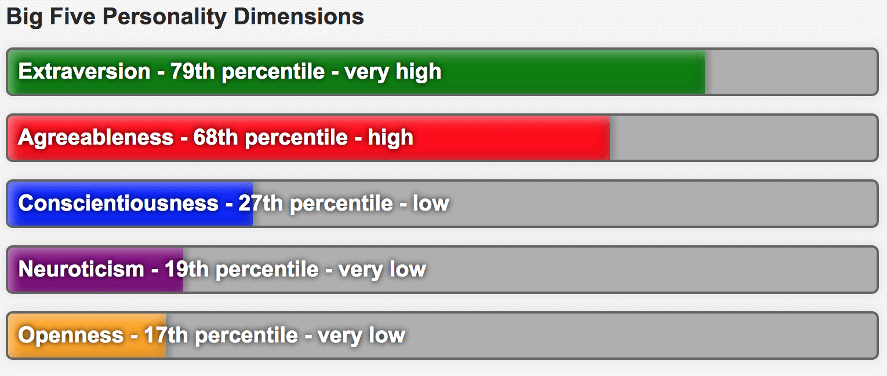
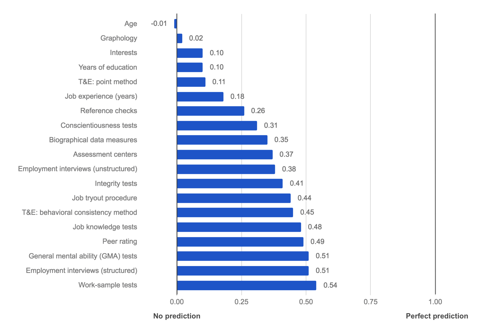

\newpage
CHAPTER 3: Not All Methods Are Equal
------------------------------------

Since we’re all biased and we use incorrect proxies, why not just outsource hiring to experts or recruitment agencies? After all, they’ve been screening people for many years, so they must know how to do it right?

Not really. I was surprised to discover that many experts disagree with each other. Everybody praises their pet method and criticizes the others. Many of these methods look legitimate, but are based on fake science.

### Hiring Science Gone Wrong

Fake science looks similar to real science, with impressive-looking studies, charts, and numbers—until you dig deeper into what those numbers actually represent.

For example, let's look at popular personality tests. HR departments love personality tests, because they are universal—they need just one test for all candidates.

Many companies claim that their personality test has high *statistical reliability*[^reliability] (when a candidate repeats the test they get a similar result). That doesn’t mean a thing. A person's height has a high “reliability” because it doesn’t change from day to day. That doesn’t mean it is good for hiring—well, unless you’re hiring a basketball player.

It’s the same when companies claim high *face validity* (the candidate agrees that the results accurately represent them). Horoscopes have high face validity[^barnum-effect], but we wouldn’t think of only hiring Libras because they are supposedly curious and outgoing.

One of the oldest personality profiling system is Myers–Briggs. According to The Myers-Briggs Company, "88% of Fortune 500 companies use it in hiring and training"[^fortune-500]. Myers–Briggs sorts people into 16 archetypes[^16personalities] that have fancy names, like “Architect” and “Commander.” More than 20 studies concluded that Myers-Briggs doesn’t work[^personality-popular]. Myers-Briggs Type Indicator (MBTI) is not even reliable, as 50% of people get a different Myers-Briggs archetype on repeated testing[^measuring-mbti]. Forbes concluded that, “MBTI is so popular because it provides the illusion of solution[^mysterious-popularity].” The New York Times called Myers-Briggs “totally useless” and concludes that it is popular because people like to put themselves and others into categories[^mb-useless].

[^reliability]: Wikipedia: <https://en.wikipedia.org/wiki/Reliability_(statistics)>
[^barnum-effect]: Wikipedia: <https://en.wikipedia.org/wiki/Barnum_effect>
[^fortune-500]: The Myers-Briggs Company: <https://www.themyersbriggs.com/en-US/Products%20and%20Services/Myers-Briggs>
[^16personalities]: 16personalities: <https://www.16personalities.com/personality-types>
[^personality-popular]: Psychometric Success: <http://www.psychometric-success.com/personality-tests/personality-tests-popular-tests.htm>
[^measuring-mbti]: Article: <http://www.indiana.edu/~jobtalk/Articles/develop/mbti.pdf>
[^mysterious-popularity]: Article: <https://www.forbes.com/sites/toddessig/2014/09/29/the-mysterious-popularity-of-the-meaningless-myers-briggs-mbti/>
[^mb-useless]: Article: <https://op-talk.blogs.nytimes.com/2014/07/18/why-myers-briggs-is-totally-useless-but-wildly-popular/>

Another popular assessment is DiSC[^disc] (Dominance, Influence, Steadiness, and Conscientiousness). DiSC results are not normalized[^ipsative], meaning that you can’t compare different people with it. Some assessment vendors, like People Success, claim that DiSC “has a validity rate of between 88% and 91%”[^people-success]. Validity around 0.9 would be a spectacular result for any pre-employment method, on par with a crystal ball. But, the vendor failed to mention that it was just face validity[^disc-analysis].

Generally, modern psychology has debunked the idea that people fall into certain “types.” Personality traits come in a spectrum—for example, people are distributed on a scale from introversion to extroversion. Traits are not binary. And, the traits that people actually have are *not* the ones claimed by Myers-Briggs or DiSC.

A personality test that *is* scientifically proven is the Big Five[^big-five], which measures openness, conscientiousness, extraversion, agreeableness, and neuroticism. The Big Five doesn’t classify people as a certain “type”, merely offers percentage scores for each trait, see the next figure.

{width=95%}

While scientific, the Big Five still gives weak predictions. A paper by Morgeson et al.[^morgeson] summarizes multiple studies and concludes that only one of its variables (conscientiousness) is worth looking at, and even that is weakly correlated.

[^disc]: RMi: <https://www.rmiexecutivesearch.com/disc-assessment>

[^ipsative]: Wikipedia: <https://en.wikipedia.org/wiki/Ipsative>

[^people-success]: People Success: <https://web.archive.org/web/20210802000354/http://www.peoplesuccess.co.uk/behavioural-style/validity/>

[^disc-analysis]: Presentation: <https://tinyurl.com/y7ubrkq7>

[^big-five]: Wikipedia: <https://en.wikipedia.org/wiki/Big_Five_personality_traits>

[^morgeson]: Morgeson et al. (2007): <https://pdfs.semanticscholar.org/0fc2/97c288263c1a4d0e1e1119668563274d242e.pdf>

### The Ultimate Measure: Predictive Validity

The only statistical measure that we should look for is *predictive validity*[^predictive-validity]. This is different to face validity and reliability because it actually measures how well the candidate did at their job *after* being hired.

Predictive validity is very hard to calculate. One would need to follow up a few years after the hire to correlate actual job performance with the original screening scores. Fortunately, there's research that shows which screening methods have high predictive validity. Schmid and Hunter[^schmid-hunter] did a meta-analysis of thousands of studies and compared different screening methods. Their conclusions are in the next figure.

[^predictive-validity]: Wikipedia: <https://en.wikipedia.org/wiki/Predictive_validity>

[^schmid-hunter]: Schmid and Hunter (1998): <https://web.archive.org/web/20190109161650/https://citeseerx.ist.psu.edu/viewdoc/download?doi=10.1.1.172.1733&rep=rep1&type=pdf>

{width=95%}

Predictive validity is a range from -1.0 (negative correlation) to 1.0 (positive correlation). The higher the number, the more often we were right about whether someone was a good hire. A screening method with a 1.0 predictive validity would find a great hire every time.

Now, let's go through the rankings, from worst to best.

### Low Validity Methods

These methods definitely shouldn’t be used, because they have validity below 0.2 and, so, are about as good as asking Mystic Mahjoob, the local fortune teller: 

Method                                  | Validity  | Description     
:-----------                            | ----:     | :---------------------------
Age                                     | -0.01     | Candidate age has non-existent validity, so companies that discriminate against candidates that are “too young” or “too old” should stop doing so—not only because it’s illegal in most countries, but it’s also just plain invalid.
Graphology                              | 0.02      | Analysis of a candidate’s handwriting is advertised as a way to detect their personality. It’s popular in Western Europe, especially in France where 70-80% of companies still use it[^bbc-graphology] (no, I’m not making this up). This is surprising, since it has no validity and even the graphology wiki page[^wiki-graphology] states it is a pseudoscience.
Interests                               | 0.10      | Interests are a common part of a résumé that you can safely ignore, as they have very low validity.
Years of education                      | 0.10      | Surprisingly, requiring more education for a job has very little validity. In other words, slapping a PhD requirement on a job that could be done by an engineer with just a bachelor’s degree doesn’t significantly improve the quality of your hires.
Training and experience: point method   | 0.11      | This method gives points for candidate’s training, education, and experience, multiplied by the length of time in that activity[^ipac-point]. It can be calculated manually from a résumé or automatically from the application form. Point scoring is popular in government hiring, but, today, even government websites point out that it “does not relate well to performance on the job.”[^gov-point]
Job experience (years)                  | 0.18      | Years of experience in the job correlates only slightly with the job performance, and, thus, should not be used. It’s often a deciding factor since it’s easy to determine from a candidate's résumé and, somehow, feels, intuitively, like it should be valid—it isn’t.

[^bbc-graphology]: BBC article: <http://www.bbc.com/capital/story/20171025-the-peculiar-psychoanalysis-of-job-hiring>

[^wiki-graphology]: Wikipedia: <https://en.wikipedia.org/wiki/Graphology>

[^ipac-point]: IPAC presentation: <http://www.ipacweb.org/Resources/Documents/conf13/white.pdf>

[^gov-point]: Section from OPM.gov: <https://tldrify.com/pgu>

### Medium Validity Methods

The methods below have validity between 0.2 and 0.45 and can be used in addition to high validity methods:

Method                                  | Validity  | Description     
:---------------                        | ----:     | :------------------------ 
Reference checks                        | 0.26      | Contacting previous employers is a valid method, as past performance predicts future performance. Unfortunately, it is often not possible for a current job, as previous employers are usually reluctant to share that information and it is illegal in some countries.
Conscientiousness tests                 | 0.31      | Conscientiousness is a measure of a specific personality trait and can be asked during an interview. It highlights candidates with a high level of self-discipline.
  Biographical data measures            | 0.35      | Many life experiences (such as school, parenting style, hobbies, sports, membership in various organizations, etc.) are scored based on *statistical data from past hires*. Quite hard to develop, but easy to use thereafter. Note that sex, age, and marital status are illegal to use.
  Assessment centers                    | 0.37      | Assessment centers use a variety of methods, including personality and aptitude tests, interviews, and group exercises. They are popular with companies, which is unfortunate because their validity is low for such a time-intensive, multi-method approach.
  Employment interviews (unstructured)  | 0.38      | A normal interview where there is no fixed set of questions. It is enjoyable for both a candidate and an interviewer, as it feels like a friendly chat, but doesn’t have the validity of a more structured interview.
  Integrity tests                       | 0.41      | These tests can either ask candidates directly about their honesty, criminal history, drug use, or personal integrity, or draw conclusions from a psychological test. Again, conscientiousness is the most important personality trait.
  Job tryout procedure                  | 0.44      | Candidates are hired with minimal screening and their job performance is monitored for the next three to six months. This method has reasonable validity, but it is very costly to implement.
  Training and experience: behavioral consistency method | 0.45 | First, companies identify Knowledge, Skills and Abilities (KSA[^ksa]) that separate high performers from low. Candidates are then asked to give past achievements for each KSA. Responses are scored based on a rating scale.

[^ksa]: Wikipedia: <https://en.wikipedia.org/wiki/Knowledge,_Skills,_and_Abilities>

### High Validity Methods

Only five methods have a validity above 0.45:

Method                                  | Validity  | Description     
:-----------                            | ----:     | :---------------------------
Job knowledge tests                     | 0.48      | Question the specific professional knowledge required for the job. This method has high validity, but can pose a problem when screening junior candidates who require training.
Peer rating                             | 0.49      | Asking coworkers to evaluate a candidate’s performance and averaging the results is surprisingly valid. People inside a company have a better insight of each other’s abilities. A good method for in-company promotion or reassignment, but not for hiring outside employees.
General mental ability (GMA) tests      | 0.51      | GMA tests measure the ability of a candidate to solve generic problems, such as numerical reasoning, verbal reasoning, or problem solving. They don’t guarantee that a candidate has the required skills, just the mental capability to develop them if trained. Note that brainteasers like “how would you move mount Fuji?” are too vague and subjective for a GMA test.
Employment interviews (structured)      | 0.51      | The same interviewer asks different candidates identical questions, in the same order, writes down the answers (or, even better, records the entire session), and gives marks to each answer. This way, different candidates can be transparently compared using the same criteria.
Work-sample tests                       | 0.54      | To test if a candidate will be good at work, give them a *sample of actual work to do*. A simple and very effective idea.

As these methods have the highest validity, they should be the core of our Evidence-Based Hiring process, and, so, logically, they’re what we will focus on in the rest of this book.

### The Multiple Methods Approach

Based on the above research, we can conclude that:

> No single method of screening has high enough validity to be used exclusively, so it is necessary to combine multiple methods. 

There simply is no silver bullet for hiring. No simple signals that you can detect in a résumé and decide if a candidate is going to be a star hire. However, we do now know what methods to combine to get the highest validity for the least time, effort, and cost; work-sample tests, knowledge tests, GMA, and structured interviews.

