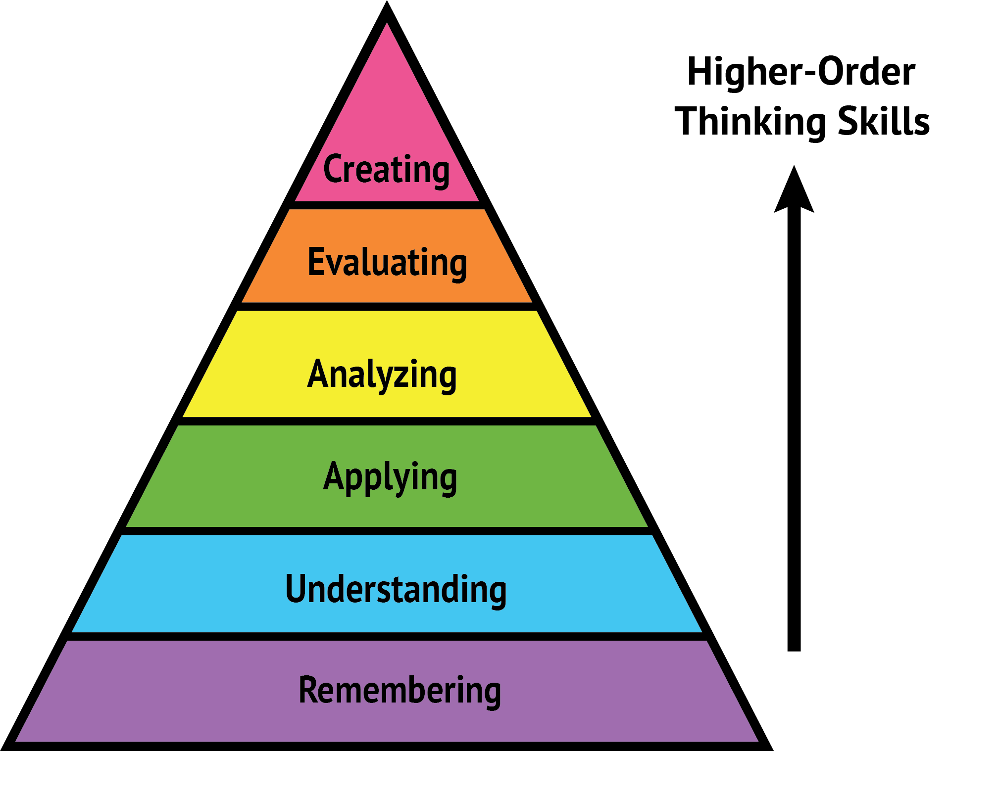
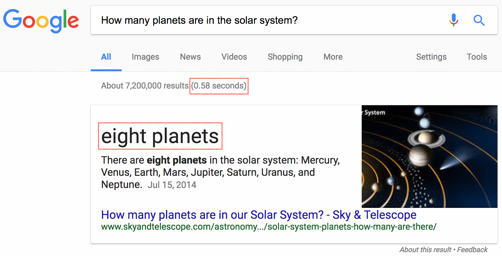
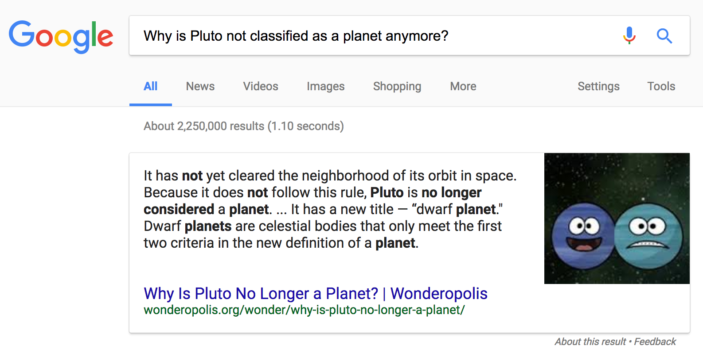

\newpage
CHAPTER 5: Maximizing the Reward: How to Ask Good Questions?
------------------------------------------------------------

The general rule for screening questions in both tests and interviews is simple, but very powerful once you’ve wrapped your head around it:

> Only ask a question if it can eliminate the candidate in the current screening round.

After all, if it can’t provide actionable evidence, why should you waste time on it? Of course, you can always ask questions like, “What are your hobbies?” but, if one candidate answers “football” and the other “sailing,” what can you do with that information? How does it inform your hiring decision? Are you going to reject the candidate who prefers football? Interviewers often say that such questions help provide a “complete picture” of a candidate, but previous chapters have explained why that’s nothing more than a back door for bias.

It’s the same with easy questions, asking a qualified accountant the difference between accounts payable and receivable won’t provide any actionable information. Of course, in addition to being eliminatory and moderately hard, a question also needs to have predictive validity. We don’t want to eliminate 90% of candidates for being right-handed, no matter how good our last left-handed employee was.

### Great Questions Cheat Sheet: Bloom’s Taxonomy

Fortunately, there’s one high-level concept that you can learn in 15 minutes, which will make you much better at asking elimination questions.

In every domain, there are different levels of knowledge. Memorizing the formula E=mc^2^ shows some knowledge but doesn’t make you a physicist—that might require applying E=mc^2^ to a specific, related, problem.

The American psychologist Benjamin Bloom categorized these different levels of knowledge into hierarchy we now call Bloom’s Taxonomy[^blooms-taxonomy], see the next figure.

[^blooms-taxonomy]: Wikipedia: <https://en.wikipedia.org/wiki/Bloom%27s_taxonomy>

{width=95%}

At the bottom of the pyramid are lower-order thinking skills; *remembering*, *understanding,* and *applying*. At the top of the pyramid are higher-order thinking skills; *analyzing*, *evaluating,* and *creating*. Creating is the hardest skill for any profession and the smallest number of candidates can do it.

For example, here is how Bloom’s taxonomy is applied to testing foreign-language proficiency:

-   **Remembering**: recall a word in a foreign language.

-   **Understanding**: understand text or audio.

-   **Applying**: use a language to compose an email or to converse with people.

-   **Analyzing**: analyze a piece of literature.

-   **Evaluating**: discuss which book has better literary value.

-   **Creating**: write a poem, essay, or fictional story.

Bloom’s taxonomy is an important tool for your screening because:

> The higher the question in the hierarchy, the more domain knowledge the candidate needs to demonstrate.

However, not all tasks require higher-tier knowledge. For example, if you are hiring a Spanish-speaking customer support representative, you need someone who *applies* the language (level 3). So, while it might seem better to have a candidate who can also *create* poetry in Spanish (level 6), we need to consider if they will get bored doing a job below their knowledge level. Therefore:

> The elimination questions that we ask should match the skill level required for the job. 

If the test is too low in the hierarchy, then it is easier for both the administrator and the test taker—but it completely loses its purpose. Unfortunately, both job screening and academic tests often get this wrong. In education, schools want most of their students to pass. Often rote memorization is all you need. But, the fact that you’ve memorized which year Napoleon was born doesn’t make you a good historian—doing original research does.

Let's see examples of automated questions for every level of Bloom’s taxonomy, and how to automate scoring for each step.

### Level 1: Remembering

Let’s suppose you are hiring an astronomer. You could test basic knowledge with the following question:

How many planets are in the solar system?

-   7

-   **8 (correct)**

-   9

-   10

-   11

This is often called a trivia question—recalling bits of information, often of little importance. In my modest opinion, using such questions in screening should be banned by law. Why?

First, trivia questions test *simple memorization*, which is not an essential skill for 21st century jobs.

Second, since memorization is easy, test creators often try to make it harder by adding *hidden twists*. The hidden twist in the question above is that there were nine planets until 2006, when Pluto was demoted to a dwarf planet. A person who knows astronomy, but was on holiday when news of Pluto’s dismissal was going around, would fail this question. On the other hand, a person who knows nothing about astronomy but just happened to be reading a newspaper that day, back in 2006, would answer correctly.

Third, trivia questions are *trivial to cheat*. If you copy-paste the exact question text into Google, you will get an answer in less than a second, see the next figure.

{width=95%}

This is not only a problem for online tests: it’s also trivial to cheat in a supervised classroom setting. All you need is a smartphone in a bag, a mini Bluetooth earphone bud[^bluetooth-earbud], and a little bit of hair to cover your ear. It doesn’t take a master spy. How can you know if a student is just repeating a question to themself or talking to Google Assistant?

[^bluetooth-earbud]: Bluetooth Earbud on Amazon: <http://a.co/fxz9Wbm>

For some reason, many employers and even some big testing companies love online tests with trivia questions, such as “What is X?” They think having copy-paste protection and a time limit will prevent cheating. In my experience, they merely test how fast a candidate can switch to another tab and retype the question into Google.

Which brings us to the last problem which results from badly formulated trivia questions: *candidate perception*. If you ask silly questions, you shouldn’t be surprised if the candidate thinks your company is not worth their time. 

### Level 2: Understanding

How can you improve the Pluto question? You could reframe it to require *understanding*, not *remembering*. For example, this is better:

> Why is Pluto no longer classified as a planet?

-   It is too small.

-   It is too far away.

-   **It doesn’t dominate its neighborhood. (correct)**

-   We have discovered many larger objects beyond it.

All the options offered are technically correct: Pluto is small, far, and astronomers have discovered many large objects beyond it. But, that is not the reason for its reclassification. You would need to understand that astronomers must agree on three criteria for a planet, and Pluto doesn’t satisfy the third one—dominating its neighborhood.

However, just like level-1 questions, even a rephrased formulation above can be solved with a quick Google search, see the next figure.

{width=95%}

A smart candidate will deduce the right answer after reading the first search result. It would take a little more skill to do so, which is good, but not very much, which is not.

However, there is a trick to improving level-2 questions even further:

> If the question is potentially googleable, replace its important keywords with descriptions.

In the example above, the Google-friendly keyword is “Pluto”. If we replace it with a description (celestial body) and decoy about another planet (Neptune), we get a better question:

> Recently, astronomers downgraded the status of a celestial body, meaning that Neptune has become the farthest planet in the solar system. What was the reason for this downgrade of that celestial body?

-   It is too small.

-   It is too far.

-   **It doesn’t dominate its neighborhood. (correct)**

-   We discovered many large objects beyond it.

Currently, the first result Google returns for this question is completely misleading[^google-npr]. Therefore, with a time limit of two minutes, this question can be part of an online screening test. However, Google is always improving and, in a year, it’ll probably be able answer it. So, let’s look at better questions to ask, further up Bloom’s taxonomy.

[^google-npr]: As of 2017, the first answer on Google was: <https://www.npr.org/templates/story/story.php?storyId=5653191>

### Level 3: Applying

Let’s presume that our imaginary candidates are applying to work at an astronomer’s summer camp. They need to organize star-gazing workshops, so the job requirement is to know the constellations of the night sky.

One approach would be organizing a dozen late-night interviews on a hill outside of the city, and rescheduling every time the weather forecast is cloudy.

However, there’s a much easier way—we just test if the candidates can *apply* (level 3) their constellation knowledge with a simple multiple-choice question:

*Below is a picture of the sky somewhere in the Northern Hemisphere. Which of the enumerated stars is the best indicator of North?*

{width=95%}

-   A

-   B

-   C

-   D

-   E

-   **F (correct)**

This question requires candidates to recognize the Big Dipper[^big-dipper] and Little Dipper[^ursa-minor] constellations, which helps to locate Polaris (aka The North Star). The picture[^night-sky] shows the real night sky with thousands of stars of different intensities, which is a tough problem for a person without experience.

[^big-dipper]: Wikipedia: <https://en.wikipedia.org/wiki/Big_Dipper>

[^ursa-minor]: Wikipedia: <https://en.wikipedia.org/wiki/Ursa_Minor>

[^night-sky]: Credits: <https://www.flickr.com/photos/50428479@N06/>

Because the task is presented as an image, it is non-googleable. A candidate could search for tutorials on how to find the North Star, but that would be hard to do in the short time allotted for the question.

This level of question is not trivial, but we are still able to automatically score responses. In my opinion, you should never go below the *apply* level in an online test. Questions in math, physics, accounting, and chemistry which ask test-takers to calculate something usually fall into this *apply* category, or even into the *analyzing* category, which is where we’re going next.

### Level 4: Analyzing

Unlike the *apply* level, which is straightforward, *analyzing* requires test-takers to consider a problem from different angles and apply multiple concepts to reach its solution.

Let’s stick with astronomy:

> We are observing a solar system centered around a star with a mass of 5x10^30^ kg. The star is 127 light years away from Earth and its surface temperature is 9600K. It was detected that the star wobbles in a period of 7.5 years, with a maximum star wobbling velocity of ±1 m/s. If we presume that this wobbling is caused by a perfectly round orbit of a single gas giant, and this gas giant’s orbit plane lies in a line of sight, then calculate the mass of this gas giant.

-   **2.41 x 10^26^ (correct)**

-   8.52 x 10^26^

-   9.01 x 10^27^

-   3.89 x 10^27^

-   7.64 x 10^28^

Easy, right? There are a few different concepts here: Doppler spectroscopy, Kepler's third law, and a circular orbit equation. Test-takers need to understand each one to produce the final calculation[^doppler-example]. Also, note that star distance and surface temperature are not needed, as in real life, the candidate needs to separate important from unimportant information.

[^doppler-example]: Wikipedia: <https://en.wikipedia.org/wiki/Doppler_spectroscopy#Example>

If the example above was a bit complicated, this second one is more down-to-earth, see the next figure.

![Online *Inspector* question.[^testdome-inspector]](../images/inspector-screenshot.png){width=95%}

[^testdome-inspector]: TestDome: <https://www.testdome.com/questions/html-css/inspector/17629>

The above text box contains HTML with four errors and a *Run* button which provides feedback to the candidate on the debugging progress. As fixing invalid code is the bread and butter of front-end development, this kind of task easily filters out candidates with no HTML experience.

Of course, we’ve now moved beyond the realms of multiple-choice answers, which means marking this type of question is more difficult. But, it’s still possible to automate it. You need to write something that checks the output of a piece of code, called a unit test[^unit-testing]. Today, a few platforms provide a testing service where you can upload your own code and unit tests to check them.

[^unit-testing]: Wikipedia: <https://en.wikipedia.org/wiki/Unit_testing>

### Level 5: Evaluating

The next level, *evaluating,* demands more than merely analyzing or applying knowledge. To be able to critique literature or architecture, you need to have a vast knowledge of the subject to draw from. Typical questions in the *evaluating* category might be:

-   Do you think *X* is a good or a bad thing? Explain why.

-   Judge the value of *Y*?

-   How would you prioritize *Z*?

While great in theory, scoring answers to *evaluating*-level questions is difficult and subjective in practice. Reviewing a candidate’s answer would require a lot of domain knowledge, and would still be subjective. If a candidate gave a thorough explanation as to why the best living writer is someone who you’ve never heard of, let alone read, would you give them a good or bad score?

In the end, it is highly opinionated. That means that it’s not easy to measure knowledge, and highlights:

A.  How strongly a candidate’s opinion matches those of the interviewer. “She also thinks X is the best, she must be knowledgeable!”

B.  How eloquent the candidate is. “Wow, he explained it so well and with such confidence, he’s obviously very knowledgeable!”

Unless you want your company to resemble an echo chamber or a debate club, my advice is to avoid *evaluating* questions in tests and interviews. Because of the problems above, Bloom’s taxonomy was revised in 2000[^bloom-revised]. We’re using the revised version, with *evaluating* demoted from level 6 (the top) to to level 5. Let’s go meet its level-6 replacement:

[^bloom-revised]: Article: <http://www.nwlink.com/~donclark/hrd/bloom.html#revised>

### Level 6: Creating

*Creating* is the king of all levels. To create something new, one needs not only to remember, understand, apply, analyze, and evaluate, but also to have the extra spark of creativity to actually make something new. After all, it’s this key skill that separates knowledge workers from other workers.

Surprisingly, *creating* is easier to check then *evaluating*. If a student is given the task of creating an emotional story, and their story brings a tear to your eye, you know they are good. You may not know how they achieved it, but you know it works.

Accordingly, *creating*-level tests are often used in pre-employment screening, even when they need to be manually reviewed. For example:

-   Journalist job applicants are asked to write a short news story based on fictitious facts.

-   Designer job applicants are asked to design a landing page for a specific target audience.

-   Web programmers are asked to write a very simple web application based on a specification.

Although popular and good, this approach has a few drawbacks:

-   Manually reviewing candidate answers is time consuming, especially when you have 20+ candidates.

-   Reviewers are not objective, and have a strong bias to select candidates who think like them.

-   The best candidates don’t want to spend their whole evening working on a task. Experienced candidates often outright reject such tasks, as they feel their résumé already demonstrates their knowledge.

The solution to these problems is to break down what you’re testing into the shortest unit of representative work, and test just that. Here is an example of a *creating*-level question which screens data scientists, by asking them to create a single function in Python, see the next figure.

![Online *Marketing Costs* question[^testdome-marketing-costs].](../images/marketing-costs-screenshot.png){width=95%}

[^testdome-marketing-costs]: TestDome: <https://www.testdome.com/questions/data-science/marketing-costs/11855>

A good data scientist with Python experience can solve this question in less than 20 minutes. While there are a few ways to implement this function, which method the candidate chooses doesn’t matter as long as it works. We can just automatically check if the *created* function returns valid results.

Most people think their profession is too complicated to be tested automatically. Don’t presume this. For example, architecture is a very complex profession, where there are an infinite number of solutions to an architectural problem. Yet, you will probably be surprised to learn that, since 1997, certification for architects in the United States and Canada is a completely automated computer test. The ARE 4.0 version of that test[^are] contains 555 multiple-choice questions and 11 “vignettes.” A vignette is actually a full-blown simulation program where the aspiring architect needs to solve a problem by drawing elements. For example, the *Structural Systems Vignette* from the next figure asks a candidate to complete the structural framing for a roof, using the materials listed in the program.

[^are]: Wikipedia: <https://en.wikipedia.org/wiki/Architect_Registration_Examination#ARE_4.0>

{width=95%}

The candidate’s solution is automatically examined and scored, without human involvement. That makes the testing process transparent and equal for all. There is no chance for examiner bias, nepotism, or plain corruption in the examination process.

If architects in the United States and Canada are automatically evaluated using questions from the *creating* level since 1997, why is such testing an exception and not a rule for technically-oriented jobs 20 years later?

I don’t know, and I think we can do much better.

