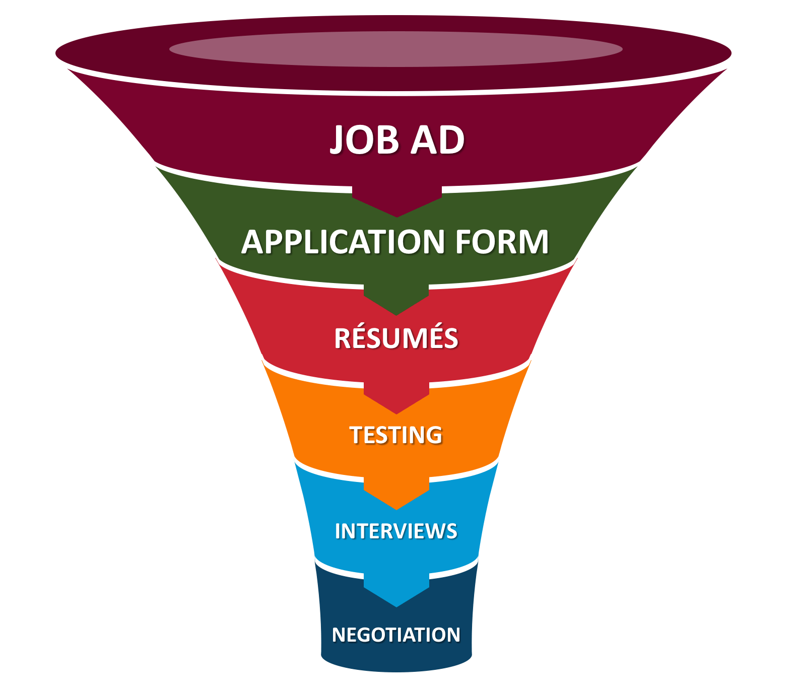
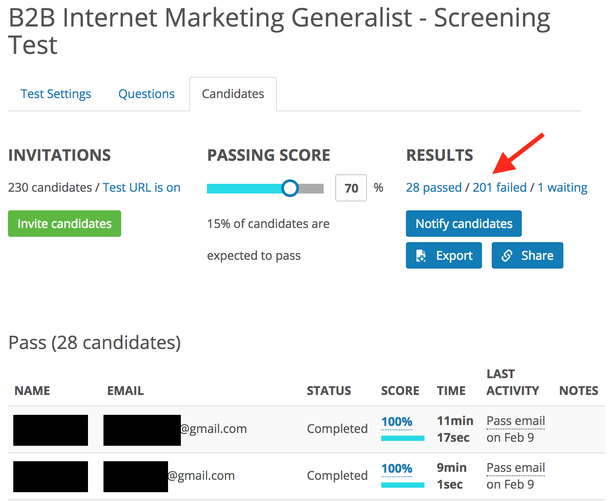
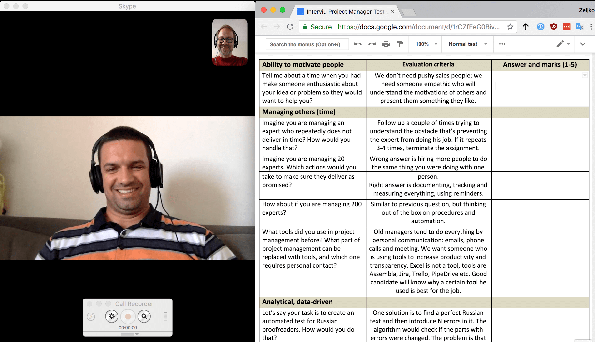

\newpage
CHAPTER 6: The New Model in Detail
----------------------------------

Now, we have all the building blocks we need. Let’s do a quick recap and then explain our new screening process step by step.

### Everything We’ve Learned: Validity, Reward vs. Effort, Good Questions

We learned that not all methods of screening are equal, as they differ substantially in their predictive validity. High-validity methods are:

-   Job knowledge tests.

-   Peer rating (for in-company hiring).

-   General mental ability tests.

-   Structured employment interviews.

-   Work-sample tests.

Therefore, these are going to be the primary methods of our improved screening process.

To minimize possible bias, we will write down the requirements needed for the job and stick to them in every step of the process. We will avoid subjective judgements of “fit” and write every decision down, so that the process can be reviewed by other people. Because different jobs require different levels of knowledge, we will take into account Bloom’s hierarchy and write questions pitched at the job’s level.

If the information gathered at each step doesn’t give us the criteria to exclude a candidate, it is not relevant for screening. All steps together form a funnel where the most effective methods start at the top of the funnel, see the next figure.

{width=95%}

Note that the funnel diagram is not to scale, as each step is drawn just slightly smaller than the previous one. In reality, the number of candidates can be 5-10 times smaller for each step (e.g. 2,000 job ad views and only 200 applications). Automation can be used most effectively at the top of the funnel, when you have larger amounts of candidates being considered, to save the most time.

Ready? Excited? Let’s get started by looking at the first step in our new screening funnel: the Job Ad.

### The Job Ad

Take a look at this sample job ad:

\noindent\makebox[\linewidth]{\rule{\textwidth}{0.4pt}}

Rockstar Developer Wanted

\noindent\makebox[\linewidth]{\rule[5pt]{\textwidth}{0.4pt}}

Do you want to change the world? Join AirBabysitters and revolutionize the babysitting business. Millions of families have problems finding short-term babysitters, and millions of students would like to earn extra money. We connect them, giving parents time for themselves and giving students nice and flexible work, thus disrupting the on-demand childcare sector. Our platform is a web app, and you will be one of the rockstars developing it. It needs to be mobile friendly, rock-solid, and scalable to millions of users.\
\
If you have technical expertise, join our awesome team. We are very friendly, informal, and have a flexible work schedule. Last but not least, we have a sweet downtown office with a ping-pong table, an in-house yoga teacher, and bulletproof coffee on tap!\
\
If interested, send your résumé to our email: ...

\noindent\makebox[\linewidth]{\rule{\textwidth}{0.4pt}}

Do you think it does a good job of summarizing the company and vacancy? Let's imagine a following story:

*Joe, a young father of two, likes the ad. He is acutely aware of the problem of finding a babysitter whenever he wants to take his wife to dinner and a movie. He applies. His enthusiasm shows in the interviews, and his twelve years of experience don’t hurt either. He gets the job.*

*The problems begin immediately... although he knows everything connected to front-end development, the Airbabysitter’s back end is written in Java and he hasn’t used Java in years. Also, after the initial week, he finds he’s in charge of technical customer support, a job he has never liked. But, the biggest problem is the work schedule. His coworkers are mostly young, childless, and arrive at work after 10am. They stay until 7pm, or even later, drinking beer or playing ping-pong. Joe’s kids are in kindergarten, so he’s on a completely different rhythm. He’s in at 8am after dropping them off, and leaves work at 4pm to pick them up. This is a problem for him and his colleagues, as many technical issues appear later in the day. Even worse, every second weekend, they work overtime because of important deadlines. The last time they had weekend overtime, Joe refused to participate, arguing that he needs his weekends for his family. The founder who hired him gets angry. It turns out “flexible work schedule” meant the employee was supposed to be flexible, not the company. In the end, they agree on a mutual contract termination five months in. Joe’s furious. The startup helping young parents fired him–because he’s a young parent. The company founder is equally mad and shouts at HR for the bad job that they’re doing when screening employees for “cultural fit.”*

Withholding relevant information in a job ad to look “more sexy” only hurts your company (and future hires) in the end. Your selection process doesn’t start with the first question in an interview, or the first time that you screen a résumé. It starts with the job ad.

If you take a look at the Rockstar Developer job ad again, it fails to mention many things that Joe and other candidates would find relevant:

-   Work schedule.

-   Expected salary range.

-   Overtime work.

-   Day-to-day tasks (e.g., technical support).

-   Required skills (e.g., back-end Java experience).

-   Whether the company offers stock options, remote work, or visa sponsorship.

And, while we’re at it, what do buzzwords like “rockstar developer” or “awesome team” even mean? The job ad asks, “Do you want to change the world?” Everybody wants to change the world, or, at least, their small corner of it, so there’s no filtering happening there.

Let’s rewrite that job ad to include the relevant information:

\noindent\makebox[\linewidth]{\rule{\textwidth}{0.4pt}}

Full-time Web Developer (HTML/JS/Java) in a Startup

\noindent\makebox[\linewidth]{\rule[5pt]{\textwidth}{0.4pt}}

[AirBabysitters](#the-job-ad) is a platform that connects parents and casual babysitters. We already have thousands of users and we’re growing rapidly.\
\
We are hiring a full-time web developer who will work on the following:\
-   Front end (HTML/CSS, Javascript).\
-   Back end (Java and PostgreSQL).\
-   Architecture of the entire platform.\
-   Technical customer support (25% of your time).\
\
Our office is downtown and parking is in the same building. We are a team of 15, who are mostly younger, informal, and very diverse. Most of the people in the office work from 10am until 7pm, with a long lunch break. We often have beers or dinner after work. Because of deadlines, we sometimes work on weekends, but compensate with overtime pay or extra vacation days. You are expected to travel at least two times a year, to conferences in Las Vegas and New York.\
\
The salary range is \$70,000 to \$90,000 per year, but we also offer 0.4% equity with a two-year vesting period. Salary depends on your level of experience and knowledge.\
\
Minimum requirements are good knowledge of HTML/CSS, Javascript, Java, SQL, and three-years experience. We will screen candidates with an online test (60 minutes of your time). Selected candidates will be invited to a 30-minute Skype interview and 90-minute face-to-face interview at our office.\
\
We need someone who can begin working next month. Unfortunately, we can’t offer visa sponsorship or remote work.\
\
If interested, please apply using this form: ...

\noindent\makebox[\linewidth]{\rule{\textwidth}{0.4pt}}

If Joe had seen this ad, he would have never applied. He could easily see that the job requires Java and technical support, which he dislikes, and a late working schedule, which he can’t do. On the other hand, we can easily imagine the following person:

*Emma found this job to be a perfect match. She is young and single, often going out and sleeping late into the morning. Hanging out with coworkers is really important to her. The salary is in her expected range, and she would even get equity. She doesn’t mind working some weekends, and she can use the extra vacation days for her next trip to Thailand.*

While the second job ad is less sexy, it is much more specific, thus filtering more job seekers. Candidates are completely capable of screening themselves, at zero cost for you, if you give them all the relevant information. In hiring, being honest and transparent pays in the long run. The last thing that your company needs is a dissatisfied employee leaving after five months because you over-promised in the beginning.

If you don’t know what criteria to put in the job ad, think of the most common reasons why your candidates fail at interviews. Probably, you can add text to the job ad that would have deterred them from applying in the first place.

### The Application Form

The job ad finished with instructions on how to apply. As a rookie employer, I would put this:

> “If interested, send your résumé and cover letter to our email: ...”

I learned the hard way that this is a mistake. My inbox instantly got filled with 30 résumés, two pages long on average, and 30 cover letters which were obviously copy/paste jobs from prepared templates. I was stuck with 70+ pages of tedious reading that wouldn’t give me the actual information that I needed to eliminate candidates. As I mentioned in [*Chapter 2: Proxies and Biases in Hiring*](#proxies-and-biases-in-hiring), most people have a polished résumé, full of buzzwords and examples of how they’ve changed the world. Switching to an application form makes a huge difference.

Why?

Because, after asking biographical details, you can sneak in a few, quick, selective questions. You shouldn’t overdo it, because candidates tend to quit on longer application forms. In the case of my companies, 20 minutes is the maximum a candidate should spend applying, and we estimate that it takes them five minutes to fill in their name, email, LinkedIn profile, and upload a résumé. That leaves us with 15 minutes for quick screening questions. While the higher-level questions, like *creating* from Bloom’s hierarchy, are usually too long to be included, we can comfortably fit in three to five *applying*-level, multiple-choice questions. Every question that we include must meet two requirements:

1.  The question must be *basic* enough that, if the applicant answers incorrectly, they will be eliminated from the process.

2.  The question must be *difficult* enough that at least 20% of applicants will fail it.

It might seem hard to find questions that are both *basic* and *difficult*. But, that’s not the case. For example, one of the really basic skills that we want from an employee working in a tech company is an ability to interpret a simple chart. The online three-minute question that checks just that is in the next figure.

![Online *Profit per Employee* question[^profit-employee].](../images/profit-employee-screenshot.png){width=95%}

[^profit-employee]: TestDome: <https://www.testdome.com/questions/numerical-reasoning/profit-per-employee/10960>

To our great surprise, so many people failed this *applying* question that we have classified it as hard in our testing system. Don’t get me wrong, I don’t think candidates who fail this question are bad workers, but, between two candidates, I prefer to hire a person who doesn’t need help interpreting data.

This question checked numerical reasoning, which is a part of general mental ability (which we know from earlier has a 0.51 predictive validity). The same system of short, demanding questions works in almost every domain of knowledge. For example, when hiring a WordPress expert, you could use online question from the next figure.

![Online *Theme Header* question[^theme-header].](../images/theme-header-screenshot.png){width=95%}

[^theme-header]: TestDome: <https://www.testdome.com/questions/wordpress/theme-header/11688>

Our data shows that more than 70% of people claiming WordPress expertise can’t achieve a full score on this question, even if they have three minutes to google it in a separate tab. Given two candidates, I prefer to give a job to a candidate who has the expertise that they are claiming.

Again, as with the Job Ad, if you’re not sure what questions to ask in your application form, think of basic questions which candidates fail in your interviews.

When you do it right, you get results as those in the application test in the next figure.

{width=95%} 

For this remote-working marketing position, we got 230 applications. But, after the application test, 201 candidates failed to reach the passing score of 70%. That was 201 résumés and covering letters that we didn’t have to read, allowing us to focus on just the top 28 candidates. It is also a great experience for these 28 candidates, because, they qualified for the next round in just ten minutes. And, they knew that they did well, since our testing system displays their score at the end of the test.

To conclude, short screening questions embedded within the application form are the second most effective screening method, after a properly written job ad.

### Screening Résumés

The next step is reading résumés. Résumés should be read as what they are, a marketing brochure. We need to wade through the hyperbole haystack in search of the fact-needles that we require. To do so in a structured way, first, make a list of relevant requirements before reading any résumé. This will be easy, since these are already stated in the job ad. For example, if you are searching for a marketing manager, the requirements might be:

-   Has experience in marketing projects with a total spend of at least one million.

-   Has led, at least, a five person team for, at least, a year.

-   Average duration with each employer is more than a year.

It’s easier to uncover our biases when we create lists like this. Is it OK that we require experience with million-dollar projects? What if a candidate led a small team of three people for five years? Would that still qualify? You must decide in advance if you want the requirement to be a minimum criteria (pass or fail) or scoring criteria (e.g., from 1 to 10).

It is probably obvious that you shouldn't give negative points for age, gender, or ethnicity, not only because it’s illegal but because it has no predictive validity. It’s perhaps less obvious, however, that you shouldn’t give *positive* points for the same things. This is called “positive discrimination” and some companies use it in an effort to increase diversification. Mathematically, giving two positive points to a certain ethnicity is equal to giving two negative points to all other ethnicities. It’s just negative discrimination in disguise.

While companies will have different résumé scoring procedures, they should all ask the same question: “Would we feel comfortable if our procedure was posted on the company notice board?” If the answer is no, then there’s something wrong.

After we have a fixed set of requirements, we can read résumés and search for the relevant information only. We assign a score to each candidate and they get a pass or a fail. This treats candidates more equally and the screening process takes only 2-3 minutes per candidate.

### Communicating With Candidates

Imagine that you are a very talented candidate. You applied to a few companies and passed their initial tests. You know you are good. Why would you spend time progressing through multiple stages with companies that don’t get back to you for weeks?

Therefore, for most companies, the key communication begins after the application form and résumé screening. You’ve already screened most candidates. You can now inform all who have failed, thanking them for their time. Next, you need to motivate candidates who passed to invest effort in the upcoming stages. No big words or motivational speeches are needed here. You just need to let good candidates know that:

-   They passed the application form questions.

-   They passed the résumé screening.

-   You are thankful for their interest and invested time.

-   What the next steps in the screening process are going to be.

-   The name of the person who reviewed their application, together with that person’s contact details in case they have questions.

Having a real person address them by name shows both a personal touch and that someone cares about their application. The level of personal attention depends whether your company is hiring in an *employer market* (where unemployment is high) or a *candidate market* (where talent is scarce). In employer markets, email communication as a first step is fine. If you employ in Silicon Valley, however, email will probably not cut it. You will have to call or meet with candidates, explain why your company is good, how you can help their career, and make sure you have good reviews on [GlassDoor.com](https://www.glassdoor.com).

Here are a few common questions which our candidates tend to ask at this stage, together with our answers:

-   Q: Is the salary range from the job ad fixed?\
    A: Yes, usually it is, otherwise we would put a different range.

-   Q: Can I work part-time, instead of full-time?\
    A: Usually no, because otherwise we would have put part-time in the job ad.

-   Q: How long will your process take, as I am also talking with another company?\
    A: We can hurry up your application, but the minimum time is X.

Whatever the answer is, give it directly and timely. It is very annoying for candidates not to receive a response for days or to get a convoluted answer. Your communication is a mirror of your company culture, so make it shine.

### Detailed Screening Test

After you have motivated candidates to continue, you can send them a detailed screening test. Normally, this test is between 50 and 100 minutes, and I would advise against anything longer. The shorter, the better. You should also present the test as a benefit to them: after all, they can take it from their home, at their convenience, and, in the process, distinguish themselves from other candidates.

To select good questions for a test, you need to identify two things:

A.  The key, testable skills for the job.

B.  Bloom’s level of those skills.

For example, empathy can be a key skill for a customer representative but it’s hard to test for. On the other hand, language skills, verbal reasoning, or typing skills can easily be tested. Don’t worry if you can’t test something that is important for a job—for other stuff there is always the interview. The purpose of the detailed screening test is to detect unqualified candidates in all *testable* skills. Even the most empathetic person will be a bad customer representative if they don't properly speak the required support language.

Next, create screening questions to match the Bloom hierarchy level that is required for the job. If you make the level too low, you’ll end up with employees who can only do the basic tasks. If you make the level too high, they will be overqualified and bored.

To give you an idea, below is a list of jobs and fitting work-sample questions:

Job  | Work-sample test question   |
:--- | :------------               |
Accountant                  | “File the following ten invoices into the accounting system. If the invoice is missing some details, select what is missing in the *More information needed* dropdown.” |
Customer Analytics          | “Given the following Excel pivot table, find the count and total of requested customer refunds in Germany for December which were not paid out by the end of that month.” |
Factory Product Manager     | “Calculate cost variance for a project with the starting budget X (spread equally over duration) and expected duration Y, if you are currently A months into the project and the money spent so far is B.” |
Translator                  | “Below is the example of an original and translated text. Unfortunately, the translated text has seven words that are mistranslated. Select each of them and provide a word that fits the context.” |
Programmer                  | “Change the following HTML code, so the page formats correctly for screens with a width of 480px.” |
Journalist                  | “Given the following facts, write a title and a lead paragraph of a maximum of 35 words.” |
Customer Service Agent      | “Below is an email from an angry customer whose delivery failed to show up on time. Our system indicates that the delivery was late because of road traffic. Write your response to the customer.” |

I have noticed that many people fail to create short tests, primarily because they don’t understand the difference between elimination and knowledge tests. Screening tests are *elimination tests*. Most candidates should fail. They’re not *knowledge tests* like those used in schools, where students are sorted into A, B, C, D, and F grades. You don’t need easy D-level questions, as you would never hire D-level candidates anyway.

It’s both not fair and not necessary to give applicants long work-sample tests, such as asking a translator to translate a few pages from a book or asking a programmer to create a simple app. Although this approach is popular, it takes up too much of candidate's time, they can feel they are doing free labor, and their creations are difficult to evaluate.

In jobs where performance is highly subjective (such as writing or design), it is often impossible to do automated scoring. But, even then, you can use this trick:

>  Ask multiple people for a blind review and then use the average score as a result.

For example, when evaluating designers, ask three colleagues to rate their designs. Don’t tell them the candidates’ names or show them résumés. After all, visitors to a web page won’t ever know who designed it. Your screening processes should be just as blind.

### Structured Interviews

With the detailed screening test completed, we have now eliminated most of the candidates. We only need to interview the few who remain. Interviews come in a few forms; phone, video call, and on-site interview. No matter which medium of communication is used, the problem is the same. How do you objectively compare candidates?

Easy, we’ll only use structured interviews.

Remember, the validity of unstructured interviews is 0.38, while the validity of structured interviews is 0.51. The effort to prepare questions in advance is well worth a 35% better prediction.

*Structured interviews* enforce a rigid process:

-   There is a list of specific questions.

-   Every candidate is asked the same questions, in the same order.

-   The interviewer writes down the score for every question, based on a predefined criteria.

-   Candidate answers are written down or recorded.

-   The company keeps records of all interviews for future analysis.

All the tools that you need for structured interviews are available free of charge. We use Google Docs for questions and scoring, as well Skype and Call Recorder[^call-recorder] for calls. Our interviews look like in the next screenshot.

[^call-recorder]: Ecamm Call Recorder: <https://www.ecamm.com/mac/callrecorder/>

{width=95%}

Of course, this requires preparation on the side of the interviewer. So, write questions in advance. If the answer to the question is complex, define the criteria for evaluation. For example, these are some of our questions for a position of Internal Project Manager:

| Question | Scoring criteria | Answers and marks (1-5) |
| :------  | :------          | :------                 |
| Tell me about a time when you had to make someone enthusiastic about your idea or problem so that they would want to help you? | *Wrong:* Pushing your idea onto others. \
\
*Correct:* Having empathy to understand the motivations of others and present them something in a way that they will like. |
| Imagine that you are managing an expert who repeatedly misses deadlines. How would you handle this? | *Wrong:* Threatening them. \
\
*Correct:* Following up a couple of times to understand the obstacle that’s preventing them doing their job. If it repeats three or four times, find a replacement contractor. |
| Imagine that your job changes overnight, going from managing five experts to 20. How would your supervision style change? | *Wrong:* Working harder or hiring a subordinate to assist you. \
\
*Correct:* Move from a personal to a more systematic approach—documenting, tracking, and measuring everything, using reminders. |

When the structured interview is over, we are in a much better position to judge candidates. Multiple interviewers can read notes, or listen to a recording and give their marks. All these marks are then added to compare candidates. We can even compare today’s candidate with a really good employee who we hired three years ago.

Here are some tips for running an effective structured interview:

-   *Let the candidate talk*. If you’re talkative, I strongly suggest recording your interviews. If you later find out that candidate is talking less than 70% of the time, you’ve failed as an interviewer.

-   *Don’t be suggestive in questions*. If the candidate isn’t talking much, or taking a long time to formulate an answer, resist the temptation to offer them more information like, “would you rather do *A* or *B*?” Choosing an option and rephrasing is much easier than answering independently, so you are giving that candidate an unfair advantage.

-   *Be comfortable with silence*. A good rule for presentations is that, whenever you ask an audience if they have questions, you should silently count to ten before continuing. People need time to speak up. Exactly the same applies to interviews. Use silent moments to your advantage: often a candidate will start talking just to end the silence.

-   *Control the flow of the conversation*. If the candidate goes into too much detail or starts to meander into what they did three jobs ago or as a Boy Scout in Alaska, raise your hand and gently interrupt them: “Unfortunately, because of time constraints, we need to move to the next question.”

Some people feel the above recommendations are too restrictive, formal, or cold. But, in my experience, a structured, professional interview gives better predictions than a friendly, conversational interview and is fairer on the applicant. We both need some distance to be objective.

While we’ve focused mostly on work-related questions so far, I’ll now explain why it’s equally important to probe a candidate’s motivation and character—a lesson that I have learned the hard way.

### Probing Motivation and Character

I was hiring a programmer for a full-time, remote position. One candidate came out on top, let's call him Mike. He not only knew how to code, he was teaching it to kids at summer camps. However, his résumé was not great. He’d prolonged his time at university for many years and he still didn't finish it. He started working a few years ago but had long periods out of work. He blamed both on his health problems and family issues. Still, he was smart and I really wanted to hire him. He assured me that he could balance his remaining exams with work. Just to be on the safe side, we agreed on a four-day workweek, and signed the employment contract.

In Mike’s second week some of his tasks were unexpectedly unfinished. There were many silly bugs in his code, including those that programing tools report automatically—if you ever run them. After weeks of similar inattention and amateur mistakes, we had to conclude that Mike was smart but sloppy and that he didn’t pay attention to details. After talking with him, he promised to be more attentive.

This saga continued for months until, one day, his manager came to me. “I think we have a problem,” he said. “Mike’s been logging normal 9-to-5 working hours but has not been on Skype which made me suspicious. So, I checked the commit logs. Mike’s been committing a little bit of code every day at 11PM but not working at all during the day.” Mike had pulled the four-hour workweek[^four-hour] trick on us.

[^four-hour]: Book: <https://www.amazon.com/4-Hour-Workweek-Escape-Live-Anywhere/dp/0307465357>

I wondered if I should have sent Mike for psychological testing before hiring him? After all, many companies do them as a first step in their hiring process. Maybe they’d have found what I had obviously missed? I decided this was the perfect opportunity for an experiment.

I sent Mike to a specialized psychological testing company, for a multiple-hour Big Five test[^big-five], emotional testing across eight dimensions, and an interview with a licensed psychologist. Two days later, I got a three-page PDF report in my inbox. It was a fascinating read–Mike was rated as a great employee. The report stated that Mike is “very honest, conscientious, and diligent,” “committed to his job,” and, “when he starts something, he finishes it”.

Did they mix up the results with someone else, I wondered?

I called Mike to the office the next day. I turned a monitor around showing his timesheet and an actual log side-by-side. He turned red. He admitted that he was not working some days. He said that he was busy with university and that he thought he could manage the work at night. “It won’t happen again,” he said. “I am sure it won’t,” I replied, “here is your contract termination.” He took the document and left in silence.

I learned a lot from this unfortunate event. All the clues were there: he had studied without finishing his courses for over a decade and had held a whole series of jobs. But, he’d spun a nice story during the interview which had evoked my empathy. He was even good at manipulating professional psychologists, it seemed. I would never have used the words, “when he starts something, he finishes it” for a person who studied for ten years without graduating.

That’s the problem with psychology. Companies pay billions of dollars for the promise of reading a candidate’s mind, but it doesn’t work. Psychological tests are based on self-reporting and smart candidates are able to manipulate them, just like Mike had done. Until we invent a mind-reading machine, a lot of today’s psychological testing is a waste of money.

Accepting all this, how can you probe motivation and character? Well, you have to be willing to give a candidate tough questions, while trying to find inconsistencies in their story.

There are two phenomena that can help us become better at this:

-   While most people are prone to exaggeration and overpromising, few will outright lie.

-   People are more likely to lie in writing, in comparison to when they are looking you in the face.

With that in mind, we can:

-   *Ask situational questions*. Instead of asking a candidate if they are good at X, ask them for a situation where their actions demonstrated that proficiency. "Good at X" is just an exaggeration, and a lot of candidates will have no problem saying that. Inventing an entire story is an outright lie, and most people will not go that far.

-   *Ask about the candidate’s past, not a hypothetical future*. If you have ever studied product development, interface design, or run focus groups, you have already learned the mantra: the best predictor of future behavior is *past behavior*. Ask people if they would donate to charity and an overwhelming majority will answer yes. Ask them, “how many times have you donated to charity in the last year?” and you’ll get a vastly different result.

-   *Ask tough questions in person.* If you suspect a candidate could be dishonest, hold back difficult questions until the in-person interview.

Here is a list of suggested questions and scoring criteria to help you probe motivation in an interview.

Question | Scoring criteria | Answers and marks (1-5)
:-----   | :------          | :------
How did you hear about the position and what motivated you to apply? | Is the candidate selective in applying for a job? Is the candidate motivated by this specific work? \
\
*Red flags:* Too much emphasis on money.
Why did you decide to leave your last job? | Is this position a logical next step for them? Are the reasons for leaving their last job fulfilled by this job? \
\
*Red flags:* Bad mouthing their last employer or having unrealistic career expectations. |
Would you mind if I contact your previous employer and ask them for a reference? | Are they welcoming to the idea, do they feel the previous employer would say nice things about them? \
\
*Red flags:* They had a dispute with the last employer which can’t be justified. |
Why do you have this gap / job change in your résumé? | Can the candidate provide a consistent explanation for gaps in career or frequent job changes? \
\
*Red flags:* Unconvincing explanations, withholding information. |
Where do you see yourself 3-5 years from now?	| Does the candidate’s ambition align with the company’s typical career development? \
\
*Red flags:* Extremes, such as doing the same thing as now or advancing unrealistically far. |
Tell me about a disagreement/difficult situation which you had with your manager. | Do they handle conflicts at work in a calm, rational, respectful manner? \
\
*Red flags:* Not taking any ownership for the bad things. Making conflicts personal. |

You should also add motivation and character questions that are specific to the job vacancy. For example, when hiring a designer, the obvious thing to look for is the likeability of their designs. But, in my experience, the frequent problem with designers is that they get too attached to their designs and treat any feedback as a personal insult. I even had an interior designer storm out on me because I bought a designer chair not in accordance with his vision of my flat. Therefore, when I look for designers now, I ask questions like:

Question | Scoring criteria | Answers and marks (1-5)
:-----   | :------          | :------
What are the first steps of your design process and how much time do you spend on each? | Do they invest time talking with the client or understanding the target audience first? \
\
*Red flags:* Start designing before they have sufficient input. |
How many variants of your design do you normally do? | Does the designer create multiple variants and iterate on designs, based on feedback? \
\
*Red flags:* Insisting on just one variant of the design. |
What happened the last time that a client didn’t like your design? | How does the designer overcome disagreement with the client? Do they try to understand their issues? \
\
*Red flags:* Pushing their vision upon the client. |

Next, let’s look at example questions for a representative working on the phone for customer technical support. In this profession, representatives often lose motivation and there’s high staff turnover.

Question | Scoring criteria | Answers and marks (1-5)
:------  | :------          | :------
Have you had a customer-facing job before? If you had it, how did you like it and what were its good and bad sides? | Do they show enthusiasm for this type of work? How realistic are they in their assessment of it? \
\
*Red flags:* No relevant experience. Unrealistic idea of the job. |
Give me an example of the last two times that you helped a friend, family member, neighbor or stranger with a technical issue? How did you approach the problem?	| Do they show enjoyment for explaining technology? Do they just jump in and solve the problem or actually take the time to explain it to the user, so that they could solve it themselves next time? \
\
*Red flags:* Impatience, unwillingness to help, disrespect for laymen. |

There are many positions in which technical knowledge is less of a problem than motivation, such as in the job above. Therefore, it might seem better to do interviews first and screening tests after. It isn’t. Having a quick application test or detailed screening test first will always be more *effective*. Interviews, no matter how well-done, are expensive. It’s always better to wait until you have the smallest pool of candidates before investing time in interviews.

### Second Opinions

Interviews don’t require the effort of just one person, they require collective effort to get right. Generally, having multiple people involved in the interview process is better because:

-   If the main interviewer is busy asking questions, communicating with the candidate, or writing notes, a second pair of eyes and ears can notice things that might be missed otherwise.

-   Everybody has bias. But, multiple people have different biases, and, so, can compensate for each other.

-   Different people have different expertise. A second interviewer might notice problems with skills, knowledge, or motivation missed by the first.

There are a few ways to solicit second opinions:

A.  *Have multiple people on the interview*. One leads the questioning and conversation, while the others listen and make notes. After the interview finishes, they compare impressions and discuss the differences between them.

B.  *Note-taking by a single interviewer*. Just the simple task of taking notes makes interviewers more rational and unbiased. People will rarely write, “I don’t like this candidate.” They are more likely to provide an explanation, such as, “Often the candidate didn’t answer the question directly.” These notes can later be reviewed by another interviewer as the basis for eliciting a second opinion.

C.  *Multiple rounds of interviews, done by different interviewers*. For example, Google has at least four rounds of interviews with different members of the team. Any interviewer has the power to veto a candidate if they conclude the applicant is unfit for the job. Often companies undertake interviews with multiple levels of the organization—e.g., HR, project management, a departmental boss, etc.

D.  *Recording audio or video of the interview*. If the candidate agrees, you can record the interview. Other interviewers can then review these at their own convenience, and you have a detailed archive for future reference.

When we hire internally, we find a combination of the last three works best. Two rounds of interview, with a single interviewer taking notes and recording a video. This reduces scheduling issues and the waste of a second interviewer’s time if the main interviewer decides to veto the candidate. If the interviewer decides the candidate is a potential hire, another team member reviews the recording and the given scores.

Reviewing recorded interviews is not as time-consuming as you might think. If conversational speech is slow, you can set the speed to 1.5x and skip the parts where the interviewer talks, as well as the softer initial and end parts. As a result, you can usually finish in less than half the time the interview originally took.

You can purchase a Skype call recorder or use the Zoom.us client which has free video recording. Many video players supports listening to videos at higher speed. Recording and reviewing interviews is both easy and worthwhile.

A special form of second opinions are the references from previous employers. As mentioned before, the best predictor of future performance is past performance. We always ask a candidate, “Would you mind if we contact your previous employer and ask them for a reference?” This way, even if the candidate is reluctant, they will still have to explain why.

In an ideal world, you could then call their previous employer. However, this is often problematic—as legal departments of most companies don’t want the liability for giving that information. Asking previous employers is still an option if they are a small business, or if you are well-connected in the industry. You can search your LinkedIn profile for connections in one of the candidate’s previous companies. Of course, you should treat this information confidentially.

### Negotiating the Contract

With all the previous steps completed, if you still think that this is the right hire, it’s time to negotiate the contract. Unfortunately, often negotiations will fail, but that is expected. Your improved screening process will find you good employees, and good employees usually have multiple available options.

Transparency is the single best thing to improve the chance of hiring. Give the candidate honest feedback after each step of the process. If you don’t, the simple fact of passing each stage will lead them to think they are perfect and, so, push for the top of the salary range that you stated in the job ad. If, during the process, you realize that they are more junior than desired, tell them this. If their technical skills in Java disappointed you, inform them that they need to improve. This way, there are no big surprises when it comes to the negotiation and the salary you offer.

Ideally, transparency should come from both sides. This is often not the case. No matter how well and fairly you communicate, negotiations can break down because an applicant suddenly decides to reject your offer for reasons that they have never articulated. This is unavoidable and doesn’t mean that you’ve done anything wrong.

In case of uncertainty, both you and a candidate have the option of a probation period. While extremely resource-intensive, probation periods are the ultimate work-sample test. In the case of a probation period, it is important to negotiate:

-   How long will the probation period last? Normally, it is two to six months.

-   What specific performance criteria does the employee need to satisfy?

-   When and by whom will the performance be reviewed?

If during probation period you realize that the candidate isn’t right, there’s no reason for you both to invest further time, just terminate the contract.

### Wrapping It Up

Once you have a hire, before you can go out and celebrate, you need to wrap everything up properly. Contact the other candidates to inform them that you’ve hired someone else. Explain the reasons why you preferred the other candidate, so that they know how to improve in the future. Keep bridges open—if you leave them with a good impression, perhaps they’ll come to you later in their career. If they were your second choice for the hire, tell them so. We once had a situation where our primary pick turned out to have motivational problems when working remotely. We terminated his contract and contacted our second pick who previously didn’t get the job because he had less experience, but was otherwise great. He is now employed by us and we’re very satisfied with his work.

Lastly, archive all lists, interview notes, recordings, test results, and related emails. There are practical reasons why—you will need data to analyze for improving your screening process, and you can get into hiring or employment lawsuits. It is in the company’s best interest to have everything archived. If such a lawsuit happens, you will have years of data to justify the reasonings behind any of your decisions.

Now, your screening process is much improved, but you’re not done yet...

